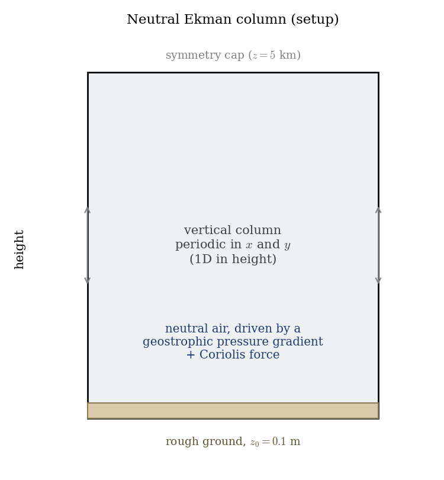
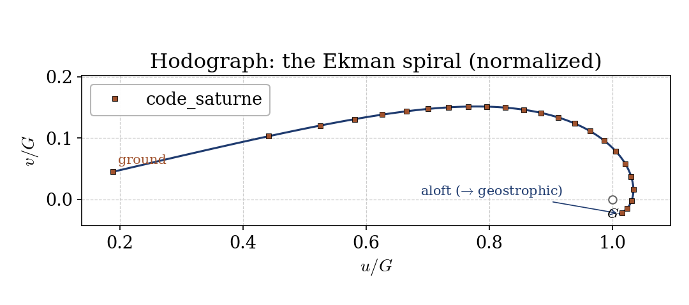
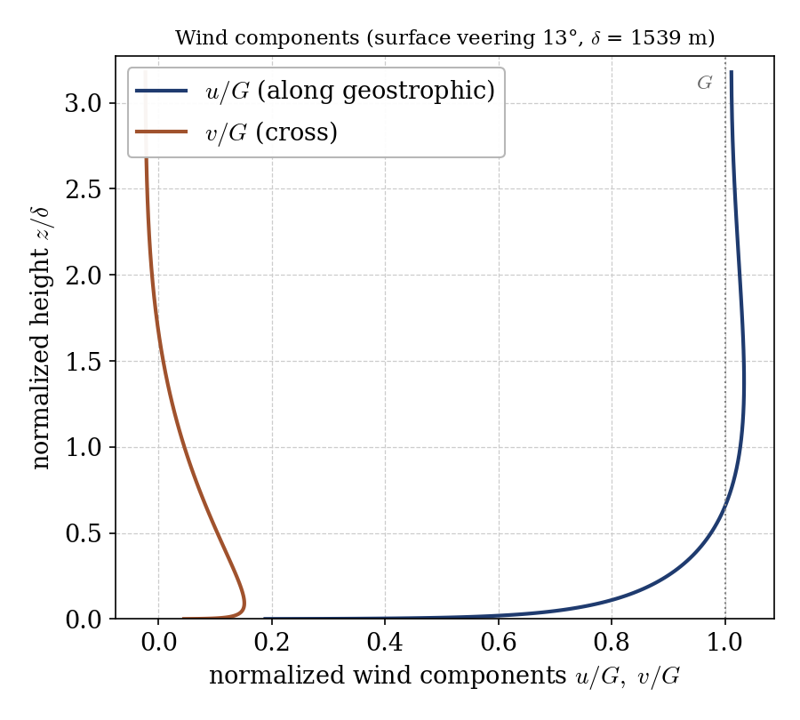

# The Ekman Layer: Wind Veering under Coriolis (atmo)

A step-by-step tutorial for the **Coriolis** effect in an atmospheric boundary
layer with **code_saturne**: the **Ekman layer**. Away from the ground the wind
is in **geostrophic balance** (pressure gradient against Coriolis) and blows
along the isobars; near the rough ground friction slows it and it **veers**
(turns direction) with height, tracing the classic **Ekman spiral**. The
showcased feature is the Coriolis source term (`omega`) combined with a
geostrophic forcing.

Maintained by [Simvia](https://Simvia.tech/fr), part of the
[tutoriel-code_saturne](https://github.com/simvia-tech/tutorials-code_saturne) collection.

## Learning objectives

After completing this tutorial you will be able to:

1. Activate the **Coriolis** source term via the rotation vector
   ($\omega_z = f/2$).
2. Impose a **geostrophic wind** through a constant body force in geostrophic
   balance with the Coriolis force.
3. Set up a horizontally homogeneous **1D column** (periodic in both horizontal
   directions) over a rough ground.
4. Read the **Ekman spiral** on a hodograph and the surface **veering angle**.

## Prerequisites

| Requirement | Detail |
|---|---|
| code_saturne | **v9.1** |
| Tutorials | [Atmo_Neutral_BoundaryLayer](../Atmo_Neutral_BoundaryLayer) (neutral surface layer, rough wall) |

If code_saturne is not yet installed, build it from the
[official homepage](https://code-saturne.org/), pull a
ready-to-use Singularity image from the
[Open Simulation Center](https://open-simulation-center.org/downloads/code_saturne/code_saturne),
or pull the
[Simvia Docker image](https://hub.docker.com/r/Simvia/code_saturne) before continuing.

## Case files

```
Atmo_Ekman_Layer/
├── CASE/
│   ├── DATA/setup.xml                    # neutral atmo, Coriolis (omega_z), k-epsilon
│   └── SRC/
│       ├── cs_user_source_terms.cpp      # geostrophic body force
│       └── cs_user_initialization.cpp    # start from the geostrophic wind
├── FIGURES/
└── README.md
```

> No mesh file: the vertical column is built by the **built-in cartesian mesher**.

## Physical model

In the free atmosphere, steady and frictionless, the horizontal momentum balance
is **geostrophic**: the pressure-gradient force balances the Coriolis force,

$$f\,\mathbf{\hat z}\times\mathbf{U}_g = -\tfrac1\rho\nabla p,$$

with $f = 2\Omega\sin\varphi$ the Coriolis parameter ($\varphi$ the latitude).
The result is the geostrophic wind $\mathbf{U}_g$, blowing along the isobars.

Near the ground, **friction** removes momentum and breaks this balance: the wind
slows and turns toward low pressure. The three-way balance (pressure gradient,
Coriolis, friction) gives a wind that **rotates with height**, the **Ekman
spiral**, from a reduced, veered wind at the surface to the full geostrophic wind
aloft.

Here the Coriolis force is set through the rotation vector $\omega_z = f/2$, and
the geostrophic pressure gradient is imposed as a constant body force
$(0,\rho f G,0)$, which in geostrophic balance yields $\mathbf{U}_g = (G,0,0)$.
The column is periodic in both horizontal directions (the flow varies only with
height) over a rough ground.

### Flow parameters

| Quantity | Symbol | Value |
|---|---|---|
| Latitude | $\varphi$ | $45$° |
| Coriolis parameter | $f = 2\Omega\sin\varphi$ | $1.03\times10^{-4}$ s⁻¹ |
| Geostrophic wind | $G$ | $10$ m/s |
| Roughness length | $z_0$ | $0.1$ m |
| Domain height | $H$ | $5000$ m |
| Turbulence | | $k$-$\varepsilon$ |

<p align="center">
  
  <br>
  <em>Figure 1: the setup. A tall vertical column, periodic in the horizontal (so the flow varies only with height), over a rough ground, driven by a geostrophic pressure gradient with the Coriolis force.</em>
</p>

## Geometry and boundary conditions

A vertical column, $z$ the vertical, periodic in $x$ and $y$ (horizontally
homogeneous). The ground (`Z0`) is a rough wall ($z_0 = 0.1$ m) and the top
(`Z1`) is a symmetry plane. The Coriolis rotation and the geostrophic body force
act throughout the volume.

## Numerical setup

Neutral atmospheric model, $k$-$\varepsilon$ turbulence, constant density. The
Coriolis term is set with $\omega_z = f/2$; `cs_user_source_terms.cpp` applies
the geostrophic force. The run is advanced well past one inertial period
($2\pi/f \approx 17$ h) so the inertial oscillation is damped and the profile is
steady.

## Running the simulation

```bash
cd CASE
code_saturne run --n 4
```

The mesh is generated internally. The run writes `CASE/RESU/<id>/` with the
velocity and turbulence fields.

## Results and verification

The wind rotates with height, the signature of the Ekman layer. The profiles are
shown **normalized**: the wind by the geostrophic speed $G$ and the height by the
Ekman depth $\delta = \sqrt{2\,\nu_t/f}$ (here $\delta \approx 1.5$ km from the
turbulent eddy viscosity), which makes the spiral universal. On the **hodograph**
($v/G$ against $u/G$), the wind starts at the ground with a reduced, veered vector,
rises, slightly **overshoots** the geostrophic value ($u/G > 1$) and then curls
back toward the geostrophic point $u/G = 1$, $v/G = 0$ aloft, the start of the
Ekman coil.

<p align="center">
  
  <br>
  <em>Figure 2: hodograph (the Ekman spiral), normalized by $G$. The wind vector turns and grows from the ground, overshoots $G$ and curls back toward it aloft.</em>
</p>

The components make the same point: the along-wind $u/G$ rises from a small
surface value to about $1$ aloft, while the cross-wind $v/G$ is largest near the
ground and vanishes aloft. The surface wind is veered about $12$° from the
geostrophic direction.

<p align="center">
  
  <br>
  <em>Figure 3: normalized wind components $u/G,\ v/G$ versus $z/\delta$. The along-wind tends to $G$ aloft; the cross-wind marks the veering, concentrated near the ground.</em>
</p>

The classic laminar Ekman solution (constant eddy viscosity) predicts a $45$°
surface veering; a turbulent boundary layer with a height-dependent eddy
viscosity veers much less, typically $10$-$30$°, and the $\approx 12$° found here
is in that range. The point of the case is the **veering with height** produced
by the Coriolis force, not a match to the constant-viscosity spiral.

## Summary

This tutorial added the Coriolis force to a neutral atmospheric column and drove
it with a geostrophic body force. The wind reaches the geostrophic value aloft
and veers toward the ground, tracing the Ekman spiral, with a surface veering of
about $12$° for this turbulent boundary layer. The lesson that carries beyond
this case: the Coriolis source term (set through the rotation vector) turns a
plain boundary layer into a rotating-frame atmospheric one, the mechanism behind
the wind turning with height in the real atmosphere.

## References

- V. W. Ekman. On the influence of the Earth's rotation on ocean currents, Arkiv för Matematik, Astronomi och Fysik 2, 1-53, 1905.
- J. R. Garratt. The Atmospheric Boundary Layer, Cambridge University Press, 1992.
- [code_saturne documentation](https://code-saturne.org/doc/)

## Authors

[Simvia](https://Simvia.tech/fr). Questions, remarks and requests are welcome.
