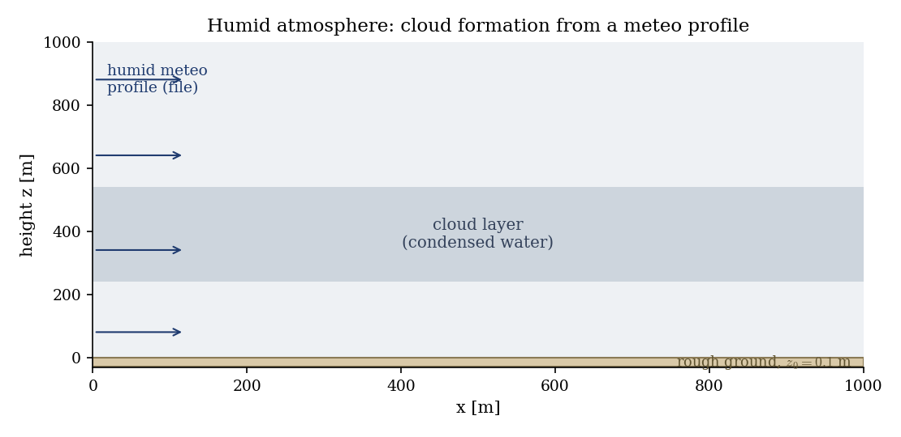
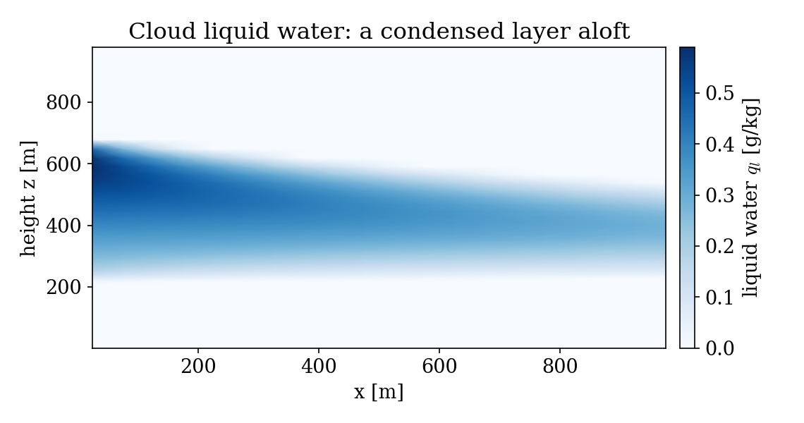
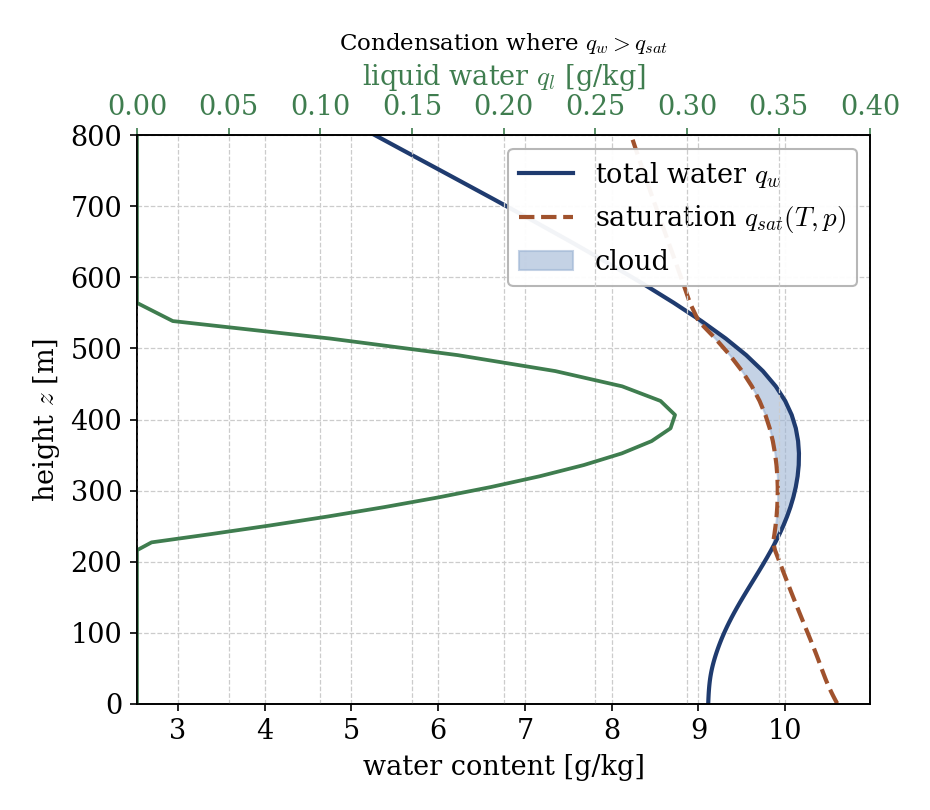

# Humid Atmosphere: Cloud Formation from a Meteo Profile (atmo)

A step-by-step tutorial for the **humid atmosphere** model of the atmospheric
flows module (`atmo`) in **code_saturne**. Building on the
[meteo-file case](../Atmo_Meteo_Profile), it switches on the **humid** model,
which transports the **total water** and the **liquid potential temperature** and
diagnoses **condensation**: where the air reaches saturation, cloud liquid water
appears. The showcased feature is the humid model and its saturation adjustment,
demonstrated on a moist meteo profile that forms a **cloud layer** aloft.

Maintained by [Simvia](https://Simvia.tech/fr), part of the
[tutoriel-code_saturne](https://github.com/simvia-tech/tutorials-code_saturne) collection.

## Learning objectives

After completing this tutorial you will be able to:

1. Activate the **humid** atmospheric model (total water, liquid potential
   temperature, cloud diagnostics).
2. Provide a **humid meteo profile** (a total-water column in the meteo file).
3. Understand the **saturation adjustment**: cloud liquid water forms where the
   total water exceeds the saturation value $q_{sat}(T,p)$.
4. Read the cloud fields (`LiqWater`, cloud fraction) and interpret the cloud
   layer.

## Prerequisites

| Requirement | Detail |
|---|---|
| code_saturne | **v9.1** |
| Tutorials | [Atmo_Meteo_Profile](../Atmo_Meteo_Profile) (meteo-file workflow), [Atmo_Neutral_BoundaryLayer](../Atmo_Neutral_BoundaryLayer) |

If code_saturne is not yet installed, build it from the
[official homepage](https://www.code-saturne.org/cms/web/Download), pull a
ready-to-use Singularity image from the
[Open Simulation Center](https://open-simulation-center.org/downloads/code_saturne/code_saturne),
or pull the
[Simvia Docker image](https://hub.docker.com/r/Simvia/code_saturne) before continuing.

## Case files

```
Atmo_Humid_Cloud/
├── CASE/
│   ├── DATA/
│   │   ├── setup.xml                     # humid atmo model, read_meteo_data on, k-epsilon
│   │   └── meteo                         # humid profile (temperature + total water)
│   └── SRC/
│       ├── cs_user_zones.cpp             # boundary zones
│       ├── cs_user_boundary_conditions.cpp   # meteo inlet + rough wall (in C)
│       └── cs_user_initialization.cpp    # initial fields (incl. total water, droplets)
├── FIGURES/
└── README.md
```

> No mesh file: the vertical slice is built by the **built-in cartesian mesher**.
> Boundary conditions are set in C for the same reason as the meteo-file case
> (the v9.1 GUI meteo-boundary path is not wired to the preprocessor).

## Physical model

The **humid** atmospheric model carries two conserved quantities: the **total
water content** $q_w$ (vapour plus condensed water) and the **liquid potential
temperature**. Only $q_w$ is transported by the flow (advection and turbulent
diffusion); the split between vapour and liquid is diagnosed at each point.

The **saturation** water content is a thermodynamic function of temperature and
pressure, from a Clausius-Clapeyron (Magnus) law for the saturation vapour
pressure $e_s(T)$:

$$e_s(T) = 611.2\,\exp\!\Big(\tfrac{17.62\,T_C}{243.12 + T_C}\Big),\qquad
  q_{sat} = \frac{0.622\,e_s}{p - 0.378\,e_s}.$$

The model then applies a **saturation adjustment**: the excess of total water
above saturation condenses into **cloud liquid water**,

$$q_l = \max\!\big(0,\; q_w - q_{sat}\big),$$

and the vapour stays at $q_{sat}$. The condensation releases **latent heat**,
which warms the air and raises $q_{sat}$, so the adjustment is an equilibrium
rather than a plain subtraction: this coupling is exactly why the conserved
thermal variable is the *liquid* potential temperature. The buoyancy accounts
for the water loading and the hydrostatic pressure is solved.

Because $q_{sat}$ **decreases with height** (the air cools), a layer with enough
moisture becomes saturated above a certain altitude (the cloud base), while it
stays clear below. Here the meteo file prescribes a moist layer between about
$250$ and $700$ m (relative humidity above $100\%$), unsaturated near the ground
(no fog) and dry aloft, so a **cloud layer** forms in between.

> **Cloud droplet number.** The meteo file also carries a droplet number
> concentration ($100\ \mathrm{cm^{-3}}$ here). It does **not** control whether
> the cloud forms: condensation is set purely by $q_w > q_{sat}$ (running with
> zero droplets gives the same liquid water). The droplet number only sets the
> mean droplet **radius**, $r \propto (q_l/N_c)^{1/3}$, used for the
> microphysics and the radiative properties of the cloud.

### Setup parameters

| Quantity | Value |
|---|---|
| Domain | $1000 \times 1000$ m (vertical slice) |
| Atmosphere | humid (dry, neutral base state, $T_{surf} = 15$°C) |
| Total water (moist layer) | $\approx 10.3$ g/kg (RH $> 100\%$) |
| Roughness length | $z_0 = 0.1$ m |
| Turbulence | $k$-$\varepsilon$ |

<p align="center">
  
  <br>
  <em>Figure 1: the humid meteo profile enters from the west; a cloud layer forms aloft where the air is saturated.</em>
</p>

## Geometry and boundary conditions

Vertical slice, $z$ the vertical. As in the meteo-file case, the west face and
the top are meteo inlets (`CS_INLET`, filled from the profile), the east face is
an outlet, the ground is a rough wall, and the spanwise sides are symmetry. The
inlet total water follows the humid profile from the meteo file.

## Numerical setup

Humid atmospheric model with `read_meteo_data` on. The velocity, turbulence,
liquid potential temperature, total water and droplet number are initialized in
`cs_user_initialization.cpp`; the meteo inlet then drives the profiles. The run
advances to a steady state ($2000$ steps).

## Running the simulation

```bash
cd CASE
code_saturne run --nprocs 4
```

The mesh is generated internally and the meteo file is read at start-up. The run
writes `CASE/RESU/<id>/` with the velocity, total water (`TotWater`), cloud
liquid water (`LiqWater`) and cloud fraction (`Nebulo_frac`).

## Results

A **cloud layer** forms aloft: the liquid water is zero near the ground, rises to
a maximum around $400$ m and vanishes again near $540$ m, exactly the band where
the total water exceeds the saturation value.

<p align="center">
  
  <br>
  <em>Figure 2: cloud liquid water field. The condensed layer thins downstream as turbulent mixing entrains drier air from above and below.</em>
</p>

The mechanism is the saturation adjustment: plotting the total water and the
saturation value against height, the cloud (shaded) sits exactly where
$q_w > q_{sat}$, and the diagnosed liquid water $q_l$ peaks there, consistent with
$q_l \approx q_w - q_{sat}$.

<p align="center">
  
  <br>
  <em>Figure 3: total water $q_w$ and saturation $q_{sat}(T,p)$ versus height. Cloud liquid water $q_l$ (green) appears where $q_w > q_{sat}$ (shaded).</em>
</p>

This is a demonstration of the humid model rather than a validated case: the
cloud thickness and liquid-water amount depend on the prescribed profile and on
the turbulent mixing, which erodes the moist layer downstream (visible in
Figure 2).

## Summary

This tutorial switched on the humid atmospheric model and fed it a moist meteo
profile: where the total water exceeds the saturation value, code_saturne
condenses the excess into cloud liquid water, forming a cloud layer aloft. The
lesson that carries beyond this case: the humid model adds the water cycle
(vapour, condensation, cloud) to the atmospheric solver through the total water
and the saturation adjustment, the entry point to fog, stratocumulus and cloudy
boundary-layer studies.

## References

- J. R. Garratt. The Atmospheric Boundary Layer, Cambridge University Press, 1992.
- R. B. Stull. An Introduction to Boundary Layer Meteorology, Kluwer, 1988.
- [code_saturne atmospheric flows documentation](https://www.code-saturne.org/cms/web/documentation)

## Authors

[Simvia](https://Simvia.tech/fr). Questions, remarks and requests are welcome.
