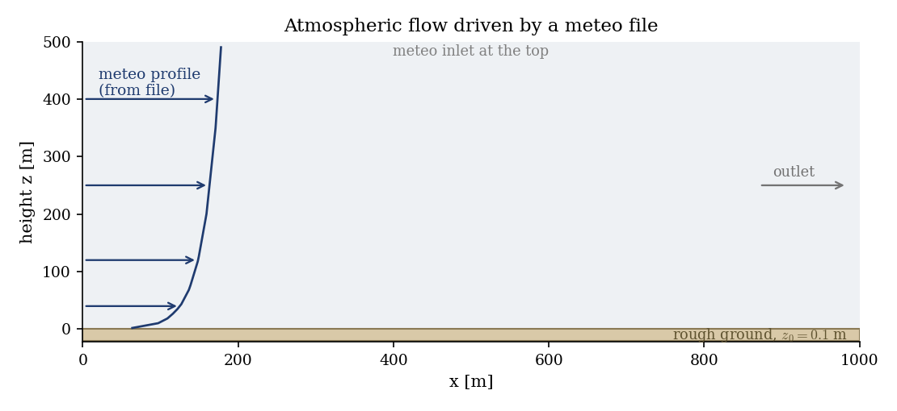
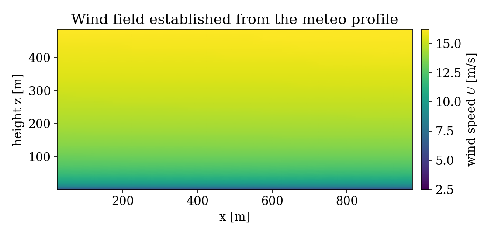
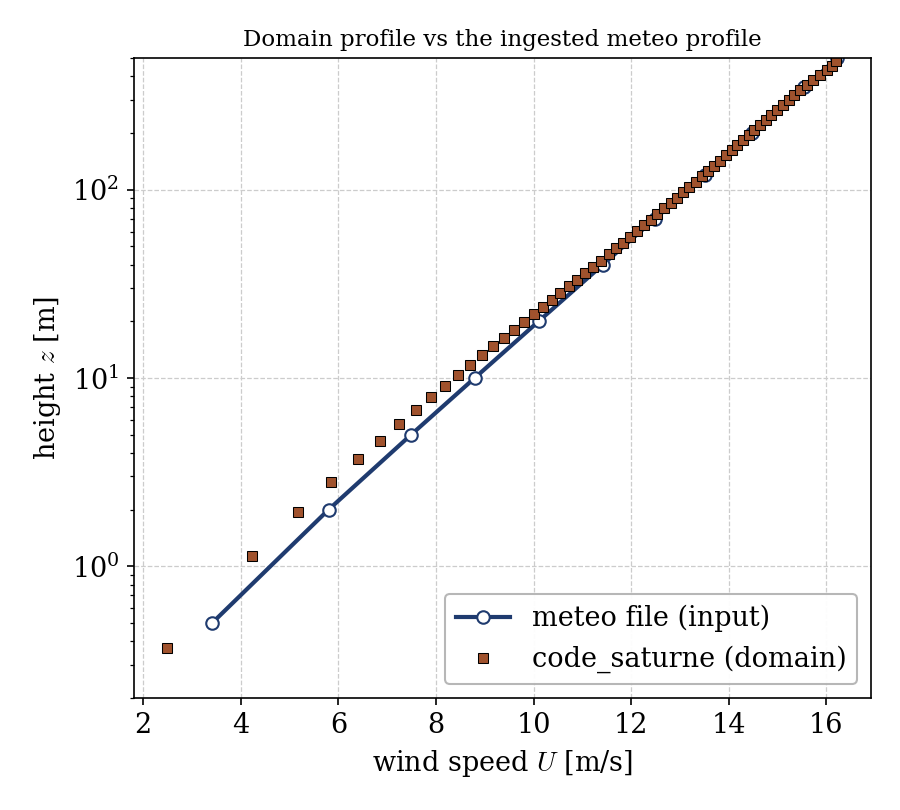

# Reading a Meteo File: Atmospheric Flow from a Vertical Profile (atmo)

A step-by-step tutorial for the **meteo-file workflow** of the atmospheric flows
module (`atmo`) in **code_saturne**. Real atmospheric simulations are driven by
measured or forecast **vertical profiles** of wind, temperature and turbulence.
This tutorial shows how to provide such a profile in a **meteo file**, have
code_saturne ingest it, and use it to initialize the domain and drive the open
boundaries. The showcased feature is `read_meteo_data`: the atmospheric
preprocessor reads the profile and applies it automatically at the inlets.

Maintained by [Simvia](https://Simvia.tech/fr), part of the
[tutoriel-code_saturne](https://github.com/simvia-tech/tutorials-code_saturne) collection.

## Learning objectives

After completing this tutorial you will be able to:

1. Write a **meteo file** in code_saturne's format (date, location, sea-level
   pressure, temperature profile, wind profile).
2. Enable **`read_meteo_data`** in the atmospheric (dry) model.
3. Impose the meteo profile at the open boundaries with a **`CS_INLET`** whose
   values are filled from the profile by the atmospheric module.
4. Check that the domain reproduces the ingested profile.

## Prerequisites

| Requirement | Detail |
|---|---|
| code_saturne | **v9.1** |
| Tutorials | [Atmo_Neutral_BoundaryLayer](../Atmo_Neutral_BoundaryLayer) (neutral surface layer, rough wall, log law) |

If code_saturne is not yet installed, build it from the
[official homepage](https://code-saturne.org/), pull a
ready-to-use Singularity image from the
[Open Simulation Center](https://open-simulation-center.org/downloads/code_saturne/code_saturne),
or pull the
[Simvia Docker image](https://hub.docker.com/r/Simvia/code_saturne) before continuing.

## Case files

```
Atmo_Meteo_Profile/
├── CASE/
│   ├── DATA/
│   │   ├── setup.xml                     # dry atmo model, read_meteo_data on, k-epsilon
│   │   └── meteo                         # the meteo file (wind + temperature profile)
│   └── SRC/
│       ├── cs_user_zones.cpp             # boundary zones (inlet/outlet/top/ground/sides)
│       ├── cs_user_boundary_conditions.cpp   # meteo inlet + rough wall (set in C)
│       └── cs_user_initialization.cpp    # initial fields from the profile
├── FIGURES/
└── README.md
```

> No mesh file: the vertical slice is built by the **built-in cartesian mesher**.

> **Why are the boundary conditions in C?** In code_saturne v9.1 the GUI's
> meteo-boundary path is not wired to the preprocessor, so the open boundaries
> are set in `cs_user_boundary_conditions.cpp`: a face marked `CS_INLET` with its
> velocity left unset is filled by the atmospheric module from the meteo profile
> (`cs_atmo_bcond`), interpolated at the face height.

## Physical model

The `atmo` **dry** model transports the potential temperature with buoyancy and
hydrostatic pressure. The `read_meteo_data` option reads a vertical profile from
the **meteo file** and:

- **initializes** the whole domain by interpolating the profile in height, and
- **imposes** the profile at every open boundary marked as an inlet.

The meteo file format is a small fixed layout (comment lines start with `/`):

```
year, quantile(day), hour, minute, second
location x, y (m)
sea-level pressure (Pa)
temperature profile:  n levels, then  altitude(m)  T(degC)  humidity  droplets
wind profile:         n levels, then  altitude(m)  u(m/s)  v(m/s)  k(m2/s2)  eps(m2/s3)
```

Here the profile is a neutral atmosphere (uniform potential temperature $15$°C)
with a logarithmic wind ($u_* = 0.8$ m/s, $z_0 = 0.1$ m) veering from the west,
from $\approx 3.4$ m/s near the ground to $\approx 16$ m/s at $500$ m.

### Setup parameters

| Quantity | Value |
|---|---|
| Domain | $1000 \times 500$ m (vertical slice) |
| Roughness length | $z_0 = 0.1$ m |
| Atmosphere | dry, neutral ($T = 15$°C) |
| Turbulence | $k$-$\varepsilon$ |
| Meteo file | 11-level wind and temperature profiles |

<p align="center">
  
  <br>
  <em>Figure 1: the meteo profile from the file is imposed at the west inlet and the top; the flow passes over the rough ground to the outlet.</em>
</p>

## Geometry and boundary conditions

Vertical slice, $z$ the vertical. The west face and the top are inlets fed by the
meteo profile (`CS_INLET`, `iautom = 1`), the east face is an outlet, the ground
is a rough wall ($z_0 = 0.1$ m, plus a thermal roughness), and the spanwise sides
are symmetry planes. All of this is set in `cs_user_boundary_conditions.cpp`.

## Numerical setup

Dry atmospheric model with `read_meteo_data` on and the meteo file named `meteo`
in `DATA/`. The $k$-$\varepsilon$ fields, the velocity and the potential
temperature are initialized from the profile in `cs_user_initialization.cpp`. The
run advances to a steady state ($2000$ steps).

## Running the simulation

```bash
cd CASE
code_saturne run --n 4
```

The mesh is generated internally and the meteo file is read at start-up (the log
prints `Reading meteo profiles data`). The run writes `CASE/RESU/<id>/` with the
velocity, potential temperature and turbulence fields.

## Results

The flow is horizontally homogeneous over the flat ground and simply carries the
meteo profile across the domain: the wind increases smoothly with height from the
ground to the top, following the ingested profile.

<p align="center">
  
  <br>
  <em>Figure 2: wind speed field. It grows with height as prescribed by the meteo file and stays uniform along the flow, as expected over flat terrain.</em>
</p>

Extracting the vertical wind profile in the domain and comparing it with the
meteo file confirms the ingestion: above the first few metres the domain profile
lies on the meteo input to within one to two percent. The wall-adjacent cells sit
slightly below, where the rough-wall law sets the near-ground gradient.

<p align="center">
  
  <br>
  <em>Figure 3: the domain wind profile (symbols) against the meteo file input (line with circles). The ingested profile is reproduced across the domain.</em>
</p>

## Summary

This tutorial fed code_saturne a meteo file: a vertical profile of wind,
temperature and turbulence, read at start-up by the atmospheric module and used
to initialize the domain and drive the inlets. The resulting flow reproduces the
prescribed profile over flat terrain. The lesson that carries beyond this case:
the meteo file is the entry point for real atmospheric simulations (measured
soundings, forecast profiles), and code_saturne ingests it through
`read_meteo_data`, applying it at inlets marked `CS_INLET`. Real terrain, several
time-stamped profiles, humidity or stratification are then natural extensions of
the same workflow.

## References

- J. R. Garratt. The Atmospheric Boundary Layer, Cambridge University Press, 1992.
- [code_saturne atmospheric flows documentation](https://code-saturne.org/doc/)

## Authors

[Simvia](https://Simvia.tech/fr). Questions, remarks and requests are welcome.
