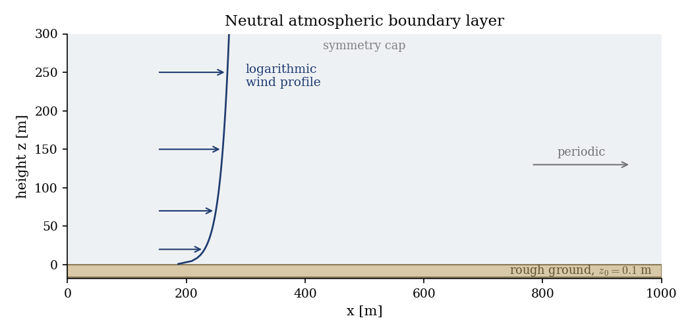
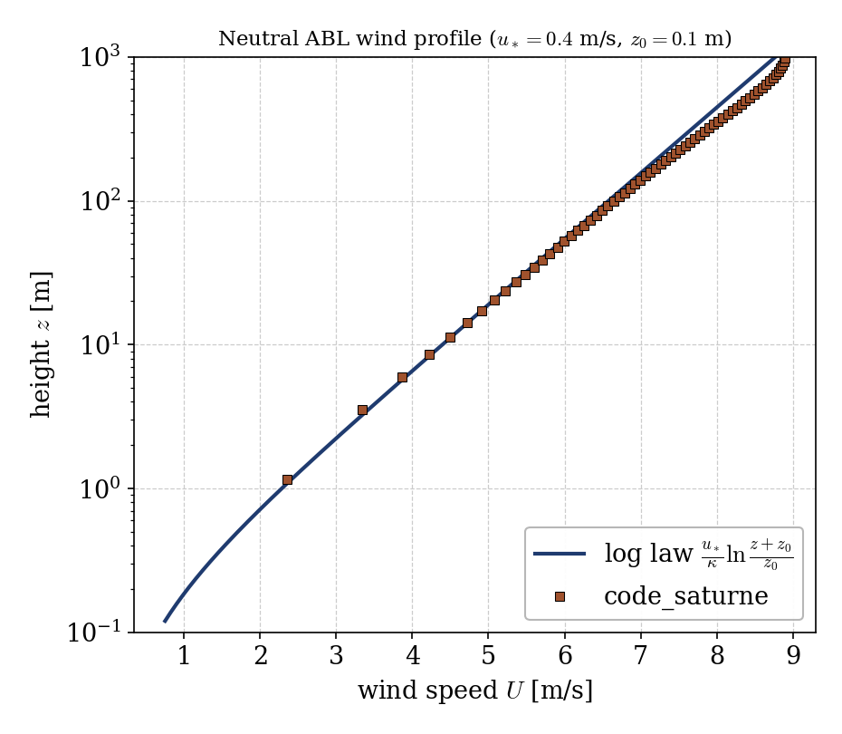

# Neutral Atmospheric Boundary Layer: the Log Law (atmo)

A step-by-step tutorial for the **atmospheric flows module** (`atmo`) of
**code_saturne**: a **neutral atmospheric boundary layer** over flat, rough
terrain. The showcased feature is the atmospheric **surface layer** with a
**rough-wall** boundary (roughness length $z_0$): driven to equilibrium by a
constant pressure gradient, the mean wind settles into the **logarithmic
profile** that is the cornerstone of micrometeorology. It is the atmospheric
cousin of the [turbulent channel](../../10_turbulence_rans/Inc_Turbulent_Channel):
same periodic, source-driven approach, but with a rough ground and validated
against the law of the wall for the atmosphere.

Maintained by [Simvia](https://Simvia.tech/fr), part of the
[tutoriel-code_saturne](https://gitlab.com/Simvia/common-tools/tutoriel-code_saturne) collection.

## Learning objectives

After completing this tutorial you will be able to:

1. Activate the **atmospheric flows** module in neutral mode
   (`atmospheric_flows model="constant"`).
2. Set a **rough-wall** ground boundary with a roughness length $z_0$.
3. Drive a **constant-stress surface layer** with a body force and fix the
   friction velocity $u_*$ by the momentum balance.
4. Validate the mean wind against the **logarithmic law**
   $U(z) = (u_*/\kappa)\ln\big((z+z_0)/z_0\big)$.

## Prerequisites

| Requirement | Detail |
|---|---|
| code_saturne | **v9.1** |
| Tutorials | [Inc_Turbulent_Channel](../../10_turbulence_rans/Inc_Turbulent_Channel) (periodic, source-driven wall turbulence), [Inc_Streamwise_Periodic](../../00_foundations/Inc_Streamwise_Periodic) |

If code_saturne is not yet installed, build it from the
[official homepage](https://www.code-saturne.org/cms/web/Download), pull a
ready-to-use Singularity image from the
[Open Simulation Center](https://open-simulation-center.org/downloads/code_saturne/code_saturne),
or pull the
[Simvia Docker image](https://hub.docker.com/r/Simvia/code_saturne) before continuing.

## Case files

```
Atmo_Neutral_BoundaryLayer/
├── CASE/
│   ├── DATA/setup.xml                    # atmo model, k-epsilon, rough wall, periodicity
│   └── SRC/
│       ├── cs_user_source_terms.cpp      # constant streamwise body force
│       └── cs_user_initialization.cpp    # log-law initial guess (k, epsilon)
├── FIGURES/
└── README.md
```

> No mesh file: the vertical slice is built by the **built-in cartesian mesher**.

## Physical model

Close to the ground, in the absence of buoyancy (neutral stratification), the
mean wind of the atmospheric surface layer follows the **logarithmic law**

$$U(z) = \frac{u_*}{\kappa}\,\ln\!\frac{z + z_0}{z_0},$$

with $u_*$ the friction velocity, $\kappa \approx 0.42$ the von Karman constant
(code_saturne's value), and $z_0$ the aerodynamic roughness length of the
surface. The turbulent kinetic energy is roughly constant in the surface layer,
$k \approx u_*^2/\sqrt{C_\mu}$.

The domain is a vertical slice, periodic in the streamwise direction and capped
by a symmetry plane. A constant horizontal body force $f_x = \rho\,u_*^2/H$
drives the flow; at equilibrium it balances the ground shear stress, so the
friction velocity is fixed by construction, $u_* = \sqrt{f_x H/\rho}$ (exactly
as the momentum source sets $u_\tau$ in the turbulent channel). The ground is a
**rough wall** of roughness $z_0$; turbulence uses the standard $k$-$\varepsilon$
model.

### Flow parameters

| Quantity | Symbol | Value |
|---|---|---|
| Domain height | $H$ | $1000$ m |
| Roughness length | $z_0$ | $0.1$ m (grassland) |
| Friction velocity | $u_*$ | $0.4$ m/s |
| von Karman constant | $\kappa$ | $0.42$ |
| Air density | $\rho$ | $1.225$ kg/m³ |
| Turbulence model | | $k$-$\varepsilon$ |

<p align="center">
  
  <br>
  <em>Figure 1: the neutral boundary layer. A body force drives the flow over a rough ground ($z_0$); the domain is streamwise periodic and capped by a symmetry plane.</em>
</p>

## Geometry and boundary conditions

The slice is $1000$ m tall, graded so the cells are fine near the ground and
coarsen upward. The ground (`ground`, group `Y0`) is a rough wall with
$z_0 = 0.1$ m; the top (`Y1`) and the spanwise sides (`Z0`, `Z1`) are symmetry
planes; the streamwise direction (`X0`/`X1`) is periodic.

## Numerical setup

Neutral atmospheric model ($k$-$\varepsilon$ turbulence), constant density. The
flow is advanced to a steady state ($4000$ steps). `cs_user_source_terms.cpp`
applies the driving body force $f_x = \rho u_*^2/H$; `cs_user_initialization.cpp`
starts the fields from the analytic log profile to speed convergence.

## Running the simulation

```bash
cd CASE
code_saturne run --nprocs 4
```

The mesh is generated internally. The run writes `CASE/RESU/<id>/` with the
velocity, pressure and the turbulence fields $k$ and $\varepsilon$ in
`postprocessing/`.

## Results and verification

**Wind profile.** Plotted against a logarithmic height axis, the computed mean
wind is a straight line that lies on the analytic log law
$U(z) = (u_*/\kappa)\ln((z+z_0)/z_0)$ with $u_* = 0.4$ m/s: the values agree to
within one to two percent over the lower part of the domain (roughly $z \approx 1$
to $150$ m, about two decades). Higher up the wind runs a little faster than the
pure log law, the expected effect of the shear stress falling toward the
symmetry cap.

<p align="center">
  
  <br>
  <em>Figure 2: mean wind versus height. The code_saturne profile (symbols) follows the logarithmic law (line) over the lower part of the domain; the small deviation higher up follows the shear stress decreasing toward the symmetry cap.</em>
</p>

The friction velocity itself is fixed exactly by the momentum balance,
$u_* = \sqrt{f_x H/\rho} = 0.4$ m/s, so the log law is a genuine prediction here,
not a fitted curve: the roughness and the turbulence model together produce the
profile.

## Summary

This tutorial computed a neutral atmospheric boundary layer with the `atmo`
module: a rough ground and a driving pressure gradient produce a constant-stress
surface layer whose mean wind follows the logarithmic law, recovered to within a
couple of percent over two decades of height, with the friction velocity set by
the momentum balance. The lesson that carries beyond this case: the atmospheric
surface layer is set up like the turbulent channel (periodic, source-driven) but
with a rough-wall ground, and the law of the wall becomes the law of the
atmospheric wind. Stratification (stable or convective) and Coriolis effects are
the natural next steps, switching the model from neutral to a thermal
atmosphere.

## References

- J. R. Garratt. The Atmospheric Boundary Layer, Cambridge University Press, 1992.
- R. B. Stull. An Introduction to Boundary Layer Meteorology, Kluwer, 1988.
- [code_saturne documentation](https://www.code-saturne.org/cms/web/documentation)

## Authors

[Simvia](https://Simvia.tech/fr). Questions, remarks and requests are welcome.
