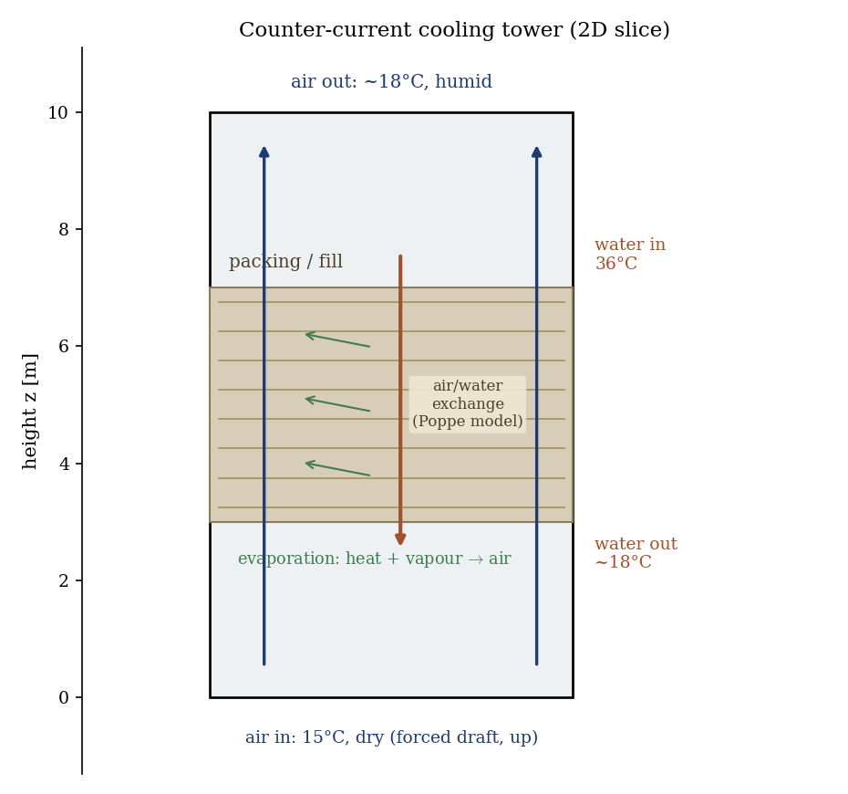
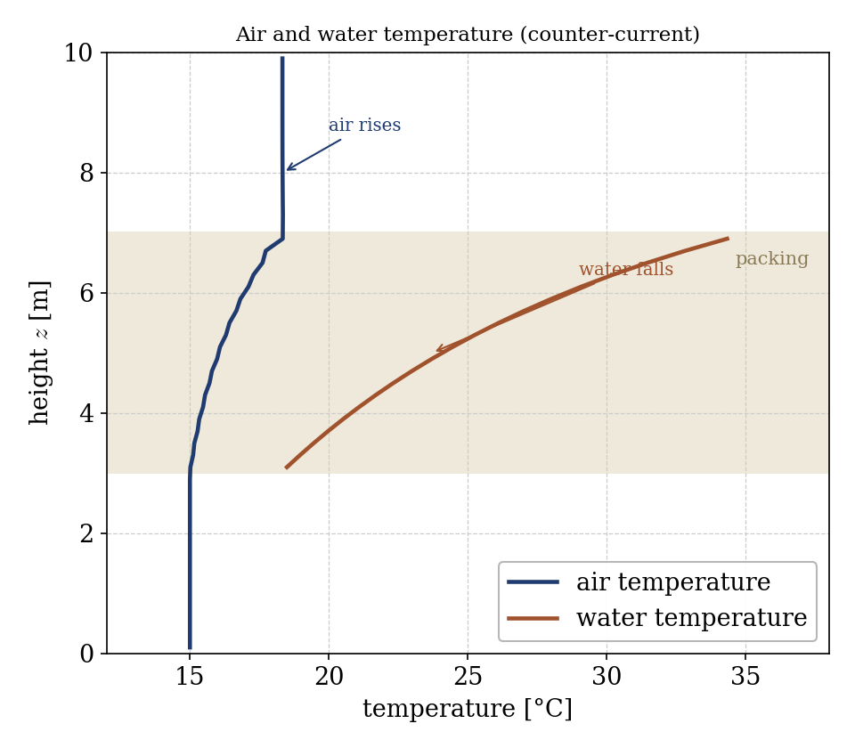
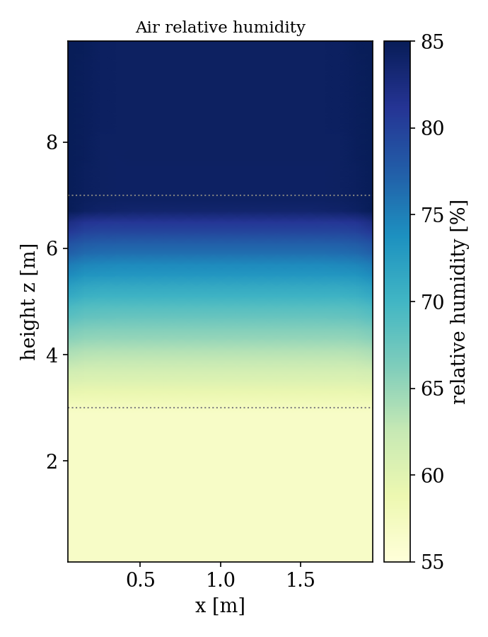

# Counter-current Cooling Tower: Evaporative Cooling (ctwr)

A step-by-step tutorial for the **cooling tower** module (`ctwr`) of
**code_saturne**. A cooling tower rejects heat by **evaporation**: warm water is
sprayed over a packing (fill) and trickles down while air is blown up through it;
part of the water evaporates, cooling the remaining liquid and warming and
humidifying the air. The showcased feature is the ctwr module with an
**exchange (packing) zone** and Poppe's evaporation model, on a simple
**counter-current** tower.

Maintained by [Simvia](https://Simvia.tech/fr), part of the
[tutoriel-code_saturne](https://gitlab.com/Simvia/common-tools/tutoriel-code_saturne) collection.

## Learning objectives

After completing this tutorial you will be able to:

1. Activate the **cooling tower** model (`CS_COOLING_TOWERS`, Poppe evaporation)
   and the dilatable (variable-density) algorithm.
2. Define a **packing exchange zone** with `cs_ctwr_define` (counter-current,
   injected water temperature and flow rate, exchange law).
3. Set humid-air **boundary conditions** (velocity, temperature, humidity) for
   the air inlet and outlet.
4. Read the coupled result: **air warms and humidifies** while the **water
   cools** across the packing.

## Prerequisites

| Requirement | Detail |
|---|---|
| code_saturne | **v9.1** |
| Tutorials | [Atmo_Humid_Cloud](../Atmo_Humid_Cloud) (humid air, saturation), any inlet/outlet case |

If code_saturne is not yet installed, build it from the
[official homepage](https://www.code-saturne.org/cms/web/Download), pull a
ready-to-use Singularity image from the
[Open Simulation Center](https://open-simulation-center.org/downloads/code_saturne/code_saturne),
or pull the
[Simvia Docker image](https://hub.docker.com/r/Simvia/code_saturne) before continuing.

## Case files

```
Ctwr_Counterflow_Tower/
├── CASE/
│   ├── DATA/setup.xml                    # GUI: ctwr model, k-epsilon, mesh, BCs, time
│   └── SRC/
│       ├── cs_user_parameters.cpp        # humid-air thermodynamic properties, evaporation model
│       ├── cs_user_zones.cpp             # packing exchange zone (cs_ctwr_define)
│       ├── cs_user_boundary_conditions.cpp   # inlet values of the model variables
│       └── cs_user_initialization.cpp    # initial humid-air state
├── FIGURES/
└── README.md
```

> No mesh file: the tower slice is built by the **built-in cartesian mesher**.
> Most of the case is set through the **GUI** (`setup.xml`): the cooling tower
> model, the turbulence model, the mesh, the gravity and the standard boundary
> conditions (inlet velocity and temperature, outlet, walls, symmetry). Only what
> the v9.1 GUI does not cover stays in C: the **packing exchange zone** (built
> only by `cs_ctwr_define`), the detailed **humid-air properties** and the
> evaporation model, the **inlet values of the model variables** (humidity, rain,
> packing liquid, which the solver does not read from the GUI here), and the
> initial state.

## Physical model

The cooling tower module solves the **humid air** (velocity, temperature, water
content `ym_water`) coupled to a **liquid water** field in the packing. In the
packing zone, an exchange law transfers **heat and mass** between the falling
water and the rising air: some water evaporates, which

- **cools** the liquid water (latent heat taken from it),
- **warms and humidifies** the air.

The evaporation rate follows **Poppe's model**. The exchange zone is
**counter-current**: water is injected at the top of the packing (here at
$36$°C) and falls, air enters at the bottom and rises, so the hottest water
meets the most humid air at the top and the coolest water meets the driest air
at the bottom, maximizing the exchange.

**How the packing is modelled.** The packing (fill) is **not resolved
geometrically**: there is no honeycomb in the mesh. It is a **sub-grid exchange
model** attached to a volume zone (here the band $3 \le z \le 7$ m, declared with
`cs_ctwr_define`). Inside that zone the model carries the liquid water as extra
fields (its mass fraction and enthalpy) descending counter-current, and adds
**source terms** coupling air and water through the evaporation law: the air
gains heat and vapour, the water loses heat. The exchange intensity is set by the
injected water flow rate, its temperature, the contact surface and the transfer
law constants ($\beta_{x0}$ and its exponent), not by a resolved geometry.

> **Is this a nuclear-plant cooling tower?** The *principle* is the same: the
> big hyperbolic towers are counter-current wet cooling towers with a fill and
> evaporative cooling. But those are **natural draft** (the ~150 m hyperbolic
> chimney creates the airflow by buoyancy), whereas this case is a small
> **forced-draft 2D slice** (the air velocity is imposed at the inlet) that
> demonstrates the fill exchange, not the full tower with its chimney and plume.

### Setup parameters

| Quantity | Value |
|---|---|
| Tower slice | $2 \times 10$ m (packing between $3$ and $7$ m) |
| Air inlet | $0.8$ m/s upward, $15$°C, $6$ g/kg (RH $\approx 60\%$) |
| Injected water | $36$°C, $2$ kg/s over the packing |
| Evaporation model | Poppe |
| Turbulence | $k$-$\varepsilon$ |

<p align="center">
  
  <br>
  <em>Figure 1: the counter-current tower slice. Air rises (blue), water falls through the packing (red); in the fill, the sub-grid exchange (green) moves heat and vapour from the water to the air. Air enters at 15°C dry and leaves ~18°C humid; water enters at 36°C and leaves ~18°C.</em>
</p>

## Geometry and boundary conditions

A 2D vertical slice, $z$ the vertical. The bottom (`Z0`) is the air inlet (upward
velocity, $15$°C, prescribed humidity), the top (`Z1`) is the outlet, the side
walls (`X0`/`X1`) are no-slip and the spanwise faces (`Y0`/`Y1`) are symmetry.
The packing occupies $3 \le z \le 7$ m, where `cs_ctwr_define` injects the water.

## Numerical setup

The cooling tower model is selected in the GUI (atmospheric model `ctwr`). The
dilatable algorithm (`idilat = 2`) and the humid-air properties (heat capacities,
latent heat, liquid density) are set in `cs_user_parameters.cpp` with the
reference ctwr values, and the dilatable/variable-density formulation carries the
buoyancy from temperature and humidity. The run advances to a near-steady state
($2000$ steps).

## Running the simulation

```bash
cd CASE
code_saturne run --nprocs 4
```

The mesh is generated internally. The run writes `CASE/RESU/<id>/` with the
humid-air temperature and humidity, the packing liquid temperature, the
evaporation rate and the exchanged thermal power.

## Results

The counter-current exchange is clear in the vertical profiles. Rising through
the packing, the **air warms** from $15$ to about $18$°C and its water content
grows from $6$ to about $11$ g/kg (relative humidity from $\approx 60$ to
$\approx 80\%$). The **water cools** from its $36$°C injection at the top of the
packing to about $18$°C at the bottom: roughly $17$°C of cooling, the purpose of
the tower.

<p align="center">
  
  <br>
  <em>Figure 2: air and water temperature versus height. The air (rising) warms from 15 to ~18°C; the water (falling through the packing) cools from 36°C at the top to ~18°C at the bottom, the counter-current signature.</em>
</p>

<p align="center">
  
  <br>
  <em>Figure 3: air relative humidity, rising from the inlet value at the bottom to near saturation at the top as the air picks up evaporated water.</em>
</p>

This is a demonstration of the cooling tower module rather than a validated case:
the amount of cooling depends on the packing exchange law, the water flow rate
and the air flow, which are chosen here to give a clear, stable exchange.

## Summary

This tutorial ran a counter-current cooling tower with the ctwr module: humid air
rising through a packing exchanged heat and mass with water injected at $36$°C,
cooling the water by about $17$°C and warming and humidifying the air. The lesson
that carries beyond this case: the cooling tower module couples the humid-air
flow to a liquid water field through an evaporative exchange law in the packing
zone, the basis for modelling industrial wet cooling towers.

## References

- M. Poppe, H. Rögener. Berechnung von Rückkühlwerken, VDI-Wärmeatlas, 1991.
- J. C. Kloppers, D. G. Kröger. A critical investigation into the heat and mass transfer analysis of counterflow wet-cooling towers, Int. J. Heat Mass Transfer 48, 765-777, 2005.
- [code_saturne documentation](https://www.code-saturne.org/cms/web/documentation)

## Authors

[Simvia](https://Simvia.tech/fr). Questions, remarks and requests are welcome.
