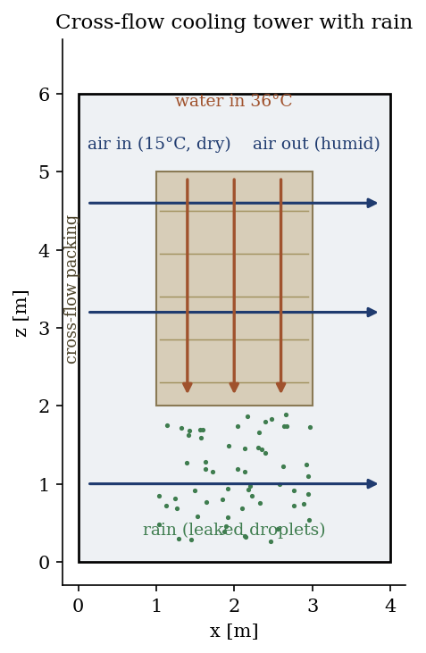
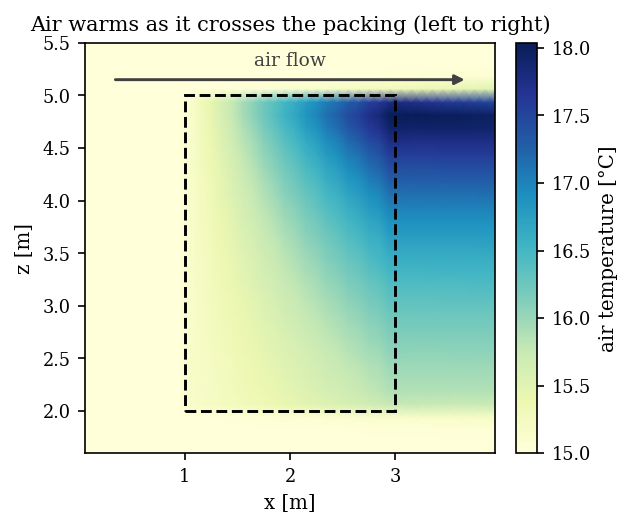
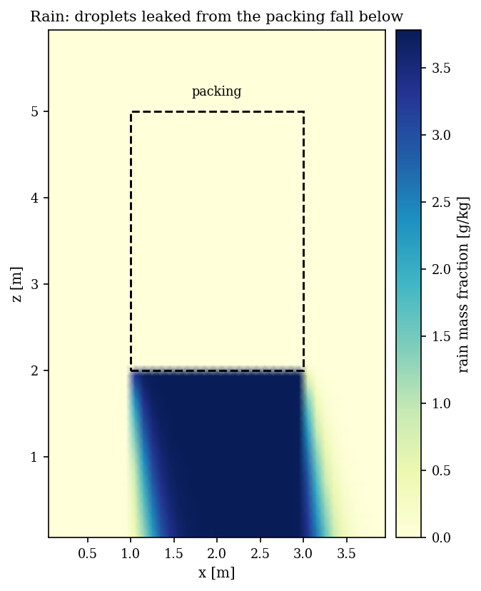

# Cross-flow Cooling Tower with Rain (ctwr)

A step-by-step tutorial exercising two further features of the **cooling tower
module** (`ctwr`) of **code_saturne**, on top of the counter-current base case
([Ctwr_Counterflow_Tower](../Ctwr_Counterflow_Tower)):

1. a **cross-flow** exchange zone (`CS_CTWR_CROSS_CURRENT`): the air flows
   **horizontally** while the water falls **vertically** through the packing, so
   the two streams cross;
2. a **rain zone**: a leakage factor turns part of the injected water into
   **droplets** that leak out of the packing and fall through the domain (the
   rain model).

Maintained by [Simvia](https://Simvia.tech/fr), part of the
[tutoriel-code_saturne](https://github.com/simvia-tech/tutorials-code_saturne) collection.

## Learning objectives

After completing this tutorial you will be able to:

1. Define a **cross-flow** packing exchange zone with `cs_ctwr_define`
   (`CS_CTWR_CROSS_CURRENT`).
2. Activate the **rain model** through a positive leakage factor and see the
   droplets fall below the packing.
3. Read a cross-flow result: the air warms and humidifies **along its path** as
   it crosses the fill, while the water cools falling through it.

## Prerequisites

| Requirement | Detail |
|---|---|
| code_saturne | **v9.1** |
| Tutorials | [Ctwr_Counterflow_Tower](../Ctwr_Counterflow_Tower) (the counter-current base case, read it first) |

If code_saturne is not yet installed, build it from the
[official homepage](https://code-saturne.org/), pull a
ready-to-use Singularity image from the
[Open Simulation Center](https://open-simulation-center.org/downloads/code_saturne/code_saturne),
or pull the
[Simvia Docker image](https://hub.docker.com/r/Simvia/code_saturne) before continuing.

## Case files

```
Ctwr_Crossflow_Rain/
├── CASE/
│   ├── DATA/setup.xml                    # GUI: ctwr model, k-epsilon, mesh, BCs, time
│   └── SRC/
│       ├── cs_user_parameters.cpp        # humid-air properties, evaporation model
│       ├── cs_user_zones.cpp             # cross-flow packing + rain (cs_ctwr_define)
│       ├── cs_user_boundary_conditions.cpp   # inlet values of the model variables
│       └── cs_user_initialization.cpp    # initial humid-air state
├── FIGURES/
└── README.md
```

> As in the base case, the model, turbulence, mesh and standard boundary
> conditions are set through the **GUI**; only the packing exchange zone (built
> by `cs_ctwr_define`), the detailed humid-air properties, the model-variable
> inlet values and the initial state are in C.

## Physical model

The cooling tower physics is the one of the base case (humid air coupled to a
liquid water field through an evaporation law, Poppe model). Two options change:

- **Cross-flow exchange zone.** The packing is declared with
  `CS_CTWR_CROSS_CURRENT`: the air crosses it horizontally while the water falls
  vertically. Unlike the counter-current case, the air warms and humidifies
  **along its horizontal path**, hottest near the top of the fill where the
  water is injected.
- **Rain.** The `cs_ctwr_define` **leakage factor** ($15\%$ here) sends part of
  the injected water out of the packing as **droplets**. code_saturne then
  transports a rain field (mass fraction and temperature of the droplets), which
  falls under gravity below the packing.

### Setup parameters

| Quantity | Value |
|---|---|
| Domain | $4 \times 6$ m (2D slice), packing block $1 \le x \le 3$, $2 \le z \le 5$ |
| Air inlet (left) | $1.5$ m/s horizontal, $15$°C, $6$ g/kg |
| Injected water | $36$°C, cross-flow, $15\%$ leakage to rain |
| Evaporation model | Poppe |
| Turbulence | $k$-$\varepsilon$ |

<p align="center">
  
  <br>
  <em>Figure 1: cross-flow tower. Air crosses the packing horizontally (blue), water falls through it (red), and a fraction leaks as rain (green droplets) below the fill.</em>
</p>

## Geometry and boundary conditions

A 2D slice, $z$ the vertical, $x$ the air-flow direction. The left face (`X0`) is
the air inlet (horizontal velocity, $15$°C), the right face (`X1`) is the outlet,
the top and bottom (`Z0`/`Z1`) are walls and the spanwise faces (`Y0`/`Y1`) are
symmetry. The packing occupies the block $1 \le x \le 3$, $2 \le z \le 5$.

## Numerical setup

Same as the base case (cooling tower model selected in the GUI, dilatable
algorithm and humid-air properties in `cs_user_parameters.cpp`). The packing is
declared cross-current with a positive leakage factor in `cs_user_zones.cpp`. The
run advances to a near-steady state ($3000$ steps).

## Running the simulation

```bash
cd CASE
code_saturne run --n 4
```

## Results

**Cross-flow.** The air warms as it crosses the packing from left to right, from
$15$°C at the inlet to about $17$-$18$°C, hottest near the top of the fill where
the $36$°C water enters. The horizontal gradient is the cross-flow signature (the
counter-current case had a vertical one).

<p align="center">
  
  <br>
  <em>Figure 2: air temperature. The air warms along its path through the packing (dashed block), hottest near the top where the hot water enters.</em>
</p>

**Rain.** The leaked droplets appear at the bottom of the packing and fall as a
column below it, slightly carried downstream by the air. This rain field is
transported by the module (mass fraction and temperature of the droplets).

<p align="center">
  
  <br>
  <em>Figure 3: rain mass fraction. Droplets leak from the packing (dashed block) and fall below, the rain model triggered by the leakage factor.</em>
</p>

This is a demonstration of the two features rather than a validated case; the
rain here is dilute (its own heat exchange is small), its purpose is to show the
droplet model being activated and transported.

## Summary

This tutorial exercised two more cooling tower features: a **cross-flow** packing
(air horizontal, water vertical) and a **rain** zone (droplets leaked from the
packing). The air warms along its horizontal path through the fill and the leaked
water falls as rain below it. With the counter-current base case, the pair covers
the main configurations of the `ctwr` module: counter-current and cross-flow
packings, and the packing and rain exchange paths.

## References

- M. Poppe, H. Rögener. Berechnung von Rückkühlwerken, VDI-Wärmeatlas, 1991.
- J. C. Kloppers, D. G. Kröger. A critical investigation into the heat and mass transfer analysis of counterflow wet-cooling towers, Int. J. Heat Mass Transfer 48, 765-777, 2005.
- [code_saturne documentation](https://code-saturne.org/doc/)

## Authors

[Simvia](https://Simvia.tech/fr). Questions, remarks and requests are welcome.
