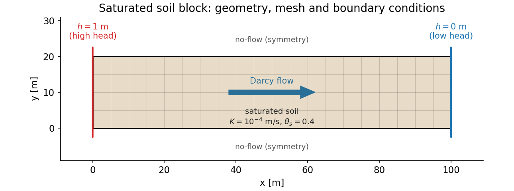
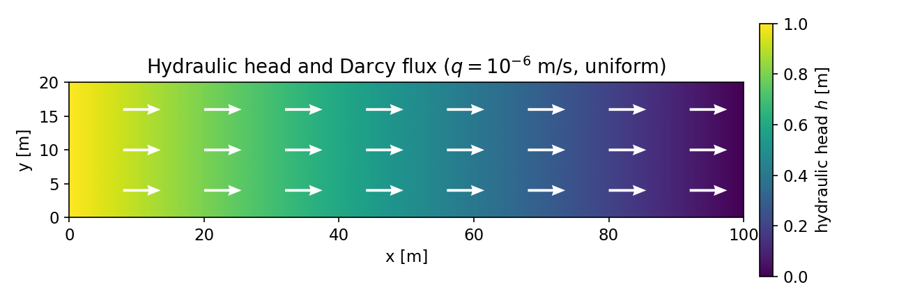
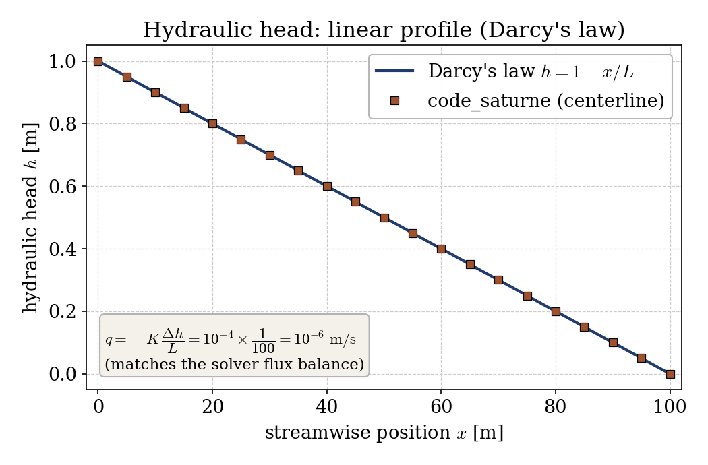
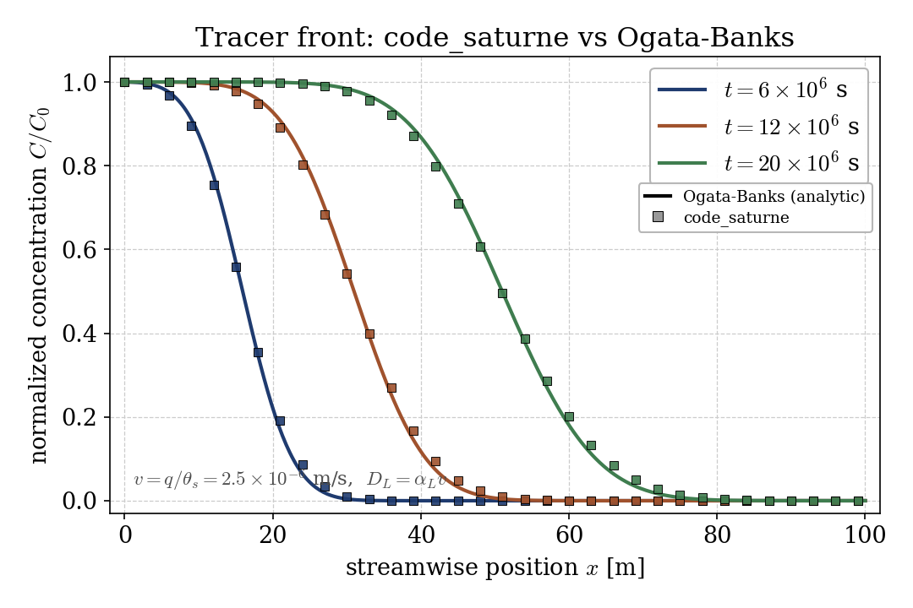

# Groundwater Flow and Tracer Transport in a Saturated Soil (Darcy, CDO)

A step-by-step tutorial for the **groundwater flow (GWF) module** of
**code_saturne**: saturated Darcy flow in a soil block, with a passive tracer
advected by the seepage and spread by mechanical dispersion. The showcased
feature is the **CDO-based groundwater solver** (`cs_gwf_*`): instead of the
Navier-Stokes momentum equation, it solves the elliptic **Richards equation**
for the hydraulic head, derives the **Darcy flux**, and transports a **tracer**
on top of it. The case is validated against two exact references: Darcy's law
(linear head, constant flux) and the Ogata-Banks advection-dispersion solution.

Maintained by [Simvia](https://Simvia.tech/fr), part of the
[tutoriel-code_saturne](https://github.com/simvia-tech/tutorials-code_saturne) collection.

## Learning objectives

After completing this tutorial you will be able to:

1. Activate the **CDO groundwater flow module** (`cs_gwf_activate`) for a
   saturated single-phase problem.
2. Define a **soil** (isotropic permeability, porosity) and a **tracer**
   equation (dispersivity, sorption) entirely from `cs_user_parameters.cpp`.
3. Impose **hydraulic-head** boundary conditions on the Richards equation and
   drive a **Darcy flux** through the domain.
4. Validate the head field against **Darcy's law** and the tracer front against
   the **Ogata-Banks** analytic solution.

## Prerequisites

| Requirement | Detail |
|---|---|
| code_saturne | **v9.1** (built with the CDO module, default) |
| Tutorials | [Inc_Species_Transport](../../00_foundations/Inc_Species_Transport) (scalar transport), [Inc_Porous_Plug](../../40_turbomachinery/Inc_Porous_Plug) (porous media, for contrast) |

If code_saturne is not yet installed, build it from the
[official homepage](https://code-saturne.org/), pull a
ready-to-use Singularity image from the
[Open Simulation Center](https://open-simulation-center.org/downloads/code_saturne/code_saturne),
or pull the
[Simvia Docker image](https://hub.docker.com/r/Simvia/code_saturne) before continuing.

## Case files

```
Gwf_Darcy_Tracer/
├── CASE/
│   ├── DATA/setup.xml               # mesh, time stepping, output only
│   └── SRC/
│       ├── cs_user_zones.cpp        # volume + inlet/outlet boundary zones
│       └── cs_user_parameters.cpp   # GWF model, soil, tracer, BCs, IC
├── FIGURES/
└── README.md
```

> No mesh file: the 2D soil block is built by the **built-in cartesian mesher**.

> **Why is everything in C, not the GUI?** In code_saturne v9.1 the groundwater
> module is driven by the **CDO** framework, activated in `cs_user_model()` with
> `cs_gwf_activate()`. The GUI's legacy groundwater panel is not wired to the
> v9.1 solver, so the model, soil, tracer and boundary conditions are all set in
> `cs_user_parameters.cpp`. The `setup.xml` only carries the mesh, the time
> stepping and the output.

## Physical model

In a **saturated** porous medium, Darcy's law relates the seepage (Darcy) flux
to the gradient of the hydraulic head $h$:

$$\mathbf{q} = -K\,\nabla h,$$

where $K$ is the hydraulic conductivity. Mass conservation of an
incompressible fluid then gives the steady **Richards equation** (here a pure
diffusion equation):

$$\nabla\!\cdot(K\,\nabla h) = 0.$$

The module solves this for $h$, evaluates the Darcy flux $\mathbf{q}$, and
transports a passive **tracer** of normalized concentration $C$:

$$\theta_s\,\frac{\partial C}{\partial t}
  + \nabla\!\cdot(\mathbf{q}\,C)
  - \nabla\!\cdot(\theta_s\,\mathbf{D}\,\nabla C) = 0,$$

with porosity $\theta_s$ and a dispersion tensor built from the longitudinal
and transverse dispersivities $\alpha_L,\alpha_T$. The tracer therefore moves at
the pore (interstitial) velocity $v = q/\theta_s$ and spreads with
$D_L = \alpha_L\,v$.

### Flow and transport parameters

| Quantity | Symbol | Value |
|---|---|---|
| Domain | $L \times H$ | $100 \times 20$ m |
| Grid | $n_x \times n_y$ | $200 \times 20$ (2D) |
| Hydraulic conductivity | $K$ | $10^{-4}$ m/s |
| Porosity | $\theta_s$ | $0.4$ |
| Head difference | $\Delta h$ | $1$ m over $L$ |
| Longitudinal dispersivity | $\alpha_L$ | $1$ m |
| Transverse dispersivity | $\alpha_T$ | $0.1$ m |
| Darcy flux | $q = K\,\Delta h/L$ | $10^{-6}$ m/s |
| Pore velocity | $v = q/\theta_s$ | $2.5\times10^{-6}$ m/s |

<p align="center">
  
  <br>
  <em>Figure 1: geometry, mesh and boundary conditions. A head difference between the left and right faces drives a left-to-right Darcy flow; top and bottom are no-flow.</em>
</p>

## Geometry and boundary conditions

The domain is a rectangular soil block. The two streamwise faces carry imposed
hydraulic heads (Richards equation Dirichlet BCs): $h = 1$ m at the inlet
(`left`, group `X0`) and $h = 0$ m at the outlet (`right`, group `X1`). The top
and bottom faces are no-flow (`CS_BOUNDARY_SYMMETRY`, the CDO default). The
tracer is injected at the inlet at $C = 1$; the domain starts tracer-free
($C = 0$).

## Numerical setup

| Setting | Value | Rationale |
|---|---|---|
| Model | saturated, single phase (`CS_GWF_MODEL_SATURATED_SINGLE_PHASE`) | full saturation, no unsaturated zone |
| Discretization | CDO vertex-based | native framework of the v9.1 GWF module |
| Richards equation | steady | saturated flow with fixed head BCs |
| Tracer equation | unsteady | transient advection-dispersion |
| Time step | $\Delta t = 10^{5}$ s | large steps allowed (implicit) |
| Duration | $200$ steps ($2\times10^{7}$ s) | tracer front reaches mid-domain |

The Richards equation is solved once (it is steady); the Darcy flux is then
constant in time and the tracer equation is advanced over the $200$ steps.

## Running the simulation

```bash
cd CASE
code_saturne run --n 4
```

The mesh is generated internally. The run writes `CASE/RESU/<id>/` with the
hydraulic head, the tracer concentration `C` and the Darcy flux field in
`postprocessing/`, plus the Darcy flux balance across the boundary zones in
`run_solver.log`.

## Results and verification

**Hydraulic head and Darcy flux.** With a uniform conductivity the Richards
equation has an exact linear solution $h(x) = 1 - x/L$, and the Darcy flux is
uniform. The solver reproduces both: the head is linear to machine precision,
and the flux balance in the log reads $q_x = 10^{-6}$ m/s (with $q_y, q_z$ at
numerical zero), matching $q = K\,\Delta h/L = 10^{-4}\times(1/100)$ exactly.

<p align="center">
  
  <br>
  <em>Figure 2: hydraulic head field and the uniform Darcy flux ($q = 10^{-6}$ m/s).</em>
</p>

<p align="center">
  
  <br>
  <em>Figure 3: centerline head versus the analytic Darcy solution. The flux follows directly from the slope.</em>
</p>

**Tracer front.** For continuous injection into a semi-infinite column with a
uniform velocity, the advection-dispersion equation has the Ogata-Banks (1961)
solution

$$\frac{C}{C_0} = \tfrac12\left[\operatorname{erfc}\!\frac{x - v t}{2\sqrt{D_L t}}
  + \exp\!\Big(\frac{v x}{D_L}\Big)\operatorname{erfc}\!\frac{x + v t}{2\sqrt{D_L t}}\right].$$

With $v = q/\theta_s = 2.5\times10^{-6}$ m/s and $D_L = \alpha_L v$, the computed
front matches the analytic curve at every output time: the front advances at the
pore velocity ($x_{0.5}\approx v t$) and broadens as $\sqrt{D_L t}$.

<p align="center">
  
  <br>
  <em>Figure 4: tracer front (symbols) versus the Ogata-Banks solution (lines) at three times. The pore velocity and the dispersive spreading are both recovered.</em>
</p>

The agreement confirms the whole chain: the head solve, the derived Darcy flux,
and the dispersive transport on top of it. The only visible departure is a
sub-percent lead of the numerical front at the latest time, the expected effect
of the finite (semi-infinite in the analytic model) column length.

## Summary

This tutorial solved a saturated groundwater flow with the CDO groundwater
module: the Richards equation fixed a linear hydraulic head and a uniform Darcy
flux ($q = K\,\Delta h/L$), and a passive tracer injected at the inlet was
advected and dispersed on top of it. Both the head (Darcy's law) and the tracer
front (Ogata-Banks) match their exact references. The lesson that carries beyond
this case: in code_saturne the groundwater module replaces the momentum equation
with Darcy's law and is set up through the CDO API in `cs_user_parameters.cpp`,
a different workflow from the finite-volume Navier-Stokes cases.

## References

- A. Ogata, R. B. Banks. A solution of the differential equation of longitudinal dispersion in porous media, U.S. Geological Survey Professional Paper 411-A, 1961.
- J. Bear. Dynamics of Fluids in Porous Media, Elsevier, 1972.
- [code_saturne documentation](https://code-saturne.org/doc/)

## Authors

[Simvia](https://Simvia.tech/fr). Questions, remarks and requests are welcome.
