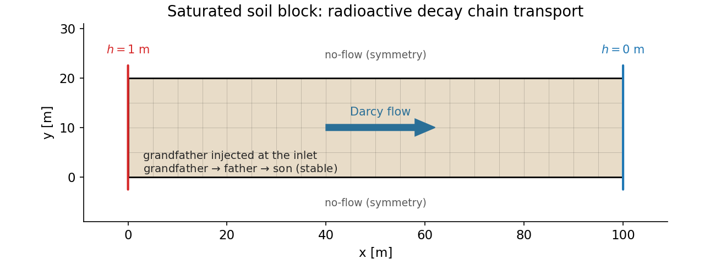
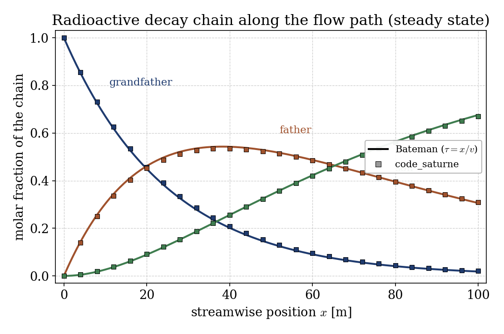
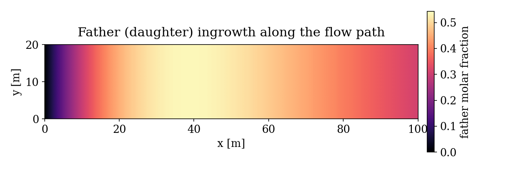

# Radioactive Decay Chain in a Groundwater Flow (CDO)

A step-by-step tutorial for **reactive multi-species transport** in the
**groundwater flow (GWF) module** of **code_saturne**: the same saturated Darcy
flow as [Gwf_Darcy_Tracer](../Gwf_Darcy_Tracer), now carrying a **three-member
radioactive decay chain**. The showcased feature is
`cs_gwf_add_decay_chain`: a set of coupled tracer equations linked by
first-order decay (parent loss feeds daughter gain). A parent is injected at the
inlet; as the water migrates, the parent decays, the intermediate grows then
decays (ingrowth), and the stable end member accumulates. The steady-state
profiles are validated against the **Bateman** solution.

Maintained by [Simvia](https://Simvia.tech/fr), part of the
[tutoriel-code_saturne](https://github.com/simvia-tech/tutorials-code_saturne) collection.

## Learning objectives

After completing this tutorial you will be able to:

1. Define a **radioactive decay chain** of coupled tracers with
   `cs_gwf_add_decay_chain` and set each species' decay constant.
2. Understand how **ingrowth** works: a daughter with no inlet source appears
   from the decay of its parent, peaks, then decays into the next member.
3. Exploit the **advection-dominated** regime, where a water parcel ages by its
   travel time $\tau = x/v$, to map a spatial profile onto a time solution.
4. Validate the whole chain against the **Bateman** equations and check molar
   conservation.

## Prerequisites

| Requirement | Detail |
|---|---|
| code_saturne | **v9.1** (built with the CDO module, default) |
| Tutorials | [Gwf_Darcy_Tracer](../Gwf_Darcy_Tracer) (saturated Darcy + tracer base case), [Gwf_Sorption_Retardation](../Gwf_Sorption_Retardation) (a second tracer feature) |

If code_saturne is not yet installed, build it from the
[official homepage](https://code-saturne.org/), pull a
ready-to-use Singularity image from the
[Open Simulation Center](https://open-simulation-center.org/downloads/code_saturne/code_saturne),
or pull the
[Simvia Docker image](https://hub.docker.com/r/Simvia/code_saturne) before continuing.

## Case files

```
Gwf_Radioactive_Chain/
├── CASE/
│   ├── DATA/setup.xml               # mesh, time stepping, output
│   └── SRC/
│       ├── cs_user_zones.cpp        # volume + inlet/outlet boundary zones
│       └── cs_user_parameters.cpp   # GWF model, soil, decay chain, BCs
├── FIGURES/
└── README.md
```

> No mesh file: the 2D soil block is built by the **built-in cartesian mesher**.
> The flow setup is that of [Gwf_Darcy_Tracer](../Gwf_Darcy_Tracer); the tracer
> is replaced by a three-member decay chain.

## Physical model

The flow is the saturated Darcy flow of the base case: a linear hydraulic head
and a uniform Darcy flux $\mathbf{q} = -K\,\nabla h$, giving a pore velocity
$v = q/\theta_s$.

A radioactive chain links three species by first-order decay,

$$\text{grandfather} \xrightarrow{\lambda_A} \text{father}
  \xrightarrow{\lambda_B} \text{son (stable)},$$

each transported by the Darcy flux. In molar units every decay is one-to-one, so
the parent's loss is the daughter's source and the total
$A + B + C$ is conserved along the flow.

With a small dispersivity the transport is **advection dominated**: a water
parcel simply ages by its travel time $\tau = x/v$ as it moves downstream.
Neglecting dispersion, the steady-state spatial profiles are therefore the
**Bateman** solution evaluated at $\tau = x/v$ (with $A_0 = 1$, $B_0 = C_0 = 0$
and a stable son):

$$A = e^{-\lambda_A\tau}, \quad
  B = \frac{\lambda_A}{\lambda_B-\lambda_A}\left(e^{-\lambda_A\tau}-e^{-\lambda_B\tau}\right),
  \quad C = 1 - A - B.$$

### Flow and chain parameters

| Quantity | Symbol | Value |
|---|---|---|
| Domain | $L \times H$ | $100 \times 20$ m |
| Hydraulic conductivity | $K$ | $10^{-4}$ m/s |
| Porosity | $\theta_s$ | $0.4$ |
| Pore velocity | $v = q/\theta_s$ | $2.5\times10^{-6}$ m/s |
| Longitudinal dispersivity | $\alpha_L$ | $0.5$ m (advection dominated, $Pe \approx 200$) |
| Grandfather decay constant | $\lambda_A$ | $10^{-7}$ s⁻¹ |
| Father decay constant | $\lambda_B$ | $4\times10^{-8}$ s⁻¹ |
| Son decay constant | $\lambda_C$ | $0$ (stable) |

<p align="center">
  
  <br>
  <em>Figure 1: geometry, mesh and boundary conditions. Only the grandfather is injected; the father and son appear from decay along the flow path.</em>
</p>

## Geometry and boundary conditions

The soil block and flow BCs are those of the base case: $h = 1$ m at the inlet
(`left`, `X0`), $h = 0$ m at the outlet (`right`, `X1`), no-flow top and bottom.
At the inlet the grandfather is imposed at $C = 1$ and the two daughters at
$C = 0$, so the profiles start from the Bateman initial condition ($\tau = 0$).

## Numerical setup

Saturated single-phase CDO model, steady Richards equation, unsteady tracer
equations. The chain is declared with `cs_gwf_add_decay_chain` (three species,
mole units); each species gets the same transport parameters via
`cs_gwf_tracer_set_soil_param` (no molecular diffusion, $\alpha_L = 0.5$ m, no
sorption). The run uses $\Delta t = 10^5$ s for $1200$ steps ($1.2\times10^8$ s),
long enough to reach steady state (about three domain transit times).

## Running the simulation

```bash
cd CASE
code_saturne run --nprocs 4
```

The mesh is generated internally. The run writes `CASE/RESU/<id>/` with the
hydraulic head and the three species `grandfather`, `father` and `son` in
`postprocessing/`.

## Results and verification

At steady state the three species partition along the flow path exactly as the
Bateman solution predicts: the grandfather decays from the inlet, the father
grows to a maximum near $x \approx 39$ m and then decays, and the stable son
accumulates monotonically. The computed molar fractions match the Bateman curves
$A(x/v)$, $B(x/v)$, $C(x/v)$ across the whole domain, and the three sum to one to
better than $10^{-6}$ (molar conservation of the chain).

<p align="center">
  
  <br>
  <em>Figure 2: chain profiles at steady state (symbols) versus the Bateman solution mapped through $\tau = x/v$ (lines). The father ingrowth peak and the son accumulation are both recovered.</em>
</p>

The only visible departure is a slight excess of the parent downstream, the
expected footprint of the finite dispersion (the mapping $\tau = x/v$ is exact
only in the zero-dispersion limit).

<p align="center">
  
  <br>
  <em>Figure 3: father (daughter) field. It is absent at the inlet, grows to a maximum where the grandfather has partly decayed, then fades as it decays into the son.</em>
</p>

## Summary

This tutorial carried a three-member radioactive decay chain through the
saturated Darcy flow of the base case. Only the parent is injected; the
intermediate and the stable end member appear from decay, giving the classic
ingrowth picture. Because the transport is advection dominated, the steady-state
spatial profiles reproduce the Bateman time solution through $\tau = x/v$, and
the chain conserves moles to round-off. The lesson that carries beyond this case:
a decay chain is a set of tracer equations coupled by reaction source terms, set
up in `cs_user_parameters.cpp` with a single `cs_gwf_add_decay_chain` call, and
the groundwater module transports and reacts them together.

## References

- H. Bateman. The solution of a system of differential equations occurring in the theory of radioactive transformations, Proc. Cambridge Philos. Soc. 15, 423-427, 1910.
- M. Th. van Genuchten. Convective-dispersive transport of solutes involved in sequential first-order decay reactions, Computers & Geosciences 11, 129-147, 1985.
- [code_saturne documentation](https://code-saturne.org/doc/)

## Authors

[Simvia](https://Simvia.tech/fr). Questions, remarks and requests are welcome.
