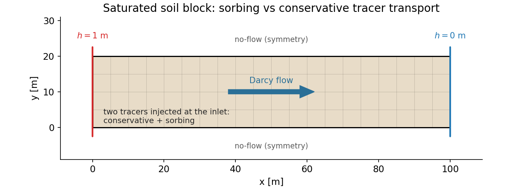
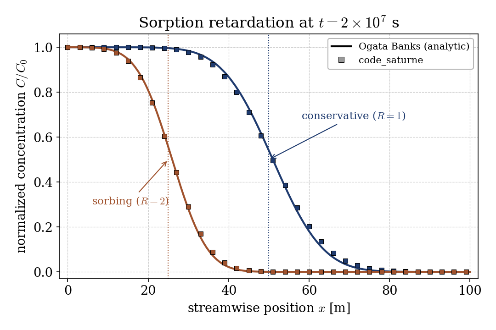
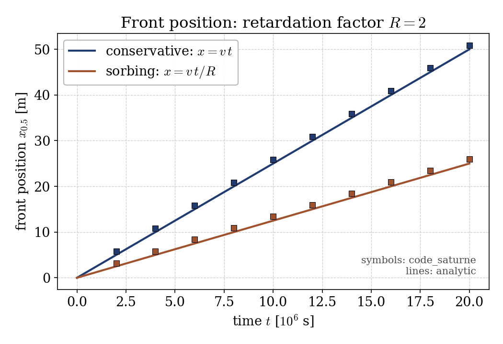

# Sorption Retardation of a Groundwater Tracer (CDO)

A step-by-step tutorial for **reactive transport** in the **groundwater flow
(GWF) module** of **code_saturne**: the same saturated Darcy flow as
[Gwf_Darcy_Tracer](../Gwf_Darcy_Tracer), but now the tracer **adsorbs onto the
soil**. The showcased feature is **linear equilibrium sorption**: two tracers
are injected side by side, one conservative (no sorption) and one sorbing, and
the sorbing front is **retarded** by the factor
$R = 1 + \rho_b\,k_d/\theta_s$. The case is validated against the retarded
Ogata-Banks solution.

Maintained by [Simvia](https://Simvia.tech/fr), part of the
[tutoriel-code_saturne](https://github.com/simvia-tech/tutorials-code_saturne) collection.

## Learning objectives

After completing this tutorial you will be able to:

1. Add **several tracers** to one groundwater calculation and give each its own
   transport parameters.
2. Activate **linear sorption** through the distribution coefficient $k_d$ and
   understand the resulting **retardation factor** $R$.
3. Read the retardation directly from the **front positions** (a sorbing plume
   lags a conservative one by $R$).
4. Validate both fronts against the **retarded Ogata-Banks** solution.

## Prerequisites

| Requirement | Detail |
|---|---|
| code_saturne | **v9.1** (built with the CDO module, default) |
| Tutorials | [Gwf_Darcy_Tracer](../Gwf_Darcy_Tracer) (the saturated Darcy + tracer base case, read it first) |

If code_saturne is not yet installed, build it from the
[official homepage](https://code-saturne.org/), pull a
ready-to-use Singularity image from the
[Open Simulation Center](https://open-simulation-center.org/downloads/code_saturne/code_saturne),
or pull the
[Simvia Docker image](https://hub.docker.com/r/Simvia/code_saturne) before continuing.

## Case files

```
Gwf_Sorption_Retardation/
├── CASE/
│   ├── DATA/setup.xml               # mesh, time stepping, output (as Gwf_Darcy_Tracer)
│   └── SRC/
│       ├── cs_user_zones.cpp        # volume + inlet/outlet boundary zones
│       └── cs_user_parameters.cpp   # GWF model, soil, TWO tracers, BCs
├── FIGURES/
└── README.md
```

> No mesh file: the 2D soil block is built by the **built-in cartesian mesher**.
> The flow setup is identical to [Gwf_Darcy_Tracer](../Gwf_Darcy_Tracer); the
> only change is a second tracer and a non-zero distribution coefficient.

## Physical model

The flow is unchanged from the base case: a saturated soil with a uniform
hydraulic conductivity $K$, driven by two imposed hydraulic heads, gives a
linear head and a uniform Darcy flux $\mathbf{q} = -K\,\nabla h$.

A tracer subject to **linear equilibrium sorption** partitions between the
dissolved phase and the solid grains, $s = k_d\,C$. Its transport equation gains
an accumulation term on the solid:

$$(\theta_s + \rho_b\,k_d)\,\frac{\partial C}{\partial t}
  + \nabla\!\cdot(\mathbf{q}\,C)
  - \nabla\!\cdot(\theta_s\,\mathbf{D}\,\nabla C) = 0,$$

with $\rho_b$ the soil bulk density and $k_d$ the distribution coefficient.
Dividing by $\theta_s + \rho_b k_d$ shows that both the advection and the
dispersion are slowed by the **retardation factor**

$$R = 1 + \frac{\rho_b\,k_d}{\theta_s}.$$

The sorbing front therefore travels at $v/R$ (with $v = q/\theta_s$ the pore
velocity) and spreads as $\sqrt{D_L t / R}$. A conservative tracer ($k_d = 0$,
$R = 1$) is transported in the same run for comparison.

### Flow and transport parameters

| Quantity | Symbol | Value |
|---|---|---|
| Domain | $L \times H$ | $100 \times 20$ m |
| Hydraulic conductivity | $K$ | $10^{-4}$ m/s |
| Porosity | $\theta_s$ | $0.4$ |
| Bulk density | $\rho_b$ | $2000$ kg/m³ |
| Pore velocity | $v = q/\theta_s$ | $2.5\times10^{-6}$ m/s |
| Longitudinal dispersivity | $\alpha_L$ | $1$ m |
| Distribution coefficient (sorbing) | $k_d$ | $2\times10^{-4}$ m³/kg |
| Retardation factor (sorbing) | $R$ | $2$ |

<p align="center">
  
  <br>
  <em>Figure 1: geometry, mesh and boundary conditions. Two tracers are injected at the inlet; only the distribution coefficient differs between them.</em>
</p>

## Geometry and boundary conditions

The soil block and flow BCs are those of the base case: $h = 1$ m at the inlet
(`left`, group `X0`), $h = 0$ m at the outlet (`right`, `X1`), no-flow top and
bottom. Both tracers are injected at $C = 1$ at the inlet; the domain starts
tracer-free.

## Numerical setup

Identical to [Gwf_Darcy_Tracer](../Gwf_Darcy_Tracer): saturated single-phase
CDO model, steady Richards equation, unsteady tracer equations, $\Delta t = 10^5$ s
for $200$ steps ($2\times10^7$ s). The two tracers are declared in
`cs_user_parameters.cpp` with `cs_gwf_add_tracer`, and their sorption is set by
the last argument of `cs_gwf_tracer_set_soil_param` ($k_d = 0$ for the
conservative tracer, $k_d = 2\times10^{-4}$ for the sorbing one).

## Running the simulation

```bash
cd CASE
code_saturne run --nprocs 4
```

The mesh is generated internally. The run writes `CASE/RESU/<id>/` with the
hydraulic head, the two tracer concentrations `Cc` (conservative) and `Cs`
(sorbing), and the Darcy flux in `postprocessing/`.

## Results and verification

**Concentration profiles.** At the final time the conservative front has reached
$x \approx 51$ m (pore velocity $v\,t = 50$ m), while the sorbing front is only
at $x \approx 26$ m: exactly half, the signature of $R = 2$. Both fronts lie on
their retarded Ogata-Banks curves,

$$\frac{C}{C_0} = \tfrac12\,\operatorname{erfc}\!\frac{x - (v/R)\,t}{2\sqrt{(D_L/R)\,t}}
  \;(+\ \text{image term}),$$

with $R = 1$ and $R = 2$ respectively.

<p align="center">
  
  <br>
  <em>Figure 2: conservative and sorbing fronts at $t = 2\times10^{7}$ s (symbols) versus the retarded Ogata-Banks solution (lines). The sorbing plume lags by the factor $R$.</em>
</p>

**Front position in time.** Tracking the $C = 0.5$ crossing of each tracer gives
two straight lines through the origin, of slope $v$ and $v/R$. The computed
front positions fall on the analytic lines at every output time, a direct
measurement of the retardation factor ($R = 2$, the sorbing slope is half).

<p align="center">
  
  <br>
  <em>Figure 3: front position versus time. The ratio of slopes is the retardation factor $R = 2$.</em>
</p>

## Summary

This tutorial added **linear equilibrium sorption** to the saturated
groundwater tracer transport of the base case. Two tracers were carried in a
single run: a conservative one and a sorbing one, differing only by the
distribution coefficient $k_d$. The sorbing front is retarded by
$R = 1 + \rho_b k_d/\theta_s = 2$, and both fronts match the retarded Ogata-Banks
solution, in the concentration profiles and in the front-position history. The
lesson that carries beyond this case: sorption does not change the flow, it
rescales the transport, slowing a reactive plume relative to a conservative one
by a factor that a groundwater model captures through a single soil parameter.

## References

- A. Ogata, R. B. Banks. A solution of the differential equation of longitudinal dispersion in porous media, U.S. Geological Survey Professional Paper 411-A, 1961.
- C. W. Fetter. Contaminant Hydrogeology, 2nd ed., Prentice Hall, 1999.
- [code_saturne documentation](https://code-saturne.org/doc/)

## Authors

[Simvia](https://Simvia.tech/fr). Questions, remarks and requests are welcome.
