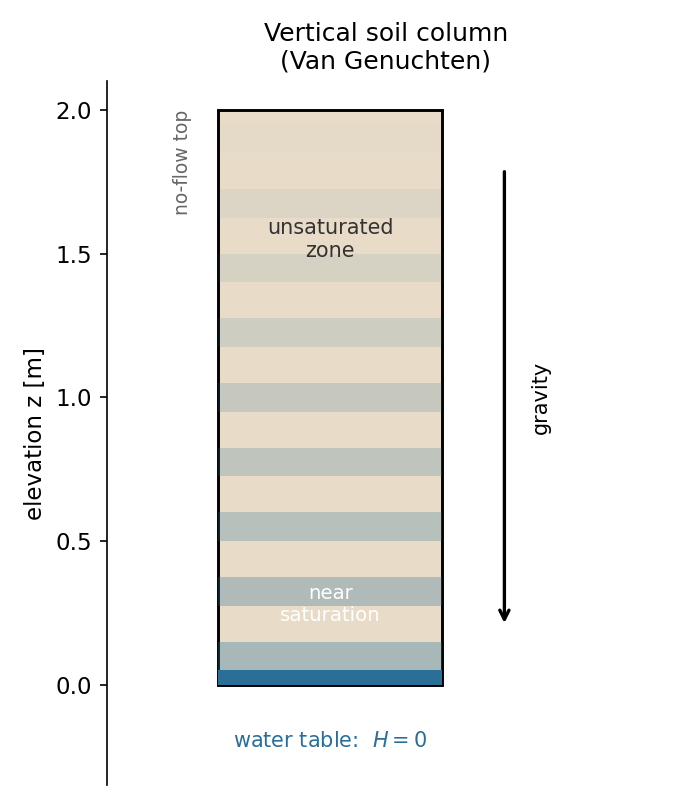
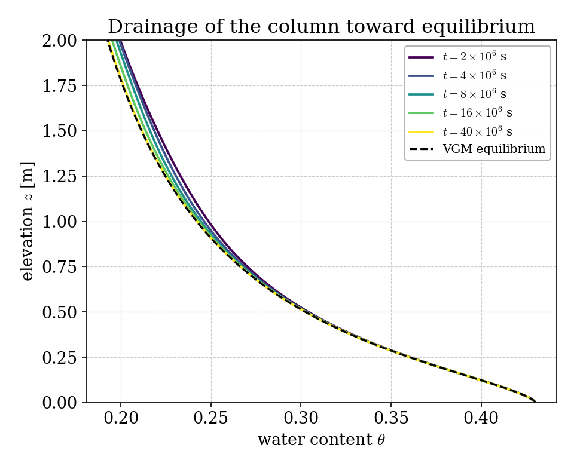
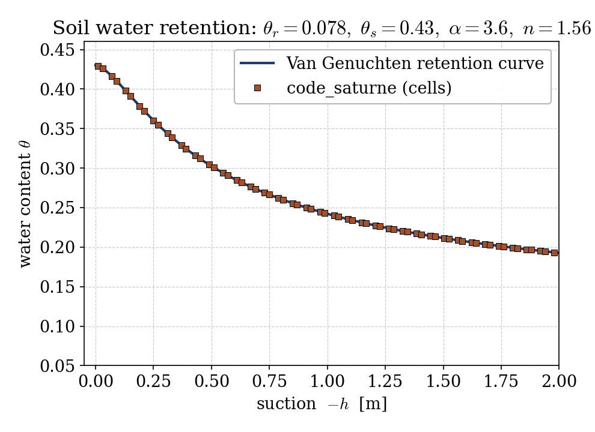

# Unsaturated Flow with the Van Genuchten Model (CDO)

A step-by-step tutorial for **variably saturated flow** in the **groundwater
flow (GWF) module** of **code_saturne**: the nonlinear **Richards equation**
with the **Van Genuchten-Mualem** constitutive laws. Where the saturated cases
([Gwf_Darcy_Tracer](../Gwf_Darcy_Tracer) and the two tracer variants) keep the
soil fully wet, this case resolves the **unsaturated zone**: a soil column drains
toward hydrostatic equilibrium above a water table, and the moisture profile
settles onto the Van Genuchten **retention curve**. That curve, and the constant
equilibrium head, are the validation references.

Maintained by [Simvia](https://Simvia.tech/fr), part of the
[tutoriel-code_saturne](https://github.com/simvia-tech/tutorials-code_saturne) collection.

## Learning objectives

After completing this tutorial you will be able to:

1. Activate the **unsaturated single-phase** groundwater model with gravity
   (`CS_GWF_MODEL_UNSATURATED_SINGLE_PHASE`, `CS_GWF_GRAVITATION`).
2. Define a **Van Genuchten-Mualem** soil (`CS_GWF_SOIL_VGM_SINGLE_PHASE`,
   `cs_gwf_soil_set_vgm_spf_param`).
3. Set a spatially varying **initial hydraulic head** with an analytic function.
4. Understand the **pressure head / elevation** split and validate the drained
   column against the Van Genuchten **retention curve** and hydrostatic
   equilibrium.

## Prerequisites

| Requirement | Detail |
|---|---|
| code_saturne | **v9.1** (built with the CDO module, default) |
| Tutorials | [Gwf_Darcy_Tracer](../Gwf_Darcy_Tracer) (the saturated base case, read it first) |

If code_saturne is not yet installed, build it from the
[official homepage](https://www.code-saturne.org/cms/web/Download), pull a
ready-to-use Singularity image from the
[Open Simulation Center](https://open-simulation-center.org/downloads/code_saturne/code_saturne),
or pull the
[Simvia Docker image](https://hub.docker.com/r/Simvia/code_saturne) before continuing.

## Case files

```
Gwf_Unsaturated_VanGenuchten/
├── CASE/
│   ├── DATA/setup.xml               # vertical column mesh, time stepping, output
│   └── SRC/
│       ├── cs_user_zones.cpp        # volume zone + bottom (water table) zone
│       └── cs_user_parameters.cpp   # GWF model, VGM soil, gravity, BC/IC
├── FIGURES/
└── README.md
```

> No mesh file: the vertical column is built by the **built-in cartesian mesher**.

## Physical model

In an **unsaturated** porous medium the pores are only partly water-filled, and
both the water content and the conductivity depend on the **pressure head** $h$
(negative = suction). The flow obeys the **Richards equation**

$$\frac{\partial \theta(h)}{\partial t}
  = \nabla\!\cdot\!\big(K(h)\,\nabla H\big),\qquad H = h + z,$$

with $H$ the hydraulic head and $z$ the elevation. code_saturne closes it with
the **Van Genuchten-Mualem** laws:

$$S_e = \big[1 + |\alpha h|^{n}\big]^{-m},\quad m = 1 - \tfrac1n,\qquad
  \theta = \theta_r + S_e\,(\theta_s - \theta_r),$$
$$K = K_s\,S_e^{L}\big[1 - (1 - S_e^{1/m})^{m}\big]^{2}.$$

A soil column, initially saturated, sits on a fixed **water table** ($H = 0$) and
is closed at the top. Water drains down and out the bottom until the flux
vanishes. At that **hydrostatic equilibrium** $H$ is uniform, so the pressure
head is $h = H - z = -z$: the moisture content then follows the retention curve
$\theta(-z)$, decreasing from saturation at the water table to residual values
higher up (the capillary fringe).

### Soil parameters (a silt-loam type soil)

| Quantity | Symbol | Value |
|---|---|---|
| Column height | $H_\mathrm{col}$ | $2$ m ($100$ cells) |
| Saturated conductivity | $K_s$ | $2.9\times10^{-6}$ m/s |
| Saturated water content | $\theta_s$ | $0.43$ |
| Residual water content | $\theta_r$ | $0.078$ |
| Van Genuchten scaling | $\alpha$ | $3.6$ m⁻¹ |
| Van Genuchten shape | $n$ | $1.56$ |
| Mualem tortuosity | $L$ | $0.5$ |

<p align="center">
  
  <br>
  <em>Figure 1: the vertical column. A fixed water table at the bottom ($H = 0$) and a no-flow top; the column drains under gravity to a capillary-fringe moisture profile.</em>
</p>

## Geometry and boundary conditions

The column is vertical ($y$ is the elevation). The bottom face (`bottom`, group
`Y0`) is the water table with an imposed hydraulic head $H = 0$; every other face
is no-flow (`CS_BOUNDARY_SYMMETRY`). The column starts fully saturated: the
initial hydraulic head is set to $H = y$ (pressure head zero everywhere) with an
analytic function.

## Numerical setup

Unsaturated single-phase CDO model with gravity. The Richards equation is
nonlinear (through $\theta(h)$ and $K(h)$) and unsteady; the run uses
$\Delta t = 10^4$ s for $4000$ steps ($4\times10^7$ s), long enough for the
column to reach hydrostatic equilibrium (the dry upper soil has a very low
conductivity, so the last approach to equilibrium is slow).

> **Elevation direction.** The module builds the pressure head as
> $h = H - (\mathbf{x}\cdot\mathbf{g})$, so the vector `gravity` is used as the
> unit vector along which the elevation head is measured. For a column vertical
> along $+y$ it is set to $(0, 1, 0)$ in `cs_user_model`, giving $h = H - y$.

## Running the simulation

```bash
cd CASE
code_saturne run --nprocs 4
```

The mesh is generated internally. The run writes `CASE/RESU/<id>/` with the
hydraulic head, the pressure head, the liquid saturation (water content) and the
permeability in `postprocessing/`.

## Results and verification

**Drainage to equilibrium.** Starting from saturation, the column drains from the
top downward. The moisture profiles at successive times converge onto the
Van Genuchten equilibrium profile $\theta(-z)$; at the final time the hydraulic
head is uniform to $H \lesssim 0.01$ m (hydrostatic equilibrium) and the pressure
head is $h = -z$ to within $0.01$ m over the whole column.

<p align="center">
  
  <br>
  <em>Figure 2: water content $\theta(z)$ at successive times, draining toward the Van Genuchten equilibrium profile (dashed). The lower soil stays near saturation; the upper soil dries to the capillary-fringe values.</em>
</p>

**Retention curve.** Plotting the computed water content of every cell against its
pressure head recovers the **Van Genuchten retention curve** exactly (maximum
deviation $4\times10^{-4}$): from $\theta_s = 0.43$ at zero suction down toward
the residual content at $2$ m of suction. This is the constitutive law the solver
integrates, verified pointwise across the column.

<p align="center">
  
  <br>
  <em>Figure 3: soil water retention curve. The cell values (symbols) lie on the Van Genuchten curve (line), confirming the constitutive model.</em>
</p>

## Summary

This tutorial solved a nonlinear, variably saturated flow with the unsaturated
groundwater model: a saturated column drained under gravity to hydrostatic
equilibrium above a water table. The equilibrium hydraulic head is uniform and
the moisture profile follows the Van Genuchten retention curve, both recovered by
the solver to better than $10^{-2}$ m and $10^{-3}$ in water content. The lesson
that carries beyond this case: unsaturated groundwater flow adds the strongly
nonlinear $\theta(h)$ and $K(h)$ closures to Darcy's law, and code_saturne
provides them through the Van Genuchten-Mualem soil model, set up with a single
`cs_gwf_soil_set_vgm_spf_param` call.

## References

- M. Th. van Genuchten. A closed-form equation for predicting the hydraulic conductivity of unsaturated soils, Soil Science Society of America Journal 44, 892-898, 1980.
- Y. Mualem. A new model for predicting the hydraulic conductivity of unsaturated porous media, Water Resources Research 12, 513-522, 1976.
- [code_saturne documentation](https://www.code-saturne.org/cms/web/documentation)

## Authors

[Simvia](https://Simvia.tech/fr). Questions, remarks and requests are welcome.
