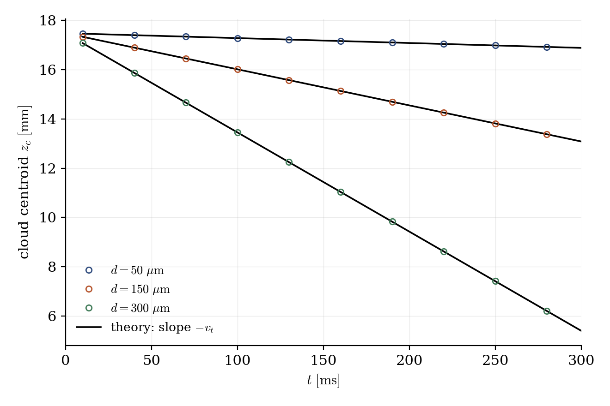
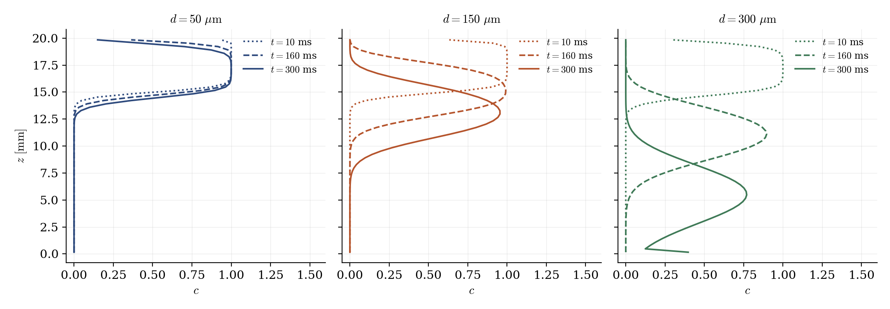

# Settling Clouds with Drift Scalars (Eulerian)

A step-by-step tutorial for the **drift-flux scalars** of **code_saturne**: three concentration fields, representing the same glass bead classes as the discrete particles of [Lag_Settling_Particle](../Lag_Settling_Particle), settle as Eulerian clouds in a box of quiescent water. The two cases form a deliberate pair: the **same physics** treated by the two approaches available in code_saturne, discrete particles (Lagrangian) versus concentration fields with a drift velocity (Eulerian). The cloud centroids fall at exactly the terminal velocities of the discrete beads.

Maintained by [Simvia](https://Simvia.tech/fr), part of the
[tutoriel-code_saturne](https://gitlab.com/Simvia/common-tools/tutoriel-code_saturne) collection.

## Learning objectives

After completing this tutorial you will be able to:

1. Turn user scalars into **drift scalars** (`drift_scalar_model` flags in `cs_user_parameters.cpp`: not exposed in the GUI).
2. Prescribe the **settling law** through the relaxation-time field `<scalar>_drift_tau` (`cs_user_physical_properties.cpp`), and understand that this choice *is* the drag model.
3. Control the **drift flux at the boundaries** (`CS_DRIFT_SCALAR_ZERO_BNDY_FLUX`), without which walls act as particle reservoirs.
4. Choose between the **Lagrangian and Eulerian** descriptions of a dispersed phase.

## Prerequisites

| Requirement | Detail |
|---|---|
| code_saturne | **v9.1** |
| Case | [Lag_Settling_Particle](../Lag_Settling_Particle) (the Lagrangian half of the pair, and the physics of the drag laws) |

If code_saturne is not yet installed, build it from the
[official homepage](https://www.code-saturne.org/cms/web/Download), pull a
ready-to-use Singularity image from the
[Open Simulation Center](https://open-simulation-center.org/downloads/code_saturne/code_saturne),
or pull the
[Simvia Docker image](https://hub.docker.com/r/Simvia/code_saturne) before continuing.

## Case files

```
Eul_Drift_Settling/
├── CASE/
│   ├── DATA/
│   │   └── setup.xml                        # pre-configured GUI case
│   └── SRC/
│       ├── cs_user_parameters.cpp           # drift flags on the scalars (MANDATORY)
│       └── cs_user_physical_properties.cpp  # relaxation times = the settling law (MANDATORY)
├── FIGURES/                                 # figures used in this README
└── README.md
```

> There is **no MESH directory**: the mesh is generated at run time by the built-in cartesian mesher.

## Physical model

A dilute cloud of particles can be described by a concentration field $c$ instead of individual trajectories. The underlying idea is the **local-equilibrium (drift-flux) approximation**: a particle released in a flow relaxes to its equilibrium velocity over its relaxation time $\tau_p$; if $\tau_p$ is small compared to the time scales of the flow (small Stokes number), the particles can be assumed to move at every instant at the fluid velocity **plus their equilibrium slip velocity**, the drift velocity. The particle momentum balance then reduces to an algebraic statement (drag balances the apparent weight):

$$
\frac{\mathbf{v}_p - \mathbf{u}}{\tau_p} = \mathbf{g}'
\quad\Rightarrow\quad
\mathbf{v}_d = \mathbf{v}_p - \mathbf{u} = \tau_p\, \mathbf{g}'
$$

and one scalar transport equation per particle class replaces the per-particle equations of the Lagrangian description:

$$
\frac{\partial c}{\partial t} + \nabla \cdot \left[ c\, (\mathbf{u} + \mathbf{v}_d) \right] = 0
$$

The approximation holds for **dilute** suspensions (no interparticle interaction, no feedback on the carrier: the Eulerian counterpart of one-way coupling) of classes that relax **fast** ($\tau_p$ small against the flow time scales: instantaneous here, since the carrier is quiescent). Each class settles independently at its own drift velocity: it is the equilibrium limit of the Lagrangian equation $dv/dt = g' - v/\tau_p$ solved by the companion case, whose transient it discards.

In code_saturne, the drift velocity is evaluated as $\mathbf{v}_d = \tau_p\, \mathbf{g}$ with the **plain gravity**, from a **relaxation-time field** $\tau_p$ that the user provides: everything else (buoyancy, drag correction) must be folded into $\tau_p$, which therefore entirely defines the settling law. Here it is prescribed as the effective constant $\tau_p = v_t / g$, with $v_t$ the **Schiller-Naumann terminal velocity** of each glass bead class in water, computed exactly as in the Lagrangian companion case (drag correction and buoyancy included). Each cloud then settles at the same velocity as the corresponding discrete bead:

| Scalar | Bead class | $v_t$ |
|---|---|---|
| `c50` | glass $50\ \mathrm{\mu m}$ | $1.99\ \mathrm{mm\,s^{-1}}$ |
| `c150` | glass $150\ \mathrm{\mu m}$ | $14.6\ \mathrm{mm\,s^{-1}}$ |
| `c300` | glass $300\ \mathrm{\mu m}$ | $40.3\ \mathrm{mm\,s^{-1}}$ |

Beware of the naive choice: the plain Stokes time $\tau_p = \rho_p d^2/(18\mu)$ (as in the official user example, written for dust in a gas) would ignore both the buoyancy of the beads and the finite-Reynolds drag correction: $2.5$ times too fast for the $300\ \mathrm{\mu m}$ bead in water.

### The two mandatory user files

- **`cs_user_parameters.cpp`** sets the `drift_scalar_model` flags on the three GUI-defined scalars: `CS_DRIFT_SCALAR_ON + CS_DRIFT_SCALAR_ADD_DRIFT_FLUX + CS_DRIFT_SCALAR_ZERO_BNDY_FLUX`. None of this is exposed in the GUI.
- The **`ZERO_BNDY_FLUX`** flag deserves emphasis, because the case fails silently without it: the drift flux through the boundary faces is then **not zero**, and the top wall behaves as an infinite particle reservoir feeding the domain (the settling columns *grow* instead of translating: the total mass tripled during the run when this tutorial was first built). With the flag, mass is conserved to machine accuracy and particles reaching the bottom simply accumulate there, as a sediment layer would.
- **`cs_user_physical_properties.cpp`** fills the `<scalar>_drift_tau` fields at every time step: constants here, but any local law (space- or concentration-dependent) fits in the same loop.

### Flow parameters

| Quantity | Symbol | Value | Source |
|---|---|---|---|
| Carrier (water) | $\rho_f$, $\mu$ | $998\ \mathrm{kg\,m^{-3}}$, $10^{-3}\ \mathrm{Pa\,s}$ | `density`, `molecular_viscosity` |
| Relaxation times | $\tau_p = v_t/g$ | $2.02 \times 10^{-4}$, $1.49 \times 10^{-3}$, $4.10 \times 10^{-3}$ s | `cs_user_physical_properties.cpp` |
| Initial clouds | | layer $z > 15$ mm ($\tanh$ front, $0.5$ mm thick) | MEG formulas |
| Gravity | $g$ | $(0, 0, -9.81)\ \mathrm{m\,s^{-2}}$ | `gravity` |
| Domain | | $10 \times 10 \times 20$ mm, $8 \times 8 \times 64$ cells | `mesh_cartesian` |
| Time | $\Delta t$, $N$ | $10^{-3}$ s, $300$ steps ($t_{end} = 0.3$ s) | `time_parameters` |

## Geometry and boundary conditions

The box of quiescent water is the same as in the Lagrangian case (rotated mesh resolution towards $z$: $64$ cells to resolve the fronts). All six faces are walls; the scalars carry the default zero-diffusive-flux condition, and the `ZERO_BNDY_FLUX` drift flag closes the drift transport at the boundaries.

The three clouds are initialized in the GUI (**Volume conditions → Initialization**) with the same MEG formula, a smoothed layer occupying the top quarter of the box:

```
c50 = 0.5*(1. + tanh((z - 0.015)/0.0005));
```

## Numerical setup

| Setting | Value | Rationale |
|---|---|---|
| Scalar convection scheme | 1st-order upwind (`blending_factor` 0) | Robust front transport; the smearing it causes does not affect the centroids (mass conservation) |
| Scalar diffusivity | $10^{-9}\ \mathrm{m^2\,s^{-1}}$ | Negligible: pure drift transport |
| Time-stepping | Fixed $\Delta t = 10^{-3}$ s | Drift CFL $\approx 0.13$ for the fastest class |
| Turbulence | none (laminar) | Quiescent carrier (no Lagrangian module involved this time) |

## Running the simulation

The commands below start from the tutorial directory:

```bash
cd Eul_Drift_Settling/
```

### Option A: Graphical interface

```bash
code_saturne gui CASE/DATA/setup.xml &
```

The GUI opens the pre-configured `setup.xml`. Review the setup if you wish,
then launch the run with the **gear (Run) button** in the toolbar.

### Option B: Command line

The command-line launcher is run from inside the case directory:

```bash
cd CASE

# serial (a few seconds)
code_saturne run
```

The two user routines are compiled automatically at the beginning of the run.

## Results

<p align="center">
  
  <br>
  <em>Figure 1: centroid of each cloud versus time (symbols) against straight lines of slope $-v_t$ (theory). The measured slopes match the prescribed Schiller-Naumann terminal velocities to better than $0.01\%$, and the total mass of each scalar is conserved to machine accuracy. The centroid is the right observable: unlike the front position, it is insensitive to the numerical smearing of the upwind scheme.</em>
</p>

<p align="center">
  
  <br>
  <em>Figure 2: concentration profiles at $t = 10$, $160$ and $300$ ms. Each front translates at its own $v_t$; the top of each column empties (the wall injects nothing, thanks to the zero-boundary-flux flag: the reservoir is finite); the $300\ \mathrm{\mu m}$ class reaches the floor and starts piling up. The front smearing is the upwind scheme at work: compare with the sharp discrete trajectories of the Lagrangian case.</em>
</p>

### Lagrangian or Eulerian?

The pair of cases makes the trade-off concrete. The **Lagrangian** description tracks individual particles: exact trajectories, per-particle physics (diameter distributions, wall interactions), but a statistical description that needs many particles for smooth fields. The **Eulerian drift scalar** gives smooth concentration fields for the price of one extra scalar per class: ideal for dilute, well-characterized classes (sedimentation, aerosols), but the settling law is only as good as the prescribed $\tau_p$, and fronts suffer numerical diffusion. Both, tuned consistently, give the same answer: here, to four significant digits.

## Summary

This tutorial set up Eulerian settling clouds with the drift scalars of code_saturne: user scalars from the GUI turned into drift scalars by `cs_user_parameters.cpp`, the settling law prescribed through the relaxation-time field (Schiller-Naumann terminal velocities, consistent with the Lagrangian companion case), and the boundary drift flux closed with `ZERO_BNDY_FLUX` (without which walls act as particle reservoirs). The cloud centroids fall at the prescribed terminal velocities to better than $0.01\%$, closing the Lagrangian/Eulerian pair.

## References

- L. Schiller, A. Naumann. Über die grundlegenden Berechnungen bei der Schwerkraftaufbereitung, Z. Ver. Dtsch. Ing., 77:318-320, 1933.
- [code_saturne documentation](https://www.code-saturne.org/cms/web/documentation)

## Authors

[Simvia](https://Simvia.tech/fr) - Questions, remarks and requests are welcome.
