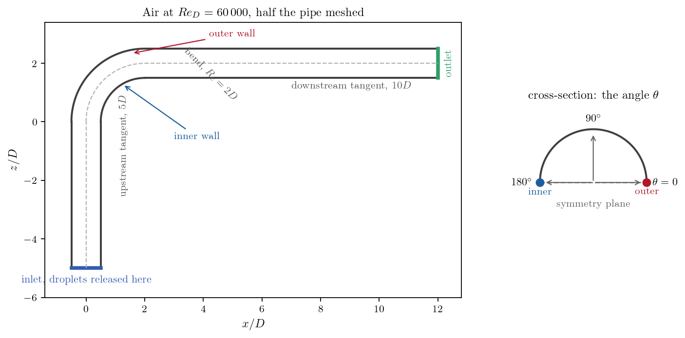
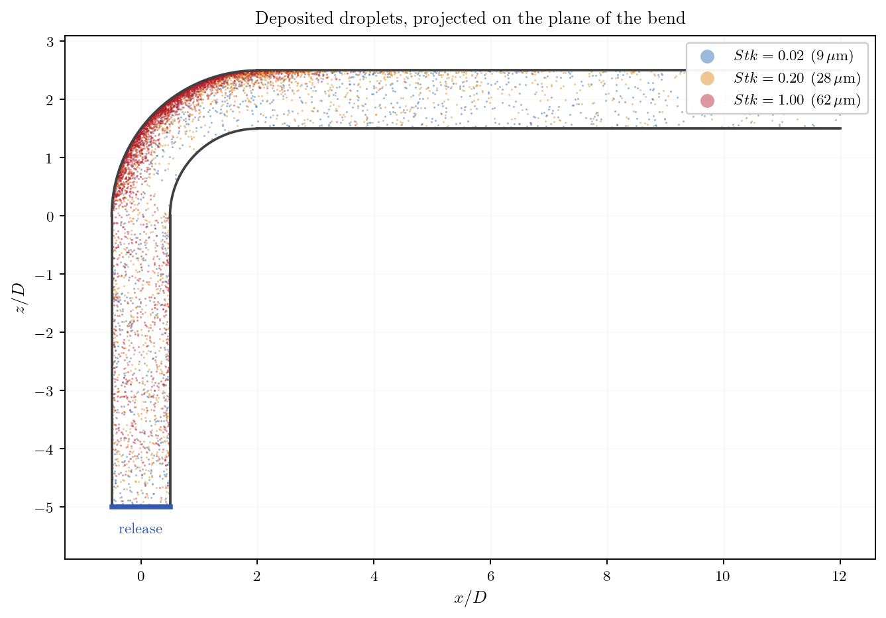
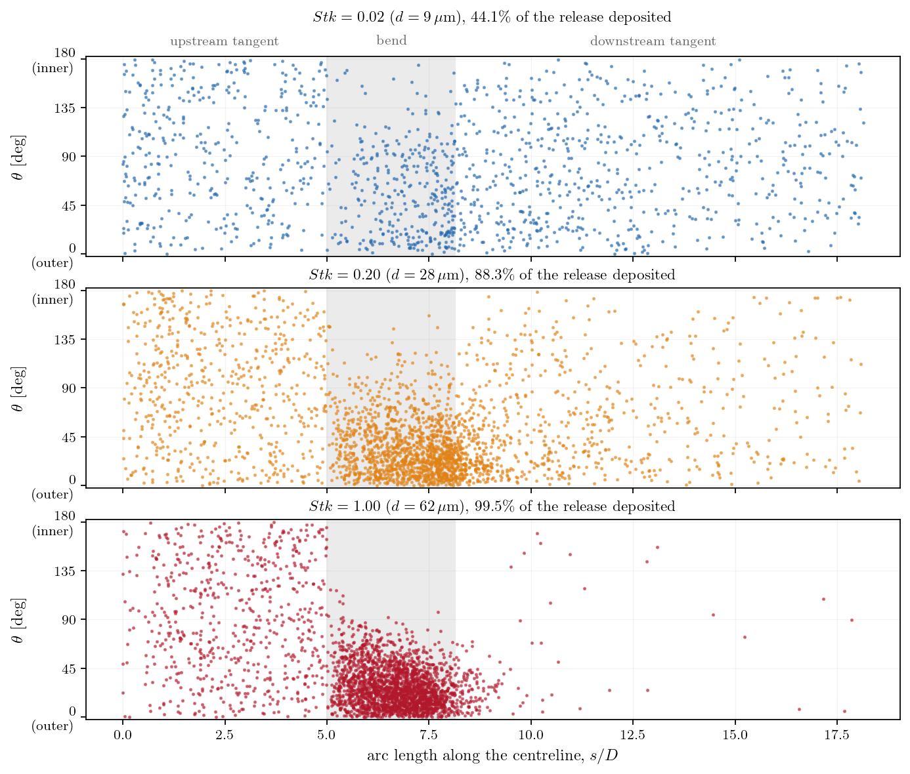
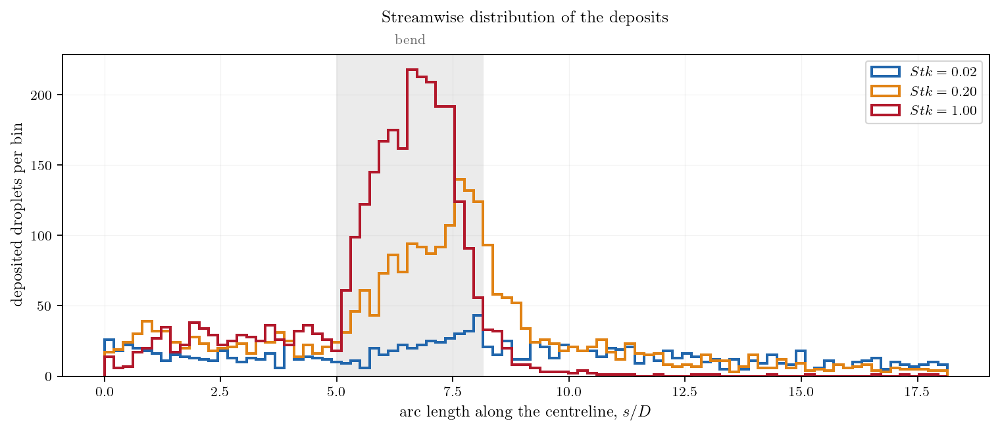

# Droplet Deposition in a Pipe Bend

Where does a particle-laden duct wear out, or foul? Anyone who has opened an
industrial pipe knows the answer for a bend: on the outside of the turn. The
Lagrangian module answers the question directly and quantitatively. Track the
droplets one by one, let them stick where they touch the wall, and the wall
itself becomes the result: a map of who lands where.

This tutorial adds particle tracking on top of a carrier flow the collection
already computes and validates, the turbulent 90 degree bend of
[Inc_Turbulent_Bend_Wallfunctions](../../10_turbulence_rans/Inc_Turbulent_Bend_Wallfunctions).
Three droplet sizes are released together, spanning the interesting range of the
Stokes number, and the case shows how the deposition pattern changes from
"scattered everywhere" to "plastered on the outer wall of the bend".

It is a **demonstration**, not a validation: nothing here is compared with
reference data, and the numbers depend on a modelling choice that is stated
plainly below. What the case does show is the workflow and the options that
matter.

Maintained by [Simvia](https://Simvia.tech/fr), part of the
[tutoriel-code_saturne](https://github.com/simvia-tech/tutorials-code_saturne) collection.

## Learning objectives

After completing this tutorial you will be able to:

1. Add **Lagrangian tracking** on top of an existing RANS computation, by restarting on a **frozen carrier field**.
2. Define **particle classes**, release them from a boundary zone, and set the **particle-wall interaction** on every boundary.
3. Know the difference between the two deposition conditions, and why only one of them leaves a map to read.
4. Read a **deposition map** out of the results, in pipe coordinates.

## Prerequisites

| Requirement | Detail |
|---|---|
| code_saturne | **v9.1** |
| Tutorials | [Lag_Settling_Particle](../Lag_Settling_Particle) (the Lagrangian module and its drag law), [Inc_Turbulent_Bend_Wallfunctions](../../10_turbulence_rans/Inc_Turbulent_Bend_Wallfunctions) (the carrier flow, validated against experiment) |
| Background | Particle relaxation time and Stokes number |

If code_saturne is not yet installed, build it from the
[official homepage](https://code-saturne.org/), pull a
ready-to-use Singularity image from the
[Open Simulation Center](https://open-simulation-center.org/downloads/code_saturne/code_saturne),
or pull the
[Simvia Docker image](https://hub.docker.com/r/Simvia/code_saturne) before continuing.

## Case files

```text
Lag_Bend_Deposition/
├── CASE_FLOW/                   # the carrier flow alone, k-omega SST
│   └── DATA/setup.xml
├── CASE_PARTICLES/              # restart with the droplets, carrier frozen
│   └── DATA/setup.xml
├── MESH/
│   └── sudo_coarse.msh          # same mesh as the bend tutorial
├── FIGURES/
└── README.md
```

There is **no user routine**: everything, including the Lagrangian module, is set
from the GUI.

The case is split in two because the two problems want different time steps. The
carrier flow is steady and is best converged with the local time step of the
GUI's pseudo-steady option, which has no physical meaning; the droplets need a
real, uniform time step to be integrated in time. So the flow is computed once,
and the particle run restarts from it with the carrier **frozen**: the velocity
field is read from the checkpoint and never solved again, which also makes the
particle run cheap.

## Physical model

The carrier is air in a 90 degree bend at $Re_D = 60\,000$, computed with the
$k$-$\omega$ SST model. That computation is not this tutorial's subject: it is
the one validated against the experiment of Sudo et al. in the bend tutorial,
reused unchanged.

The droplets are water, tracked in **one-way coupling**: the flow moves them, they
do not move the flow. Their fate is set by the **Stokes number**, the ratio of
the particle relaxation time to a flow time scale:

$$
Stk = \frac{\tau_p U}{D},
\qquad
\tau_p = \frac{\rho_p d_p^2}{18\,\mu}
$$

Below $Stk \ll 1$ a droplet follows the streamlines through the turn; above
$Stk \sim 1$ it cannot, and it crosses them to hit the outer wall.

### Flow and particle parameters

| Quantity | Symbol | Value | Source |
|---|---|---:|---|
| Pipe diameter | $D$ | $104$ mm | (mesh) |
| Bend radius | $R_c$ | $2D$ | (mesh) |
| Bulk velocity | $U$ | $8.7$ m/s | `inlet/velocity_pressure/norm` |
| Air density, viscosity | $\rho$, $\mu$ | $1.185$ kg/m³, $1.785\times10^{-5}$ Pa s | `fluid_properties` |
| Droplet density | $\rho_p$ | $1000$ kg/m³ | `class/density` |
| Droplets released | | $3000$ per class, in one release | `class/number`, `class/frequency` = 0 |

| Class | Diameter | $Stk$ |
|---|---:|---:|
| 1 | $9\ \mu$m | $0.02$ |
| 2 | $28\ \mu$m | $0.20$ |
| 3 | $62\ \mu$m | $1.00$ |

The three sizes are small compared with the pipe ($d_p/D \le 6\times10^{-4}$), and
their settling velocity stays below $1.4\%$ of the bulk velocity, so gravity plays
no part in what follows.

### The modelling choice that sets the numbers

The walls are given the condition **deposit**: a droplet that reaches the wall
sticks to it, always, whatever its incidence or its velocity. That is a
deliberate upper bound. A real droplet may rebound, splash or be re-entrained,
and the module has conditions for those too. Every deposited fraction quoted
below therefore answers the question "how many droplets touch the wall", which
is the honest reading of a sticky-wall computation.

## Geometry and boundary conditions

<p align="center">
  
  <br>
  <em>Figure 1: The bend, and the two coordinates used to read the results: the
  arc length $s$ along the centreline, and the angle $\theta$ around the pipe,
  measured from the outer generator. Only half the pipe is meshed, so $\theta$
  runs from the outer wall to the inner wall.</em>
</p>

Every boundary needs a particle condition as well as a fluid one, and the solver
stops if one is missing:

| Boundary | Fluid | Particles |
|---|---|---|
| `inlet` | uniform $8.7$ m/s | release of the three classes |
| `outlet` | free outlet | particles leave |
| `wall1`, `wall2`, `wall3` | no-slip walls | **deposit** (droplets stick) |
| `sym1`, `sym2`, `sym3` | symmetry | particle symmetry |

## Numerical setup

| Setting | `CASE_FLOW` | `CASE_PARTICLES` |
|---|---|---|
| Mesh | $70\,000$ cells | same |
| Turbulence | $k$-$\omega$ SST | same, read from the checkpoint |
| Carrier | solved, local time step | **frozen** |
| Time step | pseudo-steady | $10^{-4}$ s, constant |
| Iterations | $350$ | $6000$ ($0.6$ s, about three flow-through times) |
| Lagrangian coupling | off | one-way |

The particle run lasts long enough for every droplet to have either stuck or left:
the log reports no particle moving at the last step, so the counts below are final.

## Running the simulation

```bash
cd Lag_Bend_Deposition/

cd CASE_FLOW      && code_saturne run --n 4 --id flow      && cd ..
cd CASE_PARTICLES && code_saturne run --n 4 --id particles && cd ..
```

The `--id flow` is not cosmetic: `CASE_PARTICLES/DATA/setup.xml` points its
restart at `../CASE_FLOW/RESU/flow/checkpoint`. The flow takes a couple of
minutes on four cores, the particle run about six.

## Results

<p align="center">
  
  <br>
  <em>Figure 2: The deposits of the three classes, seen in the plane of the bend.
  The band of 62 micron droplets on the outer wall of the turn is the picture an
  engineer draws by hand when asked where a bend erodes. Note that this is a
  projection: a droplet stuck anywhere around the pipe is drawn at its distance
  from the centreline in this plane, which is why the straight tangents look
  filled rather than lined.</em>
</p>

<p align="center">
  
  <br>
  <em>Figure 3: The deposition map, one panel per class. Each dot is one droplet,
  at the place it stuck. The bend occupies the shaded band.</em>
</p>

Figure 3 unrolls the same result and separates the classes, which is what
makes the transition legible. The three panels tell three different stories.

At $Stk = 0.02$ the droplets deposit **everywhere and with no preferred angle**.
Nothing in that picture points at the bend. This is not impaction at all: it is
turbulent transport to the wall, the eddies bringing droplets into contact along
the whole length of the pipe.

At $Stk = 0.20$ the bend appears. Deposits crowd into the shaded band and drift
towards $\theta = 0$, the outer generator, while the inner wall empties.

At $Stk = 1.00$ the map is almost a single patch: a dense band on the outer wall
of the bend, starting just after the bend entry, and next to nothing downstream.
These droplets have too much inertia to follow the turn, so they cross the
streamlines and hit.

<p align="center">
  
  <br>
  <em>Figure 4: Where the deposits sit along the pipe. The peak in the bend grows
  and sharpens with the Stokes number, and moves towards the bend entry.</em>
</p>

| $Stk$ | Deposited | In the bend | Upstream tangent | Downstream tangent |
|---:|---:|---:|---:|---:|
| $0.02$ | $44\%$ | $25\%$ | $28\%$ | $48\%$ |
| $0.20$ | $88\%$ | $49\%$ | $22\%$ | $30\%$ |
| $1.00$ | $99\%$ | $75\%$ | $21\%$ | $5\%$ |

Read the columns rather than the first number. The deposited fraction is high
throughout because the wall is perfectly sticky; what changes with the Stokes
number is **where** the droplets are caught. Between $Stk = 0.02$ and $Stk = 1$
the share caught in the bend triples while the share reaching the downstream
tangent falls by a factor of ten.

## Two things worth knowing

| Point | Why it matters |
|---|---|
| There are two deposition conditions | `deposit1` removes the droplet from the computation, `deposit2` fixes it on the wall and keeps it. Only the second leaves a map to look at: with the first, the deposits vanish as they are created |
| The map here is the droplets, not the wall statistics | The module can also accumulate per-face statistics, and this case switches them on, but the maps above are built from the deposited droplets themselves, which is the direct reading. Statistics are the subject of [Lag_Dispersion_Plume](../Lag_Dispersion_Plume) |

## Summary

Particle tracking added to an already validated turbulent computation, entirely
from the GUI, and read as a map of the wall. Three droplet sizes released
together show the transition from turbulent deposition spread along the pipe to
inertial impaction concentrated on the outer wall of the bend.

The case is a demonstration: no quantity here is compared with reference data,
and the deposited fractions are upper bounds set by the sticky-wall condition.
The pattern, on the other hand, is the physics an engineer looks for when
deciding where a bend will wear out.

## References

1. K. Sudo, M. Sumida, H. Hibara, "Experimental investigation on turbulent flow in a circular-sectioned 90-degree bend", *Experiments in Fluids*, 25, pp. 42-49, 1998.
2. [code_saturne documentation](https://code-saturne.org/doc/)

## Authors

[Simvia](https://Simvia.tech/fr) - Questions, remarks and requests are welcome.
