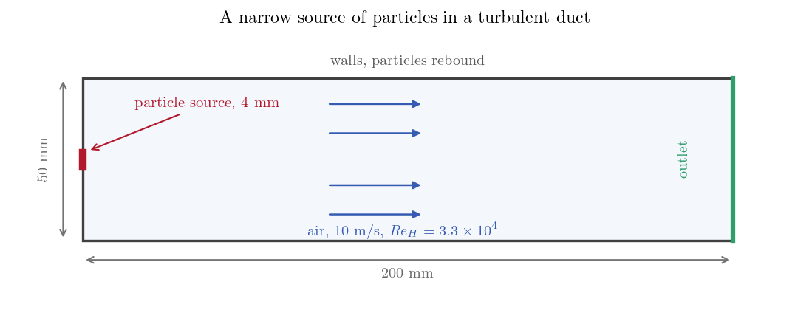
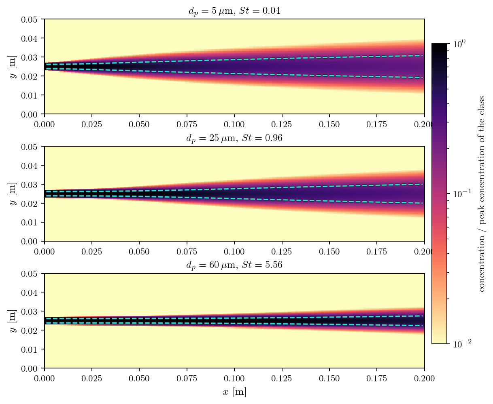
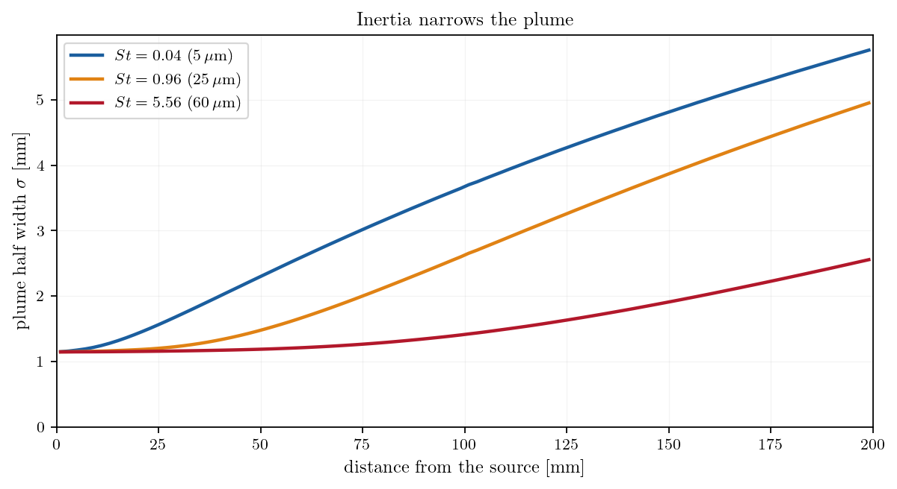

# Turbulent Dispersion of a Particle Plume

A Lagrangian computation returns trajectories, one per particle. Engineering wants
a field: a concentration one can map, integrate, or compare with a measurement.
The module bridges the two with its volume statistics, which accumulate the
particles passing through every cell into a time-averaged concentration, mean
velocity and mean diameter, one set per particle class.

This case uses them on the simplest question they answer well. Particles are
released from a narrow source in a turbulent duct, in three sizes, and the
statistics turn the resulting swarm into three concentration fields. The heavier
the particle, the narrower its plume: inertia keeps it from following the eddies
that would have spread it.

The case is an illustration of the method. Nothing here is compared with reference
data.

Maintained by [Simvia](https://Simvia.tech/fr), part of the
[tutoriel-code_saturne](https://github.com/simvia-tech/tutorials-code_saturne) collection.

## Learning objectives

After completing this tutorial you will be able to:

1. Activate the Lagrangian volume statistics, per particle class, and choose when the time averaging starts.
2. Know which setting turns those statistics into time averages, and why it also acts on the trajectories.
3. Read a particle concentration field out of the results, and measure a plume width from it.
4. Anticipate how inertia changes the dispersion of a particle plume.

## Prerequisites

| Requirement | Detail |
|---|---|
| code_saturne | **v9.1** |
| Tutorials | [Lag_Settling_Particle](../Lag_Settling_Particle) (the module and the drag law), [Lag_Bend_Deposition](../Lag_Bend_Deposition) (particle classes) |
| Background | Stokes number, turbulent dispersion |

If code_saturne is not yet installed, build it from the
[official homepage](https://code-saturne.org/), pull a
ready-to-use Singularity image from the
[Open Simulation Center](https://open-simulation-center.org/downloads/code_saturne/code_saturne),
or pull the
[Simvia Docker image](https://hub.docker.com/r/Simvia/code_saturne) before continuing.

## Case files

```text
Lag_Dispersion_Plume/
├── CASE/
│   └── DATA/setup.xml
├── FIGURES/
└── README.md
```

No mesh file and no user routine: the duct is a Cartesian mesh defined in the GUI,
and everything else, the Lagrangian module included, is set from the interface. The
statistics come from one block:

```xml
<lagrangian model="one_way">
  <carrier_field_stationary status="on"/>
  <statistics>
    <volume status="on"/>
    <boundary status="off"/>
    <statistics_groups_of_particles>3</statistics_groups_of_particles>
    <iteration_start>500</iteration_start>
    <iteration_steady_start>500</iteration_steady_start>
  </statistics>
```

`volume` switches on the cell statistics. `statistics_groups_of_particles` splits
them per class, so each particle size gets its own concentration field, named with
the suffix `_c1` to `_c3` in the results. The two iteration numbers say when the
accumulation begins: early enough to gather samples, late enough for the carrier
flow to have settled, since averaging a developing flow into a steady statistic
would mix two things.

The checkbox *The continuous phase flow is a steady flow* is what turns these
fields into time averages: it lets the module accumulate over time steps instead
of starting afresh at each one. It also acts on the trajectories, not only on the
fields written out, because the complete turbulent dispersion model reads the mean
particle velocity back out of the statistics to build the fluctuation each
particle sees.

The statistics appear in the fluid results file, alongside the velocity and the
pressure: `particle_cumulative_weight`, `mean_particle_volume_fraction`,
`mean_particle_velocity`, and the mean and variance of the residence time,
diameter and mass.

## Physical model

Air in a straight duct at $Re_H = 3.3\times10^{4}$, built on the duct height
$H = 50$ mm, computed with $k$-$\varepsilon$ and a turbulence intensity of 5
percent prescribed at the inlet. Particles of three sizes are released
continuously from a narrow patch at mid-height, tracked in one-way coupling, and
rebound off the walls so that nothing removes them from the plume.

| Quantity | Value |
|---|---:|
| Duct | $200 \times 50$ mm, one cell thick |
| Air velocity | $10$ m/s |
| Air density, viscosity | $1.2$ kg/m³, $1.8\times10^{-5}$ Pa s |
| Particle density | $2500$ kg/m³ |
| Source | $4$ mm tall, at mid-height |

| Class | Diameter | $St = \tau_p U / H$ |
|---|---:|---:|
| 1 | $5\ \mu$m | $0.04$ |
| 2 | $25\ \mu$m | $0.96$ |
| 3 | $60\ \mu$m | $5.6$ |

Gravity is switched off on purpose. With it, the heaviest particles would settle
across the duct as they travel, and their plume would drift downwards, which has
nothing to do with the dispersion the case is about. Removing gravity leaves the
three plumes centred on the source and their widths directly comparable.

## Geometry and boundary conditions

<p align="center">
  
  <br>
  <em>Figure 1: The duct. Particles enter through a 4 mm patch at mid-height, the
  air through the whole inlet section.</em>
</p>

The inlet is split into two zones with the same fluid condition, one of which also
carries the particle release. Splitting a boundary by a geometric criterion is the
simplest way to obtain a source narrower than the inlet:

```xml
<boundary label="source" nature="inlet">X0 and box[-1, 0.023, -1, 0.001, 0.027, 1]</boundary>
<boundary label="inlet"  nature="inlet">X0 and not box[-1, 0.023, -1, 0.001, 0.027, 1]</boundary>
```

| Boundary | Fluid | Particles |
|---|---|---|
| source (4 mm of the inlet) | inlet, $10$ m/s | release of the three classes |
| rest of the inlet | inlet, $10$ m/s | rebound |
| outlet | free outlet | particles leave |
| walls | no-slip walls | rebound |
| spanwise planes | symmetry | particle symmetry |

## Numerical setup

| Setting | Value |
|---|---:|
| Mesh | $100 \times 100 \times 1$ cells ($2 \times 0.5$ mm) |
| Turbulence | $k$-$\varepsilon$ |
| Time step | $10^{-4}$ s, constant |
| Iterations | $12\,000$ ($1.2$ s) |
| Statistics start | iteration $500$ |
| Release | $30$ particles per class at every time step |

The particles cross the duct in $20$ ms, so the averaging window covers some fifty
transits. The release is continuous, one batch per time step, and the cells are
four times finer across the duct than along it, since the quantity being measured
is a width of a few millimetres.

## Running the simulation

```bash
cd Lag_Dispersion_Plume/CASE
code_saturne run --n 4 --id plume
```

The run takes about thirteen minutes on four cores, almost all of it spent moving
particles rather than solving the flow.

## Results

<p align="center">
  
  <br>
  <em>Figure 2: Concentration of each class, from the volume statistics, each panel
  normalised by its own peak and shown over two decades so the dilute edges of the
  plume stay visible. The dashed lines mark the plume half width computed from the
  same field.</em>
</p>

All three plumes leave the same 4 mm source with
the same fluid velocity, and they spread differently: the 5 micron particles fill a
wide band by the end of the duct, the 60 micron ones stay a narrow streak.

<p align="center">
  
  <br>
  <em>Figure 3: Plume half width along the duct, the standard deviation of the
  concentration profile at each station.</em>
</p>

Measured this way, the heaviest class ends up a little under half as wide as the
lightest by the end of the duct. The mechanism is inertia acting as a filter: a
particle only responds to eddies that last longer than its relaxation time, so the
fast, small-scale motions that spread the light particles pass the heavy ones by.
The lightest class, whose relaxation time is short compared with everything in the
flow, follows the air closely and disperses almost like a passive scalar would.

## Summary

Volume statistics turn a swarm of trajectories into concentration fields, one per
particle class, which can then be measured. On a narrow source in a turbulent duct
they show inertia filtering the turbulence: the plume of the heaviest particles
ends up a little under half as wide as that of the lightest, all else being equal.

Two things to remember. The carrier flow has to be declared steady for these
fields to be time averages, and the averaging has to start after the flow has
settled.

## References

1. [code_saturne documentation](https://code-saturne.org/doc/)

## Authors

[Simvia](https://Simvia.tech/fr) - Questions, remarks and requests are welcome.
