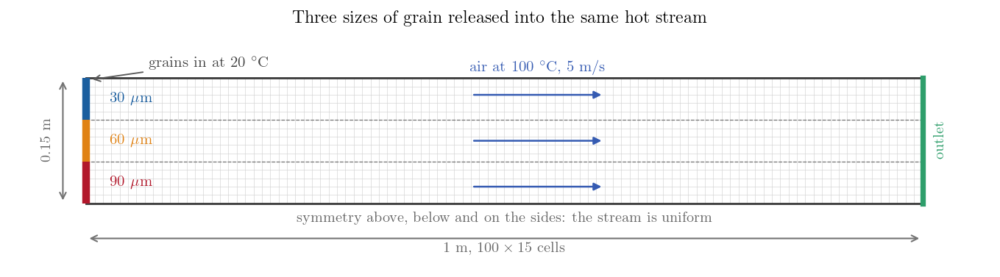
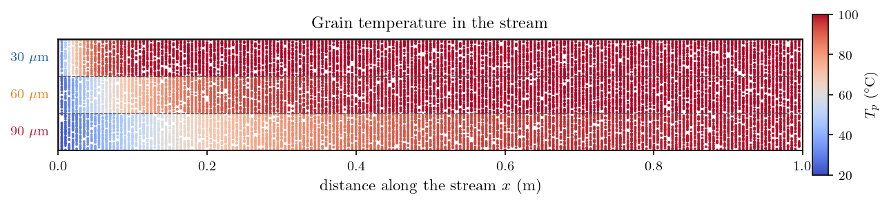
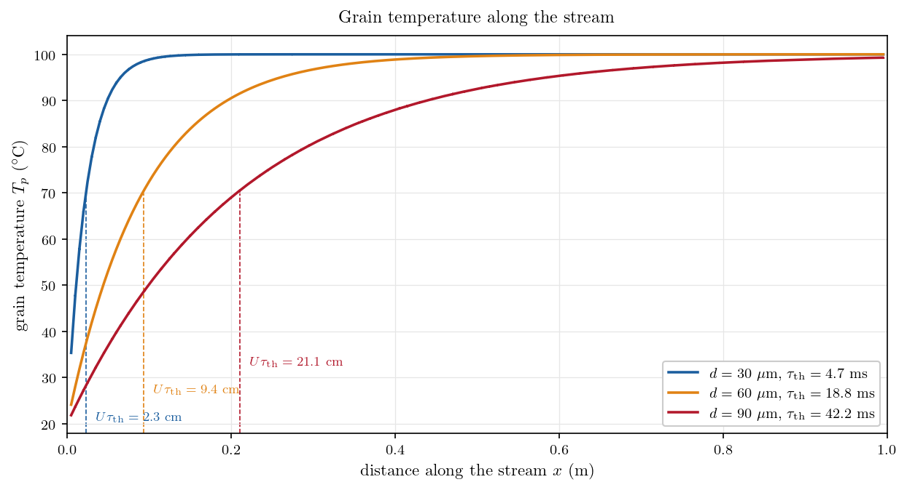

# Particle Temperature: Cold Grains in a Hot Stream

A grain thrown into a hot gas warms up exponentially. Its time constant follows
from the mass to be heated, which grows as $d^3$, and the surface the heat comes
through, which grows only as $d^2$, so the time constant itself scales as $d^2$. A
grain three times larger takes nine times longer, and in a flow it travels nine
times further before it reaches the gas temperature.

The Lagrangian module solves that equation for every particle it tracks, once the
heat transfer model is on and the carrier phase has a temperature. The case here is
a uniform stream of air at $100\ ^\circ$C with three sizes of grain entering at
$20\ ^\circ$C, in three bands one above the other, and it measures the distance
each size needs to catch up. Gravity is off and the stream is uniform, so the
grains never slip relative to the air and the time constant can be worked out
before the run. The case is an illustration of the model at work, not a validation.

Maintained by [Simvia](https://Simvia.tech/fr), part of the
[tutoriel-code_saturne](https://github.com/simvia-tech/tutorials-code_saturne) collection.

## Learning objectives

After completing this tutorial you will be able to:

1. Activate the **particle heat transfer** model, and give an injected class its temperature and specific heat.
2. Compute the thermal time constant of a particle, and turn it into a length in a flow.
3. Choose the time scheme that integrates the temperature equation correctly.

## Prerequisites

| Requirement | Detail |
|---|---|
| code_saturne | **v9.1** |
| Tutorials | [Lag_Settling_Particle](../Lag_Settling_Particle) (the module and the drag law), [Th_Balance_By_Zone](../../20_thermal/Th_Balance_By_Zone) or any other case of `20_thermal` (the thermal scalar) |
| Background | Heat capacity, Nusselt number, lumped-capacitance heating |

If code_saturne is not yet installed, build it from the
[official homepage](https://code-saturne.org/), pull a
ready-to-use Singularity image from the
[Open Simulation Center](https://open-simulation-center.org/downloads/code_saturne/code_saturne),
or pull the
[Simvia Docker image](https://hub.docker.com/r/Simvia/code_saturne) before continuing.

## Case files

```text
Lag_Heated_Particle/
├── CASE/
│   ├── DATA/setup.xml
│   └── SRC/cs_user_lagr_model.cpp
├── FIGURES/
└── README.md
```

There is no mesh file: the domain is a Cartesian mesh defined in the GUI.

The particle model is *Heat transfer and evaporation* in the drop-down list of
additional models, with *Particles heat transfer* ticked underneath:

```xml
<particles_models model="thermal">
  <thermal status="on"/>
</particles_models>
```

Each injected class then needs a temperature and a specific heat on top of its
size and density:

```xml
<class>
  <number>40</number>
  <density>2000</density>
  <diameter>9e-05</diameter>
  <temperature choice="prescribed">20</temperature>
  <specific_heat>1000</specific_heat>
  <velocity choice="fluid"/>
</class>
```

The temperature is either prescribed, as here, or read from the fluid at the point
of injection. The two entries of the drop-down list are *Temperature set by values*
and *Fluid temperature*, the second one suiting particles already in equilibrium
with the gas that carries them.

The fluid side has to carry a thermal scalar, or the solver stops with *The
resolution of the particles temperature is activated ... but the background
Eulerian computation has no thermal scalar.* Here it is a temperature in degrees
Celsius, uniform at $100\ ^\circ$C and never disturbed, since the coupling is
one-way.

The user routine switches off the stochastic dispersion models, which have no
turbulence to work from in a uniform stream. It is the same file as in the settling
tutorial.

## Physical model

For each particle the module integrates

$$\frac{\mathrm{d}T_p}{\mathrm{d}t} = \frac{T_f - T_p}{\tau_{\rm th}},
\qquad
\tau_{\rm th} = \frac{\rho_p\, c_{p,p}\, d^2}{6\, \mathrm{Nu}\, \lambda_f},
\qquad
\mathrm{Nu} = 2 + 0.55\, \mathrm{Re}_p^{1/2}\, \mathrm{Pr}^{1/3}$$

where $T_f$ is the fluid temperature seen by the particle, $\lambda_f$ the
conductivity of the fluid, and $\mathrm{Re}_p$ the particle Reynolds number built
on the velocity difference between grain and gas. A single temperature describes
the grain, which assumes it is isothermal inside.

The Nusselt number is where the flow enters. A grain carried along by the gas
exchanges heat by conduction alone and $\mathrm{Nu} = 2$; a grain slipping through
the gas gets the convective term as well. In this case the grains are released at
the local fluid velocity, the stream is uniform and gravity is off, so there is no
slip and $\mathrm{Nu} = 2$ exactly.

| Quantity | Value |
|---|---:|
| Air temperature | $100\ ^\circ$C, uniform |
| Air density, viscosity | $0.95$ kg/m³, $2.2\times10^{-5}$ Pa s |
| Air specific heat, conductivity | $1010$ J/kg/K, $0.032$ W/m/K ($\mathrm{Pr} = 0.69$) |
| Air velocity | $5$ m/s, uniform |
| Grain density, specific heat | $2000$ kg/m³, $1000$ J/kg/K |
| Grain diameters | $30$, $60$, $90\ \mu$m |
| Grain temperature at the inlet | $20\ ^\circ$C |

The time constant is then $\rho_p c_{p,p} d^2 / (12\lambda_f)$: $4.7$, $18.8$ and
$42.2$ ms for the three sizes, in the ratio $1 : 4 : 9$. At $5$ m/s that is $2.3$,
$9.4$ and $21.1$ cm.

## Geometry and boundary conditions

<p align="center">
  
  <br>
  <em>Figure 1: The domain and its mesh. The inlet is split into three bands, one
  per grain size.</em>
</p>

| Boundary | Fluid | Particles |
|---|---|---|
| inlet, lower band | inlet, $5$ m/s at $100\ ^\circ$C | $90\ \mu$m grains at $20\ ^\circ$C |
| inlet, middle band | inlet, $5$ m/s at $100\ ^\circ$C | $60\ \mu$m grains at $20\ ^\circ$C |
| inlet, upper band | inlet, $5$ m/s at $100\ ^\circ$C | $30\ \mu$m grains at $20\ ^\circ$C |
| outlet | free outlet | particles leave |
| all four lateral sides | symmetry | particle symmetry |

With no gravity and no dispersion a grain keeps the height it was released at, so
the three populations travel side by side to the outlet without mixing. Every
lateral boundary is a symmetry plane, so no wall builds a velocity profile: the
stream stays uniform at $5$ m/s and the residence time of a grain is its distance
divided by that.

## Numerical setup

| Setting | Value |
|---|---:|
| Mesh | $100 \times 15 \times 1$ cells |
| Turbulence | $k$-$\varepsilon$, required by the module |
| Time scheme for the particles | first order |
| Time step | $1$ ms, constant |
| Iterations | $400$ ($0.4$ s, two transits of the domain) |

The scheme order matters here. The second-order scheme is the default, and on this
equation it is wrong: inject grains at $100\ ^\circ$C into gas at $100\ ^\circ$C,
where nothing should happen, and the $30\ \mu$m class settles at $99.0\ ^\circ$C.
The first-order scheme applies the exact exponential over the time step and gives
$100\ ^\circ$C.

## Running the simulation

### GUI

```bash
code_saturne gui Lag_Heated_Particle/CASE/DATA/setup.xml &
```

### Command line

```bash
cd Lag_Heated_Particle/CASE
code_saturne run --n 4 --id heat
```

Twenty-three seconds on four cores.

## Results

### The three bands

<p align="center">
  
  <br>
  <em>Figure 2: The grains, coloured by their own temperature. The three bands
  enter equally cold and reach the gas temperature at three different
  distances.</em>
</p>

The $30\ \mu$m band reaches the gas temperature within the first ten centimetres,
the $60\ \mu$m band needs half the domain, and the $90\ \mu$m band never quite
gets there: $7\ ^\circ$C short at mid-length, and $99.3\ ^\circ$C at the outlet
after a fifth of a second in air at $100\ ^\circ$C.

Each vertical stripe is one injection. Forty grains per class leave the inlet at
every time step, then travel $5$ mm before the next batch, so every stripe carries
the temperature that matches its own age.

### Temperature along the stream

<p align="center">
  
  <br>
  <em>Figure 3: Grain temperature against distance travelled, one curve per size.
  The dashed lines mark the relaxation length $U\tau_{\rm th}$, where the grain has
  covered $63\%$ of the gap to the gas temperature.</em>
</p>

| Diameter | $\tau_{\rm th}$ | $U\tau_{\rm th}$ | $99\%$ of the way ($5\tau_{\rm th}$) | $T_p$ at the outlet |
|---|---:|---:|---:|---:|
| $30\ \mu$m | $4.7$ ms | $2.3$ cm | $12$ cm | $100.0\ ^\circ$C |
| $60\ \mu$m | $18.8$ ms | $9.4$ cm | $47$ cm | $100.0\ ^\circ$C |
| $90\ \mu$m | $42.2$ ms | $21.1$ cm | $105$ cm | $99.3\ ^\circ$C |

## Summary

Turning on *Particles heat transfer* gives every tracked particle a temperature and
the equation that governs it. It needs a specific heat and an injection temperature
from the user, and a thermal scalar from the fluid side.

The time constant $\rho_p c_{p,p} d^2 / (6\,\mathrm{Nu}\,\lambda_f)$ is $4.7$,
$18.8$ and $42.2$ ms for the three sizes used here. Multiplied by the flow velocity
it gives the length a device needs before its particles sit at the temperature of
the gas around them.

Leave the default second-order scheme in place and the temperature drifts: a
particle in gas at its own temperature does not stay there. The first-order scheme
integrates the equation exactly.

## References

1. W. E. Ranz, W. R. Marshall, *Evaporation from drops*, Chemical Engineering Progress, 48, 141-146 and 173-180, 1952. The module uses this form of the Nusselt correlation with a coefficient of $0.55$.
2. C. Crowe, J. Schwarzkopf, M. Sommerfeld, Y. Tsuji, *Multiphase Flows with Droplets and Particles*, 2nd edition, CRC Press, 2011.
3. [code_saturne documentation](https://code-saturne.org/doc/)

## Authors

[Simvia](https://Simvia.tech/fr) - Questions, remarks and requests are welcome.
