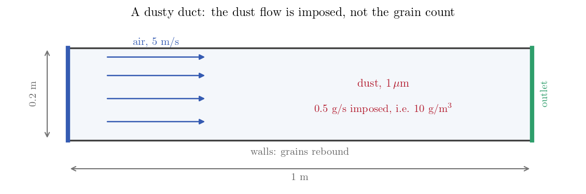

# Statistical Weight: Imposing a Real Dust Flow

Start with a count, because it decides the method. A $1\ \mu$m grain of density
$2000$ kg/m³ weighs $1.05\times10^{-15}$ kg, so a duct carrying $0.5$ g of that
dust per second, an ordinary $10$ g/m³, carries $4.8\times10^{11}$ grains per
second. No computation will ever integrate that many trajectories.

It does not have to. A Lagrangian computation tracks a modest number of particles
and gives each one a **statistical weight**, the number of identical real grains
it stands for. The weight enters the bookkeeping and not the dynamics: the
particle follows the path of a single grain of its diameter, and what the weight
multiplies is its contribution to mass flows, to concentrations and to the
momentum returned to the fluid. It can be prescribed directly, as the other
tutorials of this section do with a statistical weight, or computed from an imposed
dust flow, as here: you give the flow and the number of particles you are
prepared to track, and the solver divides. That is the way round an installation
hands you, since the dust flow is a process datum and the grain count is not.

This case is a straight duct with dust in it and nothing else, so that the
division and the two numbers it produces can be read straight from the listing.

Maintained by [Simvia](https://Simvia.tech/fr), part of the
[tutoriel-code_saturne](https://github.com/simvia-tech/tutorials-code_saturne) collection.

## Learning objectives

After completing this tutorial you will be able to:

1. Inject particles at an imposed **mass flow rate** and let the solver set the statistical weight.
2. Read, in the listing, how many real grains your tracked particles stand for.
3. Recognise the situations in which one particle can no longer stand for many.

## Prerequisites

| Requirement | Detail |
|---|---|
| code_saturne | **v9.1** |
| Tutorials | [Lag_Settling_Particle](../Lag_Settling_Particle) (the module and the drag law) |
| Background | None beyond the above |

If code_saturne is not yet installed, build it from the
[official homepage](https://code-saturne.org/), pull a
ready-to-use Singularity image from the
[Open Simulation Center](https://open-simulation-center.org/downloads/code_saturne/code_saturne),
or pull the
[Simvia Docker image](https://hub.docker.com/r/Simvia/code_saturne) before continuing.

## Case files

```text
Lag_Parcel_Weighting/
├── CASE/
│   └── DATA/setup.xml
├── FIGURES/
└── README.md
```

No mesh file and no user routine: the duct is a Cartesian mesh defined in the
GUI. The injection is the whole subject of the case:

```xml
<class>
  <number>10</number>
  <frequency>1</frequency>
  <mass_flow_rate>0.0005</mass_flow_rate>
  <density>2000</density>
  <statistical_weight choice="rate">1</statistical_weight>
  <diameter>1e-06</diameter>
</class>
```

The injection panel offers two ways of setting the weight, *Statistical weight
set by values* and *Mass flow rate*. This case uses the second, which appears as
`choice="rate"` in the file. With it, `number` is how many particles are released
per time step and `mass_flow_rate` is the dust flow they carry between them, in
kg/s. The number left inside the `statistical_weight` tag is ignored in this mode:
the weight actually used is computed from the flow.

That computation is worth following once, because it is the whole mechanism. The
time step is $2$ ms, so the $0.5$ g/s asked for means $10^{-6}$ kg of dust
entering per time step, which at $1.05\times10^{-15}$ kg a grain is $955$ million
grains. Ten particles are released to carry them, so each is given a weight of
$95$ million.

## Physical model

Air in a straight duct, with dust in it. That is all.

| Quantity | Value |
|---|---:|
| Duct | $1 \times 0.2$ m, one cell thick |
| Air velocity | $5$ m/s |
| Air density, viscosity | $1.2$ kg/m³, $1.8\times10^{-5}$ Pa s |
| Grain diameter, density | $1\ \mu$m, $2000$ kg/m³ |
| Imposed dust flow | $0.5$ g/s, i.e. $10$ g/m³ |

The grain size is chosen so that there is nothing to discuss about the dust
itself. A $1\ \mu$m grain has a relaxation time of $6$ microseconds and settles
at $60\ \mu$m/s, against an air stream at $5$ m/s: it follows the air, it does
not fall, and it does not lag. The dust loading, under one percent of the air
mass, is light enough for the grains to have no effect on the flow either. So
whatever the tracked particles do, they do it because the air carries them, and
the only thing left to look at is what each of them represents.

## Geometry and boundary conditions

<p align="center">
  
  <br>
  <em>Figure 1: The duct. Dust enters across the whole inlet at an imposed mass
  flow and leaves at the far end.</em>
</p>

| Boundary | Fluid | Particles |
|---|---|---|
| inlet | inlet, $5$ m/s | dust injection at an imposed mass flow |
| outlet | free outlet | particles leave |
| walls | no-slip walls | rebound |
| spanwise planes | symmetry | particle symmetry |

Nothing removes a grain except the outlet: the walls make them rebound. What
enters therefore has to come out.

## Numerical setup

| Setting | Value |
|---|---:|
| Mesh | $50 \times 20 \times 1$ cells |
| Turbulence | $k$-$\varepsilon$ |
| Time step | $2$ ms, constant |
| Iterations | $5\,000$ ($10$ s, fifty duct transits) |
| Listing frequency | every $10$ time steps |

The listing frequency is worth setting deliberately, because the numbers this
tutorial is about are printed with it.

## Running the simulation

```bash
cd Lag_Parcel_Weighting/CASE
code_saturne run --n 4 --id dust
```

Twenty-three seconds on four cores.

## Results

### The two numbers

The listing counts the particles twice over, and its own heading says how to read
the two columns:

```text
   Current number of particles (with and without statistical weight) :

ln  newly injected                                 10      9.54930E+08
ln  out, or deposited and eliminated               11      1.05042E+09
ln  deposited                                       0      0.00000E+00
ln  lost in the location stage                      0
ln  total number at the end of the time step      987      9.42516E+10
```

The left column is what the solver actually tracks and pays for: ten particles
released at this time step, eleven that left through the outlet, $987$ present in
the duct. The right column is the same count multiplied by the statistical weight,
which turns it into a number of real grains: the ten released stand for $955$
million grains, and the $987$ in the duct stand for **94 billion grains of dust**.

The rows in between are worth a glance too. Nothing is deposited, because the
walls of this case make grains rebound, and the location-stage row confirms that
nothing is lost on the way. That ten came in while eleven went out is the ordinary
jitter of a count of whole particles: over the run the two balance.

Both numbers can be checked on the back of an envelope, which is the point of
keeping this case bare. The first is the computation of the previous section. The
second follows from the dust the duct contains: $10$ g/m³ in a volume of
$0.01$ m³ is $0.1$ g of dust, which at $1.05\times10^{-15}$ kg a grain is $95$
billion grains.

Under a thousand trajectories integrated in time, eight orders of magnitude more
grains described: that ratio is the reason the statistical weight exists.

### When one particle can no longer stand for many

Weighting is sound here because the grains ignore one another, which any dilute
dust in one-way coupling does. Two situations break that.

If the dust is dense enough for the grains to feel each other, through collisions
or through the fluid between them, then a heavy particle is a lump whose path is
not the path its grains would have taken. And in two-way coupling the weight
multiplies the momentum handed back to the fluid, so a few heavy particles deliver
it in lumps rather than smoothly and the air feels that directly. The two-way
tutorial of this section, [Lag_Twoway_Sand](../Lag_Twoway_Sand), is where this
becomes the deciding constraint.

## Summary

Injecting at an imposed mass flow rate lets the solver work out how many real
grains each tracked particle stands for. Here that is $95$ million grains per
particle, $94$ billion grains of dust carried by under a thousand particles, and
the whole thing runs in twenty-three seconds.

The one thing to remember is what the weight touches and what it leaves alone. It
scales what a particle contributes to masses, flows and concentrations, and it
does not touch the path the particle follows. That is what makes it sound for
grains that ignore one another, and a modelling choice as soon as they do not.

## References

1. C. Crowe, J. Schwarzkopf, M. Sommerfeld, Y. Tsuji, *Multiphase Flows with Droplets and Particles*, 2nd edition, CRC Press, 2011.
2. [code_saturne documentation](https://code-saturne.org/doc/)

## Authors

[Simvia](https://Simvia.tech/fr) - Questions, remarks and requests are welcome.
