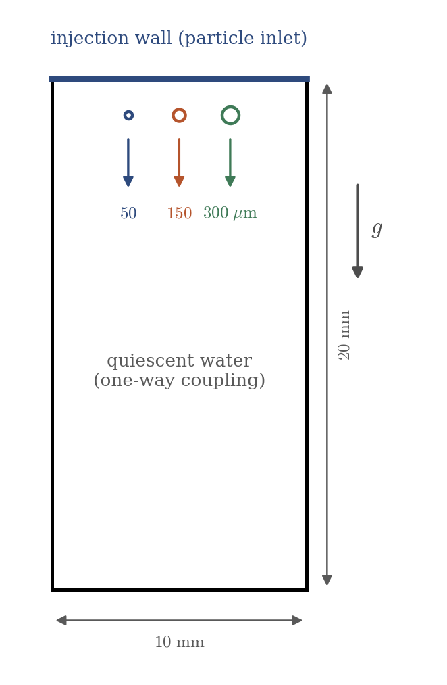
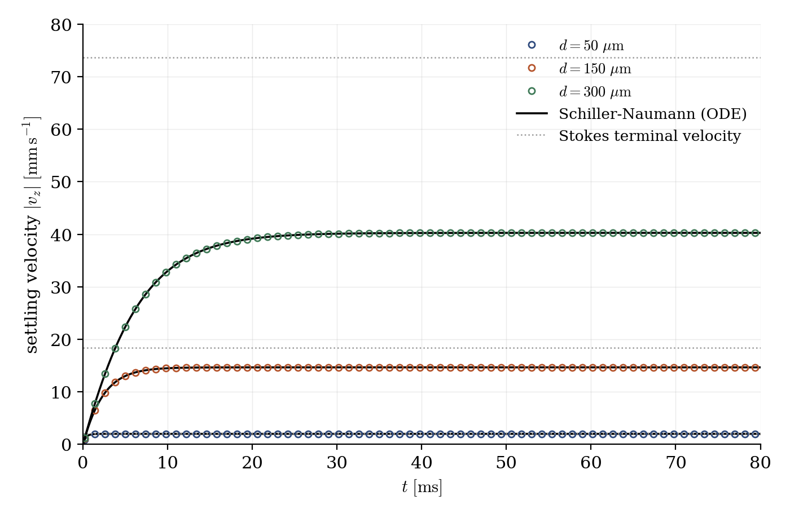

# Settling Particles (Lagrangian Module)

A step-by-step tutorial for the **Lagrangian particle tracking module** of **code_saturne**: three glass beads of different diameters are released at rest in a box of quiescent water and settle under gravity. It is the entry case of the Lagrangian series: injection of particles, drag law, gravity and buoyancy, particle post-processing outputs. As a bonus, the settling dynamics has closed-form references: each bead relaxes to its terminal velocity following the Stokes or Schiller-Naumann drag law, and the computed velocities land on the theory to all displayed digits.

Maintained by [Simvia](https://Simvia.tech/fr), part of the
[tutoriel-code_saturne](https://github.com/simvia-tech/tutorials-code_saturne) collection.

## Learning objectives

After completing this tutorial you will be able to:

1. Enable the **Lagrangian module** (one-way coupling) and define a **particle injection** (number, diameter, density, initial velocity) on a boundary zone.
2. Configure the **particle post-processing outputs** (particle mesh writer, velocity and diameter attributes).
3. Disable the **stochastic turbulent dispersion** for deterministic trajectories (a switch not exposed in the GUI: `cs_user_lagr_model.cpp`).
4. Verify the trajectories against the **Stokes** and **Schiller-Naumann** drag laws.

## Prerequisites

| Requirement | Detail |
|---|---|
| code_saturne | **v9.1** |
| Background | Particle drag basics (Stokes law, particle relaxation time) |

If code_saturne is not yet installed, build it from the
[official homepage](https://www.code-saturne.org/cms/web/Download), pull a
ready-to-use Singularity image from the
[Open Simulation Center](https://open-simulation-center.org/downloads/code_saturne/code_saturne),
or pull the
[Simvia Docker image](https://hub.docker.com/r/Simvia/code_saturne) before continuing.

## Case files

```
Lag_Settling_Particle/
├── CASE/
│   ├── DATA/
│   │   └── setup.xml                 # pre-configured GUI case
│   └── SRC/
│       └── cs_user_lagr_model.cpp    # disables turbulent dispersion (MANDATORY here)
├── FIGURES/                          # figures used in this README
└── README.md
```

> There is **no MESH directory**: the mesh is generated at run time by the built-in cartesian mesher.

## Physical model

A sphere of diameter $d$ and density $\rho_p$ released at rest in a quiescent fluid obeys, per unit particle mass,

$$
\frac{dv}{dt} = g\left(1 - \frac{\rho_f}{\rho_p}\right) - \frac{v}{\tau_p(v)},
\qquad
\tau_p(v) = \frac{\rho_p d^2}{18 \mu}\,\frac{1}{1 + 0.15\,Re_p^{0.687}}
$$

where the $Re_p$-dependent factor is the **Schiller-Naumann** drag correction ($Re_p = \rho_f |v| d / \mu$). The physics behind it: the **Stokes** law ($F = 3\pi\mu d v$, drag linear in velocity) assumes creeping flow, i.e. viscosity dominating everywhere around the sphere, with a perfectly fore-aft symmetric flow pattern; it only holds for $Re_p \lesssim 0.1$. At finite $Re_p$ the inertia of the displaced fluid breaks that symmetry: the flow separates behind the sphere, a **wake** forms, and a pressure (form) drag adds to the viscous one. The total drag then grows **faster than linearly** with velocity, which is what the factor $1 + 0.15\,Re_p^{0.687}$ (an empirical fit of measurements, valid up to $Re_p \approx 800$) represents. Since the drag at a given speed is larger than Stokes, the balance between the apparent weight and the drag is reached at a **lower velocity**: a bead at $Re_p \approx 12$ settles $45\%$ slower than the Stokes formula predicts.

The velocity relaxes to the terminal value over a few $\tau_p$; in the Stokes limit the solution is the classic exponential $v(t) = v_t\,(1 - e^{-t/\tau_p})$ with $v_t = \tau_p\, g\, (1 - \rho_f/\rho_p)$.

Three glass beads ($\rho_p = 2500\ \mathrm{kg\,m^{-3}}$) in water span the drag regimes:

| $d$ | $\tau_p$ (Stokes) | $Re_p$ at $v_t$ | $v_t$ (Schiller-Naumann) |
|---|---|---|---|
| $50\ \mathrm{\mu m}$ | $0.35$ ms | $0.10$ | $1.99\ \mathrm{mm\,s^{-1}}$ (Stokes $-3\%$) |
| $150\ \mathrm{\mu m}$ | $3.1$ ms | $2.2$ | $14.6\ \mathrm{mm\,s^{-1}}$ (Stokes $-20\%$) |
| $300\ \mathrm{\mu m}$ | $12.5$ ms | $12$ | $40.3\ \mathrm{mm\,s^{-1}}$ (Stokes $-45\%$) |

The carrier water stays at rest (one-way coupling: the particles do not affect the fluid), and the buoyancy enters through the resolved hydrostatic pressure gradient, hence the $(1 - \rho_f/\rho_p)$ factor.

### Two module-specific points

- **Turbulence model requirement**: in this version, the Lagrangian module requires an active turbulence model even for a quiescent carrier (its fluid-quantity computations assume a turbulent kinetic energy field exists). The setup therefore enables a k-ε model that stays **physically inert**: the fluid does not move, and the particle drag uses the molecular viscosity.
- **`cs_user_lagr_model.cpp` is mandatory here**: the stochastic turbulent dispersion of the particles is active by default and this switch is not exposed in the GUI. For deterministic, drag-only trajectories comparable to the analytic laws, the user file sets `idistu = 0` (and `idiffl = 0`).

### Flow parameters

| Quantity | Symbol | Value | Source |
|---|---|---|---|
| Carrier (water) | $\rho_f$, $\mu$ | $998\ \mathrm{kg\,m^{-3}}$, $10^{-3}\ \mathrm{Pa\,s}$ | `density`, `molecular_viscosity` |
| Particles (glass) | $\rho_p$, $d$ | $2500\ \mathrm{kg\,m^{-3}}$; $50$, $150$, $300\ \mathrm{\mu m}$ | injection classes |
| Gravity | $g$ | $(0, 0, -9.81)\ \mathrm{m\,s^{-2}}$ | `gravity` |
| Domain | | $10 \times 10 \times 20$ mm, $8 \times 8 \times 32$ cells | `mesh_cartesian` |
| Time | $\Delta t$, $N$ | $10^{-5}$ s, $8000$ steps ($t_{end} = 80$ ms) | `time_parameters` |

## Geometry and boundary conditions

<p align="center">
  
  <br>
  <em>Figure 1: computational domain. The three beads are injected at rest from the top wall (one per class, single injection at the first time step) and settle; the largest falls about 3 mm during the run, far from the bottom.</em>
</p>

| Boundary | Location | Fluid nature | Particle condition |
|---|---|---|---|
| `Top` | $z = 20$ mm | Smooth wall | **Particle inlet** (3 classes) |
| `Walls` | other 5 faces | Smooth wall | Deposition |

### The injection in the GUI

In **Boundary conditions**, the `Top` wall carries the *particles* condition **inlet**, with three injection sets (one per diameter). Each set: $1$ particle, **frequency $0$** (a single injection at the first time step), density $2500$, statistical weight $1$, initial velocity of **norm $0$** (released at rest), diameter $50$, $150$ or $300\ \mathrm{\mu m}$ with zero standard deviation. The Lagrangian module itself is enabled in **Calculation features → Homogeneous Eulerian - Lagrangian multiphase treatment** (one-way coupling), and the particle outputs (velocity, diameter) in the **Output control** pages.

## Numerical setup

| Setting | Value | Rationale |
|---|---|---|
| Lagrangian coupling | **one-way** | The dilute particles do not affect the carrier |
| Turbulent dispersion | **disabled** (`idistu = 0`, user file) | Deterministic drag-only trajectories |
| Carrier turbulence model | k-ε (inert, quiescent carrier) | Required by the module in this version |
| Time-stepping | Fixed $\Delta t = 10^{-5}$ s | $35$ steps per smallest $\tau_p$ |
| Particle output writer | every $20$ steps | $400$ samples of each trajectory |

## Running the simulation

The commands below start from the tutorial directory:

```bash
cd Lag_Settling_Particle/
```

### Option A: Graphical interface

```bash
code_saturne gui CASE/DATA/setup.xml &
```

The GUI opens the pre-configured `setup.xml`. Review the setup if you wish,
then launch the run with the **gear (Run) button** in the toolbar.

### Option B: Command line

The command-line launcher is run from inside the case directory:

```bash
cd CASE

# serial (about a minute)
code_saturne run
```

The user routine `SRC/cs_user_lagr_model.cpp` is compiled automatically at the beginning of the run. Each run creates a time-stamped directory `CASE/RESU/<YYYYMMDD-HHMM>/` whose `postprocessing/` contains, besides the fluid fields, the **particle output** (`PARTICLES.case`, EnSight format): positions and attributes of every particle at each output step.

## Results

<p align="center">
  
  <br>
  <em>Figure 2: settling velocity of the three beads (symbols) against the integrated Schiller-Naumann law (solid lines). Each bead relaxes over a few $\tau_p$ to its terminal velocity; the computed plateaus match the theory to all displayed digits ($1.9856$, $14.6494$, $40.2670\ \mathrm{mm\,s^{-1}}$). The dotted lines are the Stokes terminal velocities, which overestimate the settling: at finite $Re_p$ the wake behind the bead adds a form drag on top of the viscous one, so the real drag exceeds Stokes and the bead settles slower ($-20\%$ at $Re_p = 2$, $-45\%$ at $Re_p = 12$).</em>
</p>

The exact agreement is expected (the solver integrates the same drag law), and that is precisely what makes the case a useful entry point: it confirms the whole chain of conventions in one look: which drag law is active, that buoyancy is included, that the injected diameter and density are the ones prescribed, and that the trajectories are deterministic once the turbulent dispersion is off.

## Summary

This tutorial set up the Lagrangian module of code_saturne on its simplest possible case: three beads injected at rest in quiescent water, one-way coupling, deterministic drag-only trajectories (turbulent dispersion disabled in the mandatory `cs_user_lagr_model.cpp`), and particle EnSight outputs. The three settling curves land exactly on the Stokes/Schiller-Naumann theory across three drag regimes.

## References

- L. Schiller, A. Naumann. Über die grundlegenden Berechnungen bei der Schwerkraftaufbereitung, Z. Ver. Dtsch. Ing., 77:318-320, 1933.
- R. Clift, J.R. Grace, M.E. Weber. Bubbles, Drops and Particles, Academic Press, 1978.
- [code_saturne documentation](https://www.code-saturne.org/cms/web/documentation)

## Authors

[Simvia](https://Simvia.tech/fr) - Questions, remarks and requests are welcome.
