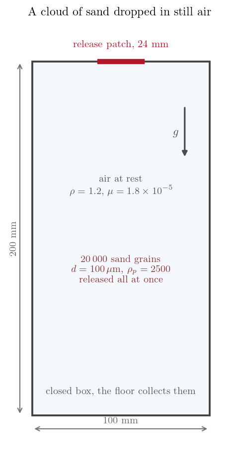
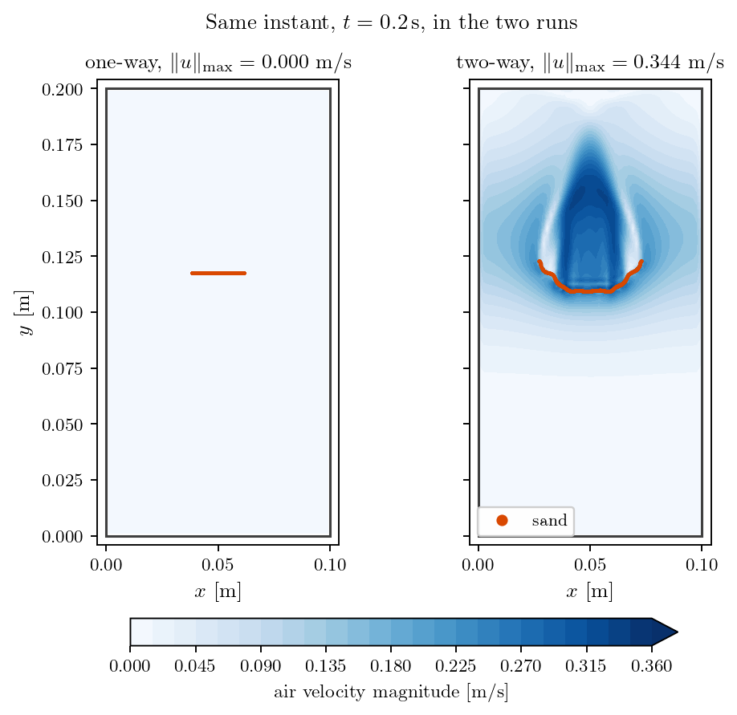

# Two-Way Coupling: a Sheet of Sand Moves the Air

In a Lagrangian computation the fluid exerts a drag force on every particle.
One-way coupling stops there: the particle feels that force, but the equal and
opposite reaction is never applied to the fluid. Two-way coupling applies it, as a
momentum source in the cells the particle crosses.

That reaction is negligible when the particles are few, and decisive when their
mass approaches the mass of fluid around them, because it then changes the very
flow that carries them.

This case is built to make the difference plain. Sand grains are released from a
patch at the top of a closed box of still air, and the case is run twice, changing
only the coupling. Nothing else could set the air in motion: no inlet, no outlet,
no moving wall. So in one-way coupling the air stays exactly at rest, whatever the
sand does above it. In two-way coupling the drag reaction drives a downward plume,
and the grains, now falling through descending air, reach the floor faster than
they would in still air.

The case is an illustration of the two options and of what changes between them.
It is not a validation, and no result here is compared with reference data.

Maintained by [Simvia](https://Simvia.tech/fr), part of the
[tutoriel-code_saturne](https://github.com/simvia-tech/tutorials-code_saturne) collection.

## Learning objectives

After completing this tutorial you will be able to:

1. Switch a Lagrangian computation from one-way to two-way coupling, and know what the extra options do.
2. Anticipate the constraint the module imposes: the return coupling needs a turbulence model, whatever the flow is doing.
3. Judge beforehand whether coupling is worth enabling, from the mass of the particles rather than their number.

## Prerequisites

| Requirement | Detail |
|---|---|
| code_saturne | **v9.1** |
| Tutorials | [Lag_Settling_Particle](../Lag_Settling_Particle) (the module and the drag law), [Lag_Bend_Deposition](../Lag_Bend_Deposition) (particle classes and wall interactions) |
| Background | Particle relaxation time, terminal velocity |

If code_saturne is not yet installed, build it from the
[official homepage](https://code-saturne.org/), pull a
ready-to-use Singularity image from the
[Open Simulation Center](https://open-simulation-center.org/downloads/code_saturne/code_saturne),
or pull the
[Simvia Docker image](https://hub.docker.com/r/Simvia/code_saturne) before continuing.

## Case files

```text
Lag_Twoway_Sand/
├── CASE_ONEWAY/
│   ├── DATA/setup.xml
│   └── SRC/cs_user_lagr_model.cpp
├── CASE_TWOWAY/
│   ├── DATA/setup.xml
│   └── SRC/cs_user_lagr_model.cpp
├── FIGURES/
└── README.md
```

There is no mesh file: the box is a Cartesian mesh defined in the GUI. The two
cases differ by the coupling and the options that come with it:

```xml
<lagrangian model="two_way">
  <two_way_coupling>
    <iteration_start>1</iteration_start>
    <dynamic status="on"/>
    <mass status="off"/>
    <thermal status="off"/>
  </two_way_coupling>
```

`dynamic` is the momentum feedback, the one used here; `mass` and `thermal` return
mass and heat instead, for evaporating or burning particles. `iteration_start`
delays the feedback, which helps when the carrier still has to settle. Here it has
nothing to settle into, so the feedback starts immediately.

The user routine switches off the stochastic dispersion models, which mean nothing
in still air. It is the same file as in the settling tutorial.

## Physical model

Air at rest in a closed box, sand grains released from a patch at the top and
collected by the floor.

| Quantity | Value |
|---|---:|
| Box | $100 \times 200 \times 5$ mm |
| Air density, viscosity | $1.2$ kg/m³, $1.8\times10^{-5}$ Pa s |
| Grain diameter, density | $100\ \mu$m, $2500$ kg/m³ |
| Release patch | $24$ mm wide, centred |
| Grains released | $20\,000$, in one release |

The grains are small and heavy enough to settle at a well-defined terminal
velocity, which the drag law of the module gives from their weight, their buoyancy
and their Reynolds number.

### Why the coupling is visible here

What matters is the mass of the particles, not their number. In this box the sand
released weighs a fifth of all the air, and it is concentrated in a thin sheet, so
locally there is several times more sand than air. Since a grain settling at its
terminal velocity hands its whole weight to the fluid, that sheet acts as a body
force: a parcel of air made several times heavier, which then falls like any dense
plume. With a hundred times fewer grains the two runs would be indistinguishable.

## Geometry and boundary conditions

<p align="center">
  
  <br>
  <em>Figure 1: The grains are released together from the patch, fall under gravity,
  and are collected by the floor.</em>
</p>

| Boundary | Fluid | Particles |
|---|---|---|
| release patch (top, centre) | wall | release |
| rest of the top, side walls | walls | rebound |
| floor | wall | deposit, the grains stay where they land |
| spanwise planes | symmetry | particle symmetry |

The box is closed for both phases: nothing can drive the air, and no boundary lets
a grain through. Whatever motion appears has one possible origin.

## Numerical setup

| Setting | Value |
|---|---:|
| Mesh | $60 \times 120 \times 1$ cells |
| Turbulence | $k$-$\varepsilon$, required by the coupling |
| Time step | $2\times10^{-4}$ s, constant |
| Iterations | $3000$ |

The run is long enough for the grains to cross the box and land.

## Running the simulation

```bash
cd Lag_Twoway_Sand/

cd CASE_ONEWAY && code_saturne run --n 4 --id drop && cd ..
cd CASE_TWOWAY && code_saturne run --n 4 --id drop && cd ..
```

Each run takes a few minutes on four cores.

## Results

<p align="center">
  
  <br>
  <em>Figure 2: Air velocity and grains at the same instant in both runs. Left, the
  grains fall and the air does not move. Right, the grains drive a plume and the
  sheet bows into it.</em>
</p>

The left panel matters as much as the right one. Its air is not slow, it is at rest
to machine precision: in one-way coupling no amount of falling sand can move it,
and the grains simply settle at their terminal velocity, in a sheet that stays
perfectly flat.

Switch the coupling on and the sand becomes part of the flow problem. It drives a
plume down the box, fed by a return flow along the walls, and the grains fall
noticeably faster than they did alone, because they are riding the plume they
created. The sheet shows it too: it bows downwards at its centre, where the plume
is strongest, instead of staying flat.

The air also keeps turning over the box after the last grains have landed. Momentum
handed to the air stays there until viscosity and the walls take it back, which is
something a one-way computation cannot represent at all.

## Summary

One setting apart, two runs of the same closed box. One-way: air at rest, grains at
their terminal velocity, sheet flat. Two-way: a plume driven by nothing but the
grains, a sheet bowing into it, grains falling faster, and a flow that outlives the
sand.

Two things to take away. The return coupling is unavailable without a turbulence
model, and it is the particle mass, not the particle count, that decides whether
any of this matters.

## References

1. [code_saturne documentation](https://code-saturne.org/doc/)

## Authors

[Simvia](https://Simvia.tech/fr) - Questions, remarks and requests are welcome.
