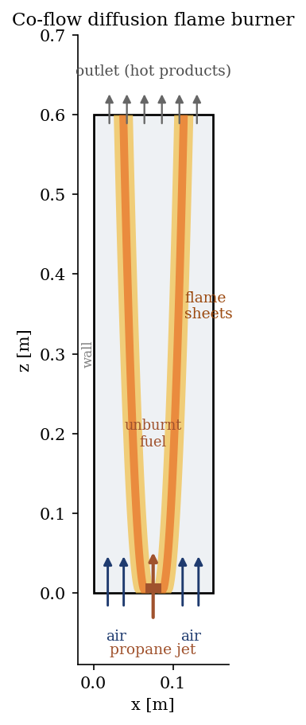
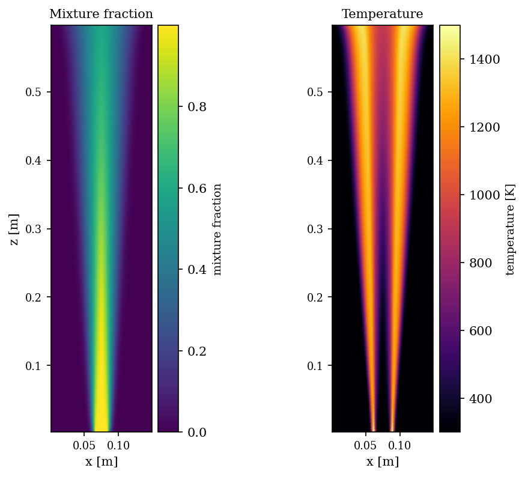
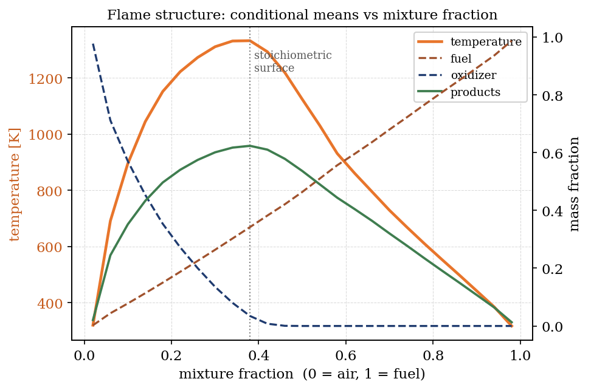

# Gas Diffusion Flame (cogz, 3-point chemistry)

A step-by-step tutorial on the **gas combustion module** (`cogz`) of
**code_saturne**, using the **3-point fast-chemistry** diffusion flame model
(`d3p`, a Burke-Schumann description). A central **propane jet** burns in an
**air co-flow**: the flame anchors on its own at the surface where fuel and air
meet in stoichiometric proportion, no ignition source needed.

Maintained by [Simvia](https://Simvia.tech/fr), part of the
[tutoriel-code_saturne](https://github.com/simvia-tech/tutorials-code_saturne) collection.

## Learning objectives

After completing this tutorial you will be able to:

1. Activate the **gas combustion** module and the **3-point diffusion flame**
   model (`d3p`) entirely through the GUI.
2. Provide a **thermochemistry data file** (`dp_C3P`, propane-air) and declare
   **fuel** and **oxidizer** inlets.
3. Read a diffusion flame result: the **mixture fraction** field (fuel/air
   mixing) and the **temperature** field (two flame sheets), and recognise the
   **Burke-Schumann** structure (temperature and products peak at the
   stoichiometric surface).

## Prerequisites

| Requirement | Detail |
|---|---|
| code_saturne | **v9.0.0** (see the note below) |
| Tutorials | any of the incompressible RANS cases (k-epsilon, inlets/outlets) |

> **Version note.** This case is set up and validated on **code_saturne 9.0.0**.
> The `d3p` model has a temperature-reconstruction regression in **9.1.0**: on
> 9.1 the mean-temperature output blows up to a fixed, unphysical value (~42698 K)
> in the **unburnt pure-fuel core** (the internal density and flow stay bounded,
> so it is an output-only artifact, but it makes the temperature field unusable).
> Running the *identical* `setup.xml` on both solvers gives a clean 300-1500 K
> field on 9.0.0 and the artifact on 9.1.0, so the difference is the solver
> version, not the setup. We therefore ship this tutorial as a 9.0.0 case until
> a fixed release is available. The
> [Simvia code_saturne 9.0.0 Docker image](https://hub.docker.com/r/Simvia/code_saturne)
> reproduces it directly.

## Case files

```
Cogz_Diffusion_Flame/
├── CASE/
│   └── DATA/
│       ├── setup.xml      # GUI: d3p model, radiation, mesh, inlets, walls, time
│       └── dp_C3P         # propane-air thermochemistry (shipped with the case)
├── FIGURES/
└── README.md
```

> The whole case is built in the **GUI**: combustion model, thermochemistry file,
> turbulence, radiation, mesh, boundary conditions and time stepping. There are
> **no user C routines**. `dp_C3P` is a standard code_saturne reference
> thermochemistry file (found under `data/user/` of the source tree), copied into
> `DATA/` so the case is self-contained.

## Physical model

The `d3p` model treats a **non-premixed (diffusion) flame** with **infinitely
fast chemistry**. Fuel and oxidizer are supplied by separate streams and mix by
turbulent transport. A single conserved scalar, the **mixture fraction** `f`
(`f = 1` in the fuel stream, `f = 0` in the air stream), together with its
variance describes the mixing; the chemistry is assumed instantaneous, so fuel
and oxygen cannot coexist. Temperature and composition are then functions of the
mixture fraction (the **Burke-Schumann** relation): they peak at the
**stoichiometric surface** and fall back to the inlet temperature in both pure
streams. No ignition or reaction-rate model is required.

Here the flame is **non-adiabatic**: the transported enthalpy (`extended`
option) is coupled to a **P-1 radiation** model, so the hot gas loses heat by
radiation to the (gray) walls. Chemistry is set by the `dp_C3P` file: **propane**
(C3H8) as fuel, **air** (O2 + 3.76 N2) as oxidizer, with CO2/H2O/N2 products.

### Flow parameters

| Quantity | Value |
|---|---|
| Domain | $0.15 \times 0.60$ m (2D slice, $x$ across, $z$ up) |
| Mesh | $60 \times 120$ cells (cartesian) |
| Fuel jet (centre, width 2 cm) | propane, $1.0$ m/s, $300$ K |
| Air co-flow (either side) | air, $0.5$ m/s, $300$ K |
| Combustion model | `d3p`, extended (non-adiabatic) |
| Radiation | P-1, gray walls ($\varepsilon = 0.8$) |
| Turbulence | $k$-$\varepsilon$ |

<p align="center">
  
  <br>
  <em>Figure 1: co-flow diffusion flame burner. Propane enters as a central jet
  (rust), air as a co-flow (blue). Two flame sheets anchor at the jet rim and
  open outward downstream; unburnt fuel stays in the core.</em>
</p>

## Geometry and boundary conditions

A 2D slice with $z$ vertical (flow up) and $x$ across. The bottom face is split
into a central **fuel inlet** (`Z0` with $0.065 < x < 0.085$, gas type *fuel*)
and an **air inlet** (the rest of `Z0`, gas type *oxydant*). The top (`Z1`) is a
free **outlet**, the sides (`X0`/`X1`) are **gray radiative walls**, and the
spanwise faces (`Y0`/`Y1`) are **symmetry**. The fuel/oxidizer inlet types are a
GUI setting (they set the mixture fraction to 1 and 0 respectively); the fuel and
oxidizer inlet temperatures ($300$ K) are the reference fuel/oxidant
temperatures.

## Numerical setup

Everything is selected in the GUI: the `d3p` combustion model with the `dp_C3P`
data file, the P-1 radiation model with gray walls, a $k$-$\varepsilon$
turbulence model, a cartesian mesh and the inlet/outlet/wall/symmetry zones. The
run advances to a near-steady state ($2500$ time steps, $\Delta t = 2\times
10^{-3}$ s).

## Running the simulation

```bash
cd CASE
# with the Simvia 9.0.0 Docker image (see the version note above):
docker run --rm -v "$(pwd)":/home/code_saturne \
       simvia/code_saturne:9.0.0 run --nprocs 4
```

Each run writes a timestamped `CASE/RESU/<id>/` with `run_solver.log` and the
EnSight Gold output under `postprocessing/`.

## Results and verification

**Two flame sheets.** The mixture fraction shows the propane jet mixing outward
into the air; the temperature shows **two flame sheets** on either side of the
jet, exactly where fuel meets air at the stoichiometric surface. The centre
(pure fuel) and the outer region (pure air) stay cool, the classic signature of
a non-premixed flame. The sheets open outward and merge downstream.

<p align="center">
  
  <br>
  <em>Figure 2: mixture fraction (left) and temperature (right). The flame sits
  at the fuel/air interface, not in the pure-fuel core.</em>
</p>

**Burke-Schumann structure.** Plotting the conditional means against the mixture
fraction recovers the expected picture: **oxidizer** is consumed and **products**
and **temperature** peak at the **stoichiometric surface**, then temperature
falls back toward the inlet value in both the fuel-rich and air-rich limits. Fuel
mass fraction rises linearly toward the pure-fuel stream.

<p align="center">
  
  <br>
  <em>Figure 3: flame structure. Conditional-mean temperature and species vs
  mixture fraction, the Burke-Schumann signature of a diffusion flame.</em>
</p>

The peak mean temperature is about $1500$ K. This is a **turbulent, radiatively
cooled mean**: it is lower than the adiabatic stoichiometric flame temperature of
propane-air (about $2270$ K) because the $k$-$\varepsilon$ mixture-fraction
variance broadens the burning across a range of mixtures and the P-1 model
removes heat by radiation. This is a demonstration of the diffusion flame model
(structure, flame position, mixture-fraction coupling) rather than a
quantitative flame-temperature validation.

## Summary

This tutorial activated the `cogz` gas combustion module with the **3-point
diffusion flame** model, entirely from the GUI: a propane jet in an air co-flow,
a shipped `dp_C3P` thermochemistry file, fuel/oxidizer inlets, and a
non-adiabatic (radiation-coupled) energy balance. The result is a textbook
co-flow diffusion flame: two flame sheets at the stoichiometric surface, a cool
unburnt-fuel core, and the Burke-Schumann coupling between temperature,
composition and mixture fraction.

## References

- N. Peters. *Turbulent Combustion*, Cambridge University Press, 2000.
- S. B. Pope. *Turbulent Flows*, Cambridge University Press, 2000 (mixture
  fraction and non-premixed combustion).
- [code_saturne documentation](https://code-saturne.org/doc/)

## Authors

[Simvia](https://Simvia.tech/fr). Questions, remarks and requests are welcome.
