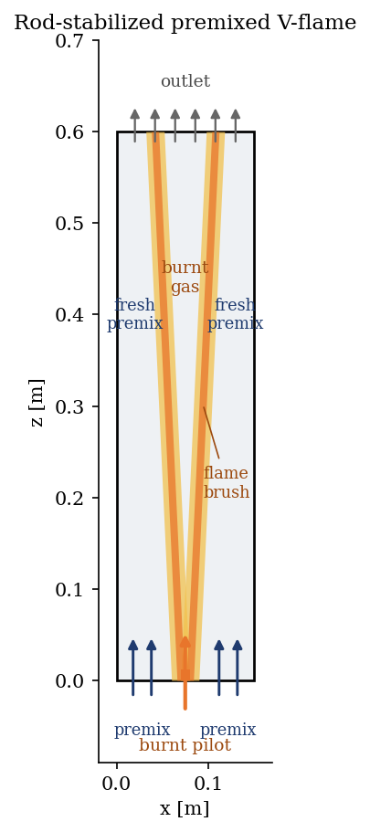
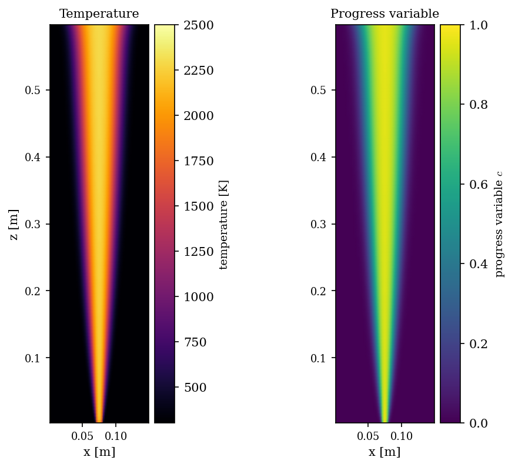
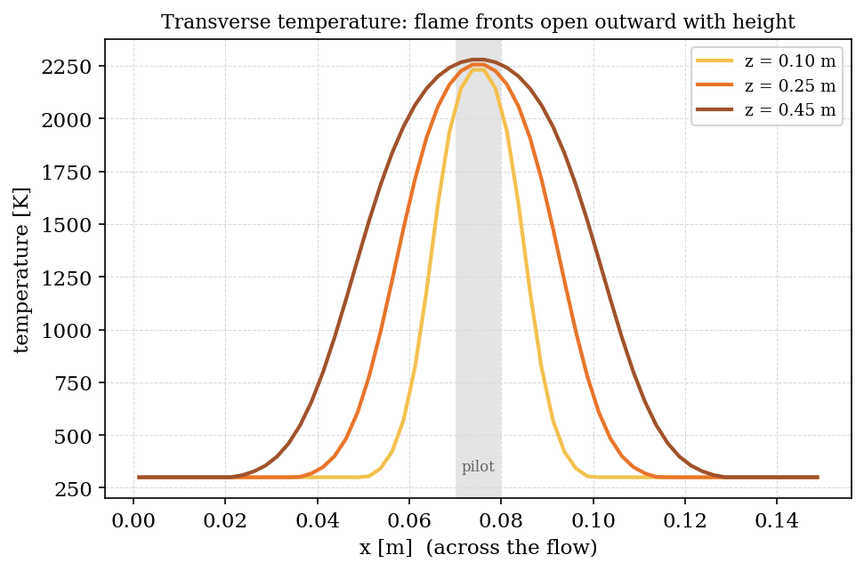

# Turbulent Premixed Flame (cogz, Eddy Break-Up)

A step-by-step tutorial on the **premixed** side of the **gas combustion module**
(`cogz`) of **code_saturne**, using the **Eddy Break-Up** model (EBU). A uniform
**fresh propane-air premix** flows up past a thin central **burnt-gas pilot**;
the pilot anchors a **rod-stabilized V-flame** that spreads outward into the
fresh gas as a turbulent flame brush.

It is the premixed counterpart of the
[Cogz_Diffusion_Flame](../Cogz_Diffusion_Flame) tutorial: there the fuel and air
enter separately and burn where they mix (non-premixed); here they are already
mixed and the flame propagates through them (premixed).

Maintained by [Simvia](https://Simvia.tech/fr), part of the
[tutoriel-code_saturne](https://github.com/simvia-tech/tutorials-code_saturne) collection.

## Learning objectives

After completing this tutorial you will be able to:

1. Activate the **EBU premixed combustion** model (`ebu`) through the GUI.
2. Declare a **fresh-premix inlet** (unburned gas) and a **burnt-gas pilot**
   inlet to anchor the flame, setting the premix mixture fraction and the
   fresh/burnt temperatures.
3. Read a premixed flame result: the **progress variable** (fresh to burnt) and
   the temperature, and recognise the **turbulent flame brush** that separates
   fresh reactants from hot products.

## Prerequisites

| Requirement | Detail |
|---|---|
| code_saturne | **v9.1** (see the note below) |
| Tutorials | [Cogz_Diffusion_Flame](../Cogz_Diffusion_Flame) (the non-premixed counterpart) |

> **Version note.** This case runs on **code_saturne 9.1**. The EBU model
> **crashes on 9.0.0** (a segmentation fault in the legacy Fortran source-term
> routine `cs_f_ebutss`), which 9.1 replaced with a clean C++ implementation.
> This is the mirror image of the diffusion-flame tutorial, whose `d3p` model is
> clean on 9.0.0 but broken on 9.1. Together the two cases run on the two
> versions: **diffusion flame on 9.0.0, premixed flame on 9.1**.

## Case files

```
Cogz_Premixed_Flame/
├── CASE/
│   └── DATA/
│       ├── setup.xml      # GUI: EBU model, mesh, premix + pilot inlets, symmetry sides, time
│       └── dp_C3P         # propane-air thermochemistry (shipped with the case)
├── FIGURES/
└── README.md
```

> The whole case is built in the **GUI**, with **no user C routines**. `dp_C3P`
> is the same standard propane-air thermochemistry file as in the diffusion-flame
> tutorial, copied into `DATA/`.

## Physical model

In a **premixed** flame the fuel and oxidizer are mixed **before** they reach the
flame, so combustion is limited by how fast a flame front can propagate through
the reactants, not by mixing of separate streams. The **Eddy Break-Up** model
represents this with a **progress variable** (here `c = 1 - `*fresh-gas fraction*,
so `c = 0` in fresh reactants and `c = 1` in burnt products). The mean reaction
rate is controlled by the **turbulent time scale** `k/\varepsilon`: turbulence
wrinkles and thickens the flame, and the model burns the reactants at a rate set
by the turbulent mixing. Temperature is a direct function of the progress
variable, from the fresh temperature to the burnt (adiabatic) temperature.

The `enthalpy_mixture_st` option transports the progress variable, the **mixture
fraction** and the **enthalpy**. The lateral boundaries are **symmetry planes**,
so the burner is effectively **unconfined** and the flame is **adiabatic**.
Chemistry is set by `dp_C3P`: propane (C3H8) and air, here as a **stoichiometric**
premix.

### Flow parameters

| Quantity | Value |
|---|---|
| Domain | $0.15 \times 0.60$ m (2D slice, $x$ across, $z$ up), unconfined (symmetry sides) |
| Mesh | $60 \times 120$ cells (cartesian) |
| Fresh premix inlet | propane-air, $2.0$ m/s, $300$ K, mixture fraction $0.06$ (stoichiometric) |
| Burnt pilot (centre, 1 cm) | burnt gas, $2.0$ m/s, $2000$ K, same mixture |
| Combustion model | EBU, `enthalpy_mixture_st` (adiabatic) |
| Turbulence | $k$-$\varepsilon$ |

<p align="center">
  
  <br>
  <em>Figure 1: rod-stabilized premixed V-flame. A central burnt-gas pilot (rust)
  anchors two flame fronts that open outward into the fresh premix (blue). The V
  does not reach the sides, so fresh premix still flows along both walls.</em>
</p>

## Geometry and boundary conditions

A 2D slice with $z$ vertical (flow up) and $x$ across. The bottom face is split
into a thin central **pilot inlet** (`Z0` with $0.070 < x < 0.080$, gas type
*burned* at $2000$ K) and a **fresh-premix inlet** (the rest of `Z0`, gas type
*unburned* at $300$ K). Both carry the same stoichiometric propane-air mixture.
The top (`Z1`) is a free **outlet**; all lateral faces (`X0`/`X1` and the
spanwise `Y0`/`Y1`) are **symmetry** planes, so the burner is unconfined (see the
note above on why walls are avoided here).

## Numerical setup

Everything is selected in the GUI: the EBU model with the `dp_C3P` data file, a
$k$-$\varepsilon$ turbulence model, a cartesian mesh and the two inlet zones plus
the outlet and symmetry boundaries. The run advances to a near-steady state
($2500$ time steps, $\Delta t = 2\times 10^{-3}$ s).

## Running the simulation

```bash
cd CASE
code_saturne run --nprocs 4
```

Each run writes a timestamped `CASE/RESU/<id>/` with `run_solver.log` and the
EnSight Gold output under `postprocessing/`.

## Results and verification

**A V-flame.** The pilot anchors the flame at the burner; the two flame fronts
open outward as they rise, so the **burnt-gas core widens with height** while the
fresh premix is consumed from the inside out. The progress variable makes this
explicit: `c = 0` (fresh) on the sides, `c = 1` (burnt) in the growing central
region, with a thin **flame brush** between them.

<p align="center">
  
  <br>
  <em>Figure 2: temperature (left) and progress variable (right). The burnt core
  widens with height as the flame fronts propagate into the fresh premix.</em>
</p>

**Flame brush.** A transverse cut at several heights shows the two flame fronts
(steep temperature rise) moving **outward** as the height increases, the V
signature: the hot central region grows and the cool fresh premix is pushed
toward the walls.

<p align="center">
  
  <br>
  <em>Figure 3: transverse temperature at three heights. The flame fronts open
  outward with height, the V-flame signature.</em>
</p>

The burnt-gas temperature reaches about $2293$ K, essentially the adiabatic
complete-combustion temperature of stoichiometric propane-air (about $2270$ K).
The small excess is because the infinitely-fast EBU chemistry burns to **complete
products** and ignores dissociation, which in reality shaves off the last tens of
kelvin. The point of the case is the **premixed flame behaviour** (progress
variable, flame brush, turbulent flame propagation), which the peak temperature
confirms is physically sound.

## Summary

This tutorial activated the `cogz` module with the **EBU premixed** model,
entirely from the GUI: a stoichiometric propane-air premix, a burnt-gas pilot to
anchor the flame, on an unconfined (symmetry-bounded) burner. The result is a
textbook rod-stabilized V-flame with a turbulent flame brush separating fresh
reactants from hot products. With the
[Cogz_Diffusion_Flame](../Cogz_Diffusion_Flame) case, the pair covers the two
fundamental combustion regimes: **non-premixed** (diffusion) and **premixed**.

## References

- N. Peters. *Turbulent Combustion*, Cambridge University Press, 2000.
- D. B. Spalding. *Mixing and chemical reaction in steady confined turbulent
  flames*, Proc. Combust. Inst. 13, 649-657, 1971 (Eddy Break-Up).
- [code_saturne documentation](https://www.code-saturne.org/cms/web/documentation)

## Authors

[Simvia](https://Simvia.tech/fr). Questions, remarks and requests are welcome.
