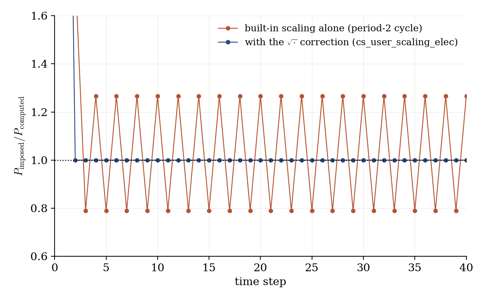
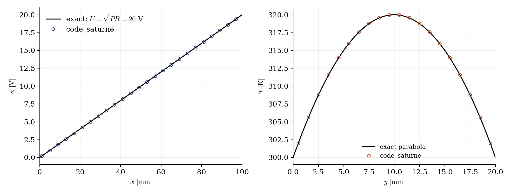

# Joule Heating at Imposed Power

A step-by-step tutorial for the **imposed-power mode** of the Joule module of **code_saturne**: instead of prescribing the electrode potentials, the operator prescribes the **dissipated power**, and the module rescales the potentials automatically at every time step: this is how electric furnaces are actually driven. On the bar of [Elec_Joule_Bar](../Elec_Joule_Bar), imposing $P = 40$ W must yield $U = \sqrt{PR} = 20$ V exactly. The case also documents (and fixes, through the official user hook) a convergence flaw of the built-in scaling iteration for the Joule variant.

Maintained by [Simvia](https://Simvia.tech/fr), part of the
[tutoriel-code_saturne](https://github.com/simvia-tech/tutorials-code_saturne) collection.

## Learning objectives

After completing this tutorial you will be able to:

1. Drive a Joule computation by **imposed power** (`variable_scaling`, `imposed_power`): the potential boundary conditions become a **shape**, whose amplitude the module finds.
2. Write rescaling-aware potential boundary conditions (a `dof` function multiplying the seed by the module's cumulative coefficient `coejou`).
3. Use the official hook **`cs_user_scaling_elec`** to impose your own regulation law, and understand why the built-in Joule power iteration cycles instead of converging.

## Prerequisites

| Requirement | Detail |
|---|---|
| code_saturne | **v9.1** |
| Case | [Elec_Joule_Bar](../Elec_Joule_Bar) (the same bar with imposed potentials, and the user-file requirements of the Joule variant) |

If code_saturne is not yet installed, build it from the
[official homepage](https://code-saturne.org/), pull a
ready-to-use Singularity image from the
[Open Simulation Center](https://open-simulation-center.org/downloads/code_saturne/code_saturne),
or pull the
[Simvia Docker image](https://hub.docker.com/r/Simvia/code_saturne) before continuing.

## Case files

```
Elec_Imposed_Power/
├── CASE/
│   ├── DATA/
│   │   └── setup.xml                        # Elec_Joule_Bar + scaling on, imposed_power 40
│   └── SRC/
│       ├── cs_user_physical_properties.cpp  # sigma + T(H) law (as Elec_Joule_Bar)
│       ├── cs_user_boundary_conditions.cpp  # SEED potentials, rescaled by coejou
│       └── cs_user_electric_scaling.cpp     # square-root correction of the scaling
├── FIGURES/                                 # figures used in this README
└── README.md
```

## Physical model

The bar is that of [Elec_Joule_Bar](../Elec_Joule_Bar) ($R = L/(\sigma A) = 10\ \Omega$). With the **potential scaling** enabled (`ielcor = 1`), the module compares at each step the dissipated power $P = \int \sigma |\nabla \phi|^2\,dV$ to the imposed one and multiplies the potential (field and boundary values, through the cumulative coefficient `coejou`) by a correction factor. At convergence:

$$
U = \sqrt{P\,R} = \sqrt{40 \times 10} = 20\ \mathrm{V},
\qquad
I = U/R = 2\ \mathrm{A},
\qquad
q_J = P/V = 4 \times 10^6\ \mathrm{W/m^3}
$$

and the steady thermal parabola scales accordingly: $\Delta T_{max} = q_J h^2 / (8\lambda) = 20$ K.

### Boundary conditions become a shape

With the scaling active, the electrode Dirichlet values are only a **seed**: the module stretches them by `coejou` until the power matches. Two consequences for the user files:

- the potential boundary condition must be evaluated **through a function** that multiplies the seed by `cs_glob_elec_option->coejou` at every evaluation (a `cs_dof_func_t` registered with `cs_equation_add_bc_by_dof_func`), otherwise the rescaling never reaches the boundary. This mirrors what the GUI does for the arc model;
- the seed value is arbitrary (here $10$ V): the converged `coejou` simply becomes $U/\mathrm{seed} = 2.0$.

### The scaling iteration, and its fix

The built-in Joule rescaling multiplies the potential by the **power ratio** $P_{imp}/P_n$. Since $P \propto U^2$, this over-corrects: the iteration $U_{n+1} = U^{*2}/U_n$ has an **unstable fixed point**, and the computation cycles forever between two values (a period-2 oscillation, clearly visible in the log and in Figure 1) instead of converging: the potential difference never settles and the power bounces around the target. The correct factor is the **square root** of the power ratio, and the module provides the official place to impose it: the hook `cs_user_scaling_elec`, called right after the built-in rescaling at every step. The shipped `cs_user_electric_scaling.cpp` recomputes the dissipated power and applies $k = \sqrt{P_{imp}/P}$ to the potential, `coejou` and the Joule power: the linear potential equation then lands exactly on the imposed power in a single step.

### Flow parameters

| Quantity | Symbol | Value | Source |
|---|---|---|---|
| Imposed power | $P$ | $40$ W | `imposed_power` (GUI) |
| Bar resistance | $R$ | $10\ \Omega$ ($\sigma = 100\ \mathrm{S/m}$) | `cs_user_physical_properties.cpp` |
| Seed potential | | $10$ V (arbitrary) | `cs_user_boundary_conditions.cpp` |
| Expected converged state | $U$, $I$, `coejou` | $20$ V, $2$ A, $2.0$ | derived |
| Expected overheat | $\Delta T_{max}$ | $20$ K | derived |
| Bar, material, mesh, time | | as in [Elec_Joule_Bar](../Elec_Joule_Bar) | `setup.xml` |

## Geometry and boundary conditions

Identical to [Elec_Joule_Bar](../Elec_Joule_Bar): electrodes at the ends (grounded / powered), cooled lateral walls at $300$ K, symmetry on the spanwise planes.

## Numerical setup

As in [Elec_Joule_Bar](../Elec_Joule_Bar), plus:

| Setting | Value | Rationale |
|---|---|---|
| Potential scaling | **on** (`variable_scaling`) | Imposed-power drive |
| Imposed power | $40$ W | The regulation target |
| User scaling law | $k = \sqrt{P_{imp}/P}$ | `cs_user_electric_scaling.cpp` (see above) |

## Running the simulation

The commands below start from the tutorial directory:

```bash
cd Elec_Imposed_Power/
```

### Option A: Graphical interface

```bash
code_saturne gui CASE/DATA/setup.xml &
```

The GUI opens the pre-configured `setup.xml`. Review the setup if you wish,
then launch the run with the **gear (Run) button** in the toolbar.

### Option B: Command line

The command-line launcher is run from inside the case directory:

```bash
cd CASE

# serial (a few seconds)
code_saturne run
```

The three user routines are compiled automatically at the beginning of the run. The scaling history is printed at every step in `run_solver.log` (`imposed power / sum(jE)` lines).

## Results

<p align="center">
  
  <br>
  <em>Figure 1: the regulation at work: ratio of imposed to computed power at each step. With the built-in scaling alone, the iteration locks into the predicted period-2 cycle ($0.79 \leftrightarrow 1.27$) and never converges; with the square-root correction in <code>cs_user_scaling_elec</code>, the ratio is $1.00000$ from the second step onward.</em>
</p>

<p align="center">
  
  <br>
  <em>Figure 2: converged state. The potential found by the regulation spans $U = 20.00$ V ($E = 200.0000\ \mathrm{V/m}$), i.e. $\mathrm{coejou} = 2.0$ from the $10$ V seed; the thermal parabola reaches $T_{max} = 320.0000$ K. Computed integrals: $I = 2.00000$ A, $P = 40.00000$ W.</em>
</p>

## Summary

This tutorial drove the Joule bar by imposed power: the electrode potentials become a seed shape rescaled by the module (evaluated through a `coejou`-aware boundary function), and the regulation finds $U = \sqrt{PR} = 20$ V exactly. The built-in Joule scaling iteration is shown to cycle rather than converge (it applies the power ratio where its square root is needed), and the official `cs_user_scaling_elec` hook fixes it in one line: a useful pattern for any custom furnace regulation law.

## References

- [code_saturne documentation](https://code-saturne.org/doc/)

## Authors

[Simvia](https://Simvia.tech/fr) - Questions, remarks and requests are welcome.
