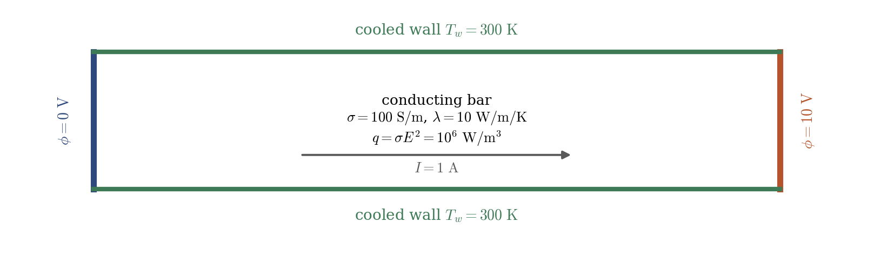
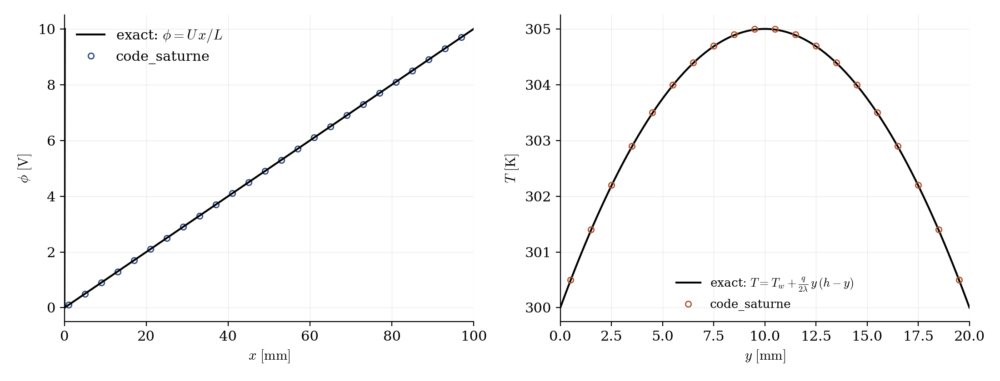

# Joule Heating of a Conducting Bar

A step-by-step tutorial for the **Joule effect module** of **code_saturne**: a static conducting bar carries a current between two electrodes, and the Joule dissipation heats it against its cooled walls. Everything has a closed form: the potential is linear, the total power is $P = UI$, and the steady temperature profile is a parabola. The case is the entry point of the electric module, and documents the three user-file requirements of its Joule variant.

Maintained by [Simvia](https://Simvia.tech/fr), part of the
[tutoriel-code_saturne](https://gitlab.com/Simvia/common-tools/tutoriel-code_saturne) collection.

## Learning objectives

After completing this tutorial you will be able to:

1. Enable the **Joule effect model** (real potential, `AC/DC`) and understand what the module solves.
2. Provide the **electrical conductivity** (the diffusivity of the potential) and the **temperature-enthalpy law** in `cs_user_physical_properties.cpp`.
3. Impose the **electrode potentials** in `cs_user_boundary_conditions.cpp` (required by a GUI limitation of this version).
4. Verify the computation against the exact solution (potential, power, current, temperature parabola).

## Prerequisites

| Requirement | Detail |
|---|---|
| code_saturne | **v9.1** |
| Background | Basic electrokinetics ($\mathbf{j} = \sigma \mathbf{E}$, Joule dissipation) |

If code_saturne is not yet installed, build it from the
[official homepage](https://www.code-saturne.org/cms/web/Download), pull a
ready-to-use Singularity image from the
[Open Simulation Center](https://open-simulation-center.org/downloads/code_saturne/code_saturne),
or pull the
[Simvia Docker image](https://hub.docker.com/r/Simvia/code_saturne) before continuing.

## Case files

```
Elec_Joule_Bar/
├── CASE/
│   ├── DATA/
│   │   └── setup.xml                        # pre-configured GUI case
│   └── SRC/
│       ├── cs_user_physical_properties.cpp  # sigma + T(H) law (MANDATORY)
│       └── cs_user_boundary_conditions.cpp  # electrode potentials (MANDATORY)
├── FIGURES/                                 # figures used in this README
└── README.md
```

> There is **no MESH directory**: the mesh is generated at run time by the built-in cartesian mesher.

## Physical model

The Joule module solves a Poisson equation for the electric potential, with the electrical conductivity as diffusivity, alongside the flow and energy equations:

$$
\nabla \cdot (\sigma \nabla \phi) = 0,
\qquad
\mathbf{j} = -\sigma \nabla \phi,
\qquad
q_J = \sigma\, |\nabla \phi|^2
$$

and injects the volumetric Joule power $q_J$ into the **enthalpy** equation (the thermal variable imposed by the module). The fluid here is kept static (no gravity, closed walls): it behaves as a solid conductor, and the case reduces to electrokinetics plus heat conduction.

With a potential difference $U$ over the length $L$ of a homogeneous bar, everything is closed-form:

$$
E = U/L, \qquad
q_J = \sigma E^2, \qquad
I = \sigma E A, \qquad
P = UI = q_J\, V
$$

and at steady state, the uniformly heated bar cooled by its two lateral walls (gap $h$) takes the parabolic profile

$$
T(y) = T_w + \frac{q_J}{2\lambda}\, y\, (h - y),
\qquad
\Delta T_{max} = \frac{q_J h^2}{8\lambda}
$$

### The three user-file requirements of the Joule variant

The electric-arc variant of the module reads its plasma properties from a data file; the **Joule variant delegates them to user code** (its industrial use, glass furnaces, involves strongly temperature-dependent material laws). Three things must be provided:

1. **The electrical conductivity** ($\sigma$, here $100\ \mathrm{S/m}$ constant): it is the *diffusivity field of the potential*, filled in `cs_user_physical_properties.cpp`. Any $\sigma(T)$ law fits in the same loop.
2. **The temperature-enthalpy conversion**: the module only performs it for electric arcs (from tabulated plasma properties); for the Joule variant the `temperature` property field must be filled by the user. With a constant $c_p$, simply $T = H/c_p$.
3. **The electrode potentials**: the GUI accepts Dirichlet values for `elec_pot_r`, but in this version its reader only applies the `joule_effect` variable boundary conditions when the electric **arc** model is active: for the pure Joule model they are silently ignored (the potential stays at zero and nothing heats). `cs_user_boundary_conditions.cpp` imposes them directly on the electrode zones with `cs_equation_add_bc_by_value`.

One more GUI quirk worth knowing: enabling the electric model converts the constant fluid properties to *user law* mode; check that the density formula carries your value and not the default `rho0` reference.

### Flow parameters

| Quantity | Symbol | Value | Source |
|---|---|---|---|
| Bar | $L \times h \times e$ | $100 \times 20 \times 5$ mm | `mesh_cartesian` |
| Electrical conductivity | $\sigma$ | $100\ \mathrm{S/m}$ | `cs_user_physical_properties.cpp` |
| Potential difference | $U$ | $10$ V | `cs_user_boundary_conditions.cpp` |
| Material | $\rho$, $c_p$, $\lambda$ | $1000$, $100$, $10$ (SI) | `fluid_properties` |
| Wall temperature | $T_w$ | $300$ K ($H_w = c_p T_w = 30000\ \mathrm{J/kg}$) | `Cooled` wall BC |
| Joule power | $q_J$, $P$ | $10^6\ \mathrm{W/m^3}$, $10$ W | derived |
| Current | $I$ | $1$ A | derived |
| Expected overheat | $\Delta T_{max}$ | $5$ K | derived |
| Time | $\Delta t$, $N$ | $10^{-2}$ s, $500$ steps ($5$ diffusion times) | `time_parameters` |

## Geometry and boundary conditions

<p align="center">
  
  <br>
  <em>Figure 1: the bar. Electrodes at the ends (potential Dirichlet, adiabatic in temperature), cooled lateral walls (fixed temperature, electrically insulated), symmetry on the spanwise planes.</em>
</p>

| Boundary | Location | Electric | Thermal |
|---|---|---|---|
| `Electrode0` | $x = 0$ | $\phi = 0$ V (user routine) | adiabatic |
| `Electrode1` | $x = L$ | $\phi = 10$ V (user routine) | adiabatic |
| `Cooled` | $y = 0$, $y = h$ | insulated (zero flux) | $T_w = 300$ K (enthalpy Dirichlet) |
| `Sym` | spanwise planes | Symmetry | Symmetry |

## Numerical setup

| Setting | Value | Rationale |
|---|---|---|
| Electric model | Joule, `AC/DC` (real potential only) | DC conduction |
| Potential scaling | **off** | The potential difference is imposed directly |
| Thermal variable | enthalpy (imposed by the module) | BC values are enthalpies: $H = c_p T$ |
| Flow | static (no gravity, closed box) | The "fluid" is a solid conductor |
| Time-stepping | $\Delta t = 10^{-2}$ s, $500$ steps | $\approx 5$ thermal diffusion times to steady state |

## Running the simulation

The commands below start from the tutorial directory:

```bash
cd Elec_Joule_Bar/
```

### Option A: Graphical interface

```bash
code_saturne gui CASE/DATA/setup.xml &
```

The GUI opens the pre-configured `setup.xml`. Review the setup if you wish,
then launch the run with the **gear (Run) button** in the toolbar.

### Option B: Command line

The command-line launcher is run from inside the case directory:

```bash
cd CASE

# serial (a few seconds)
code_saturne run
```

The two user routines are compiled automatically at the beginning of the run.

## Results

<p align="center">
  
  <br>
  <em>Figure 2: left, electric potential along the bar: linear at $100.0000$ V/m (deviation from linearity below $10^{-6}$ V). Right, temperature across the bar at mid-length: the exact parabola, with $\Delta T_{max} = 5.000$ K (deviation $\approx 0.01$ K, the discretization of the wall gradient).</em>
</p>

The three integral checks land on the exact values: total Joule power $P = 10.00000$ W ($= UI$), current $I = 1.00000$ A ($= \sigma E A$), and uniform dissipation $q_J = 10^6\ \mathrm{W/m^3}$ ($= \sigma E^2$). As in the other exact-solution cases of this collection, the point is not the agreement itself (the module discretizes these very formulas) but what it certifies: the chain electrode potentials → potential field → current → dissipation → enthalpy source → temperature is wired correctly, with every user-provided piece in place.

## Summary

This tutorial set up the Joule variant of the electric module on its simplest possible case: a static conducting bar between two electrodes. The module solves the potential with $\sigma$ as diffusivity and feeds the Joule power to the enthalpy; the user provides the conductivity, the temperature-enthalpy law, and (owing to a GUI limitation of this version) the electrode potential boundary conditions. Potential slope, current, power and the steady temperature parabola all match the closed-form solution.

## References

- J.A. Stratton. Electromagnetic Theory, McGraw-Hill, 1941.
- [code_saturne documentation](https://www.code-saturne.org/cms/web/documentation)

## Authors

[Simvia](https://Simvia.tech/fr) - Questions, remarks and requests are welcome.
