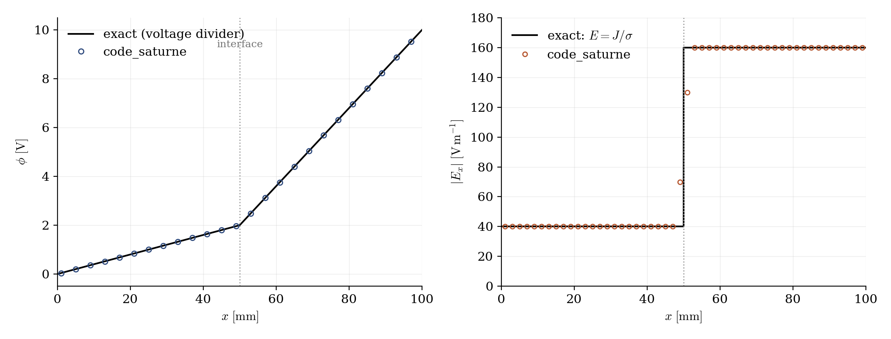
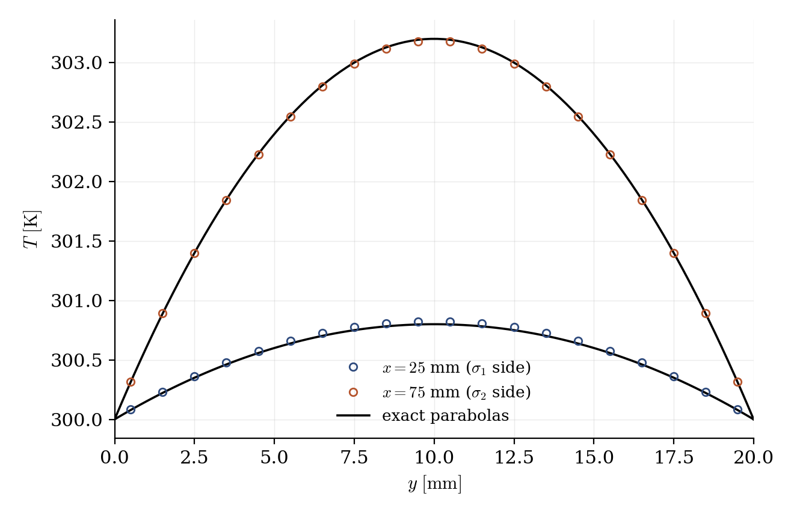

# Two-Material Bar (Voltage Divider)

A step-by-step tutorial extending [Elec_Joule_Bar](../Elec_Joule_Bar): the same conducting bar, now made of **two materials in series** ($\sigma_1 = 100$, $\sigma_2 = 25\ \mathrm{S/m}$). The case demonstrates that the electrical conductivity is a **field** (the industrial use of the Joule module: electrode regions and melts with different, temperature-dependent conductivities), and everything remains closed-form: the bar is a textbook voltage divider. It also teaches a classic finite-volume lesson along the way: the **harmonic face average** for discontinuous diffusivities.

Maintained by [Simvia](https://Simvia.tech/fr), part of the
[tutoriel-code_saturne](https://gitlab.com/Simvia/common-tools/tutoriel-code_saturne) collection.

## Learning objectives

After completing this tutorial you will be able to:

1. Prescribe a **spatially variable electrical conductivity** (a field filled in `cs_user_physical_properties.cpp`).
2. Use the **harmonic face interpolation** of a discontinuous diffusivity (`imvisf`), and know why the default arithmetic average biases the interface conductance.
3. Read the electric fields at a material interface: continuous current, jumping electric field.

## Prerequisites

| Requirement | Detail |
|---|---|
| code_saturne | **v9.1** |
| Case | [Elec_Joule_Bar](../Elec_Joule_Bar) (the single-material bar, and the three user-file requirements of the Joule variant) |

If code_saturne is not yet installed, build it from the
[official homepage](https://www.code-saturne.org/cms/web/Download), pull a
ready-to-use Singularity image from the
[Open Simulation Center](https://open-simulation-center.org/downloads/code_saturne/code_saturne),
or pull the
[Simvia Docker image](https://hub.docker.com/r/Simvia/code_saturne) before continuing.

## Case files

```
Elec_Two_Materials/
├── CASE/
│   ├── DATA/
│   │   └── setup.xml                        # identical to Elec_Joule_Bar
│   └── SRC/
│       ├── cs_user_physical_properties.cpp  # sigma(x) field + T(H) law
│       ├── cs_user_boundary_conditions.cpp  # electrode potentials (see Elec_Joule_Bar)
│       └── cs_user_parameters.cpp           # harmonic face average for sigma
├── FIGURES/                                 # figures used in this README
└── README.md
```

> There is **no MESH directory**: the mesh is generated at run time by the built-in cartesian mesher. The `setup.xml` is strictly identical to the single-material case: the whole difference lives in the user routines.

## Physical model

The bar of [Elec_Joule_Bar](../Elec_Joule_Bar) ($100 \times 20 \times 5$ mm, $U = 10$ V across) is split at mid-length into two materials. In series, the current density is continuous and the bar behaves as a voltage divider; everything follows from $R_i = L_i/(\sigma_i A)$:

| Quantity | Exact value |
|---|---|
| Resistances | $R_1 = 5\ \Omega$, $R_2 = 20\ \Omega$ |
| Current | $I = U/(R_1+R_2) = 0.4$ A ($J = 4000\ \mathrm{A/m^2}$, continuous) |
| Electric field | $E_1 = 40$, $E_2 = 160\ \mathrm{V/m}$: jump ratio $= \sigma_1/\sigma_2 = 4$ |
| Interface potential | $\phi = 2$ V (piecewise-linear $\phi$) |
| Dissipations | $q_1 = 1.6 \times 10^5$, $q_2 = 6.4 \times 10^5\ \mathrm{W/m^3}$; $P = UI = 4$ W |
| Thermal parabolas | $\Delta T_{max} = 0.8$ K ($\sigma_1$ side), $3.2$ K ($\sigma_2$ side) |

### The harmonic average lesson

The conductivity jumps across a single face. With the **default arithmetic face average** of the diffusivity, the interface conductance is overestimated, and the computed current comes out $0.7\%$ too high on this mesh (the error decreases with refinement, but slowly). The classic finite-volume remedy is the **harmonic average**, which reproduces resistances in series exactly: with `imvisf = 1` on the potential equation (set in `cs_user_parameters.cpp`), the computed plateaus land on $E_1 = 40.0$ and $E_2 = 160.\ \mathrm{V/m}$ and the interface potential on $2.0$ V. The same option matters for any transported quantity with a discontinuous diffusivity: multi-material conduction, conjugate heat transfer.

### Flow parameters

| Quantity | Symbol | Value | Source |
|---|---|---|---|
| Conductivities | $\sigma_1$, $\sigma_2$ | $100$, $25\ \mathrm{S/m}$ ($x \lessgtr 50$ mm) | `cs_user_physical_properties.cpp` |
| Potential difference | $U$ | $10$ V | `cs_user_boundary_conditions.cpp` |
| Face interpolation of $\sigma$ | `imvisf` | harmonic | `cs_user_parameters.cpp` |
| Material (thermal) | $\rho$, $c_p$, $\lambda$ | $1000$, $100$, $10$ (SI) | `fluid_properties` |
| Bar, mesh, time | | as in [Elec_Joule_Bar](../Elec_Joule_Bar) | `setup.xml` |

## Geometry and boundary conditions

Identical to [Elec_Joule_Bar](../Elec_Joule_Bar): electrodes at the ends ($\phi = 0$ and $10$ V, adiabatic), cooled lateral walls ($T_w = 300$ K, electrically insulated), symmetry on the spanwise planes. The material interface at $x = 50$ mm is **not a boundary**: it exists only through the $\sigma$ field.

## Numerical setup

As in [Elec_Joule_Bar](../Elec_Joule_Bar), plus the harmonic face interpolation of the potential diffusivity (see above).

## Running the simulation

The commands below start from the tutorial directory:

```bash
cd Elec_Two_Materials/
```

### Option A: Graphical interface

```bash
code_saturne gui CASE/DATA/setup.xml &
```

The GUI opens the pre-configured `setup.xml`. Review the setup if you wish,
then launch the run with the **gear (Run) button** in the toolbar.

### Option B: Command line

The command-line launcher is run from inside the case directory:

```bash
cd CASE

# serial (a few seconds)
code_saturne run
```

The three user routines are compiled automatically at the beginning of the run.

## Results

<p align="center">
  
  <br>
  <em>Figure 1: left, the potential is piecewise linear with the exact interface value ($2.0$ V computed); right, the electric field jumps by the conductivity ratio ($40.0$ and $160.\ \mathrm{V/m}$ computed on the plateaus). The one point inside the interface cell pair reflects the cell-gradient reconstruction across the kink of $\phi$, not the solution itself.</em>
</p>

<p align="center">
  
  <br>
  <em>Figure 2: temperature across the bar at the quarter lengths: each half carries its own parabola, with maxima in the dissipation ratio $q_2/q_1 = 4$ ($0.83$ and $3.18$ K computed for $0.8$ and $3.2$ K expected: the small deviations are the longitudinal conduction between the two halves, absent from the 1D formula).</em>
</p>

One post-processing caveat: the cell-averaged current and Joule power include the two cell layers straddling the potential kink, where the reconstructed gradient is smeared; integral values quoted from these fields come out $\approx 1\%$ high. The solution itself is exact, as the plateaus and the interface potential show.

## Summary

This tutorial turned the electrical conductivity into a field: two materials in series make the bar a textbook voltage divider, computed exactly (plateaus $40./160.\ \mathrm{V/m}$, interface at $2.0$ V) once the harmonic face average of the discontinuous diffusivity is enabled: a one-line numerical option worth knowing far beyond the electric module. Each half then heats with its own dissipation, giving two thermal parabolas in ratio four.

## References

- S.V. Patankar. Numerical Heat Transfer and Fluid Flow, Hemisphere, 1980 (section 4.2-3: the harmonic mean for discontinuous conductivities).
- [code_saturne documentation](https://www.code-saturne.org/cms/web/documentation)

## Authors

[Simvia](https://Simvia.tech/fr) - Questions, remarks and requests are welcome.
