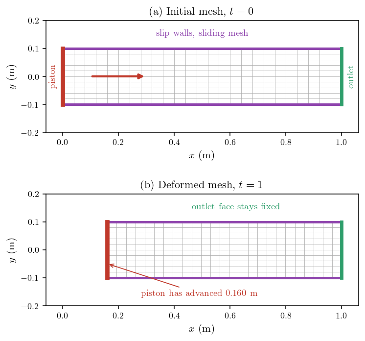
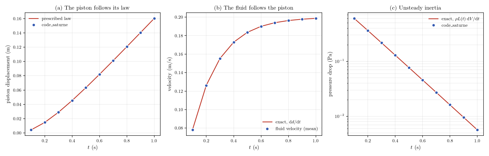
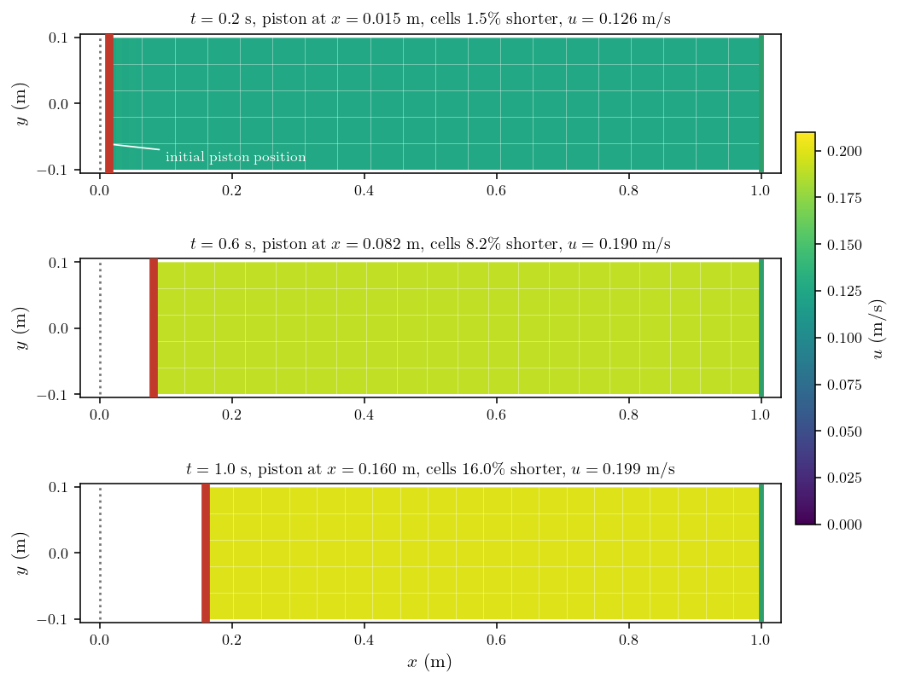

# ALE Piston in a Duct (Moving Mesh)

Most CFD boundaries stand still. Some do not: a valve closes, a piston sweeps a
cylinder, a hull heaves, a blade flutters. When the boundary moves, the mesh has
to move with it, and the conservation equations have to be written for cells that
change shape and volume as they are integrated. That is what the **Arbitrary
Lagrangian-Eulerian** formulation provides: the mesh follows the boundary,
the solver accounts for the volume it sweeps, and the fluid never notices a
discontinuity.

Two things then need care, and neither is physics. The mesh has to deform
gracefully, which means deciding how the prescribed motion of one boundary is
distributed over the interior, and the other boundaries have to be told whether
they may move, slide, or stay put. Get the second one wrong and the mesh simply
refuses to budge.

This tutorial pushes a piston into a duct along a prescribed law and checks the
result against the exact solution, which this configuration happens to have in
closed form. The whole case is set up from the GUI: there is no user routine at
all.

Maintained by [Simvia](https://Simvia.tech/fr), part of the
[tutoriel-code_saturne](https://github.com/simvia-tech/tutorials-code_saturne) collection.

## Learning objectives

After completing this tutorial you will be able to:

1. Activate the ALE method and prescribe the motion of a boundary from the GUI, with no user routine.
2. Set the ALE condition on the remaining boundaries so that the mesh can actually deform, and recognise the prescribed-velocity option that the solver accepts but does not apply.
3. Verify a moving-mesh computation against an exact solution: the boundary law, the fluid velocity, the unsteady pressure drop, and the way the deformation is spread over the interior.

## Prerequisites

| Requirement | Detail |
|---|---|
| code_saturne | **v9.1** |
| Tutorials | any of the `00_foundations` laminar cases |
| Background | Incompressible flow, transient simulation |

If code_saturne is not yet installed, build it from the
[official homepage](https://code-saturne.org/), pull a
ready-to-use Singularity image from the
[Open Simulation Center](https://open-simulation-center.org/downloads/code_saturne/code_saturne),
or pull the
[Simvia Docker image](https://hub.docker.com/r/Simvia/code_saturne) before continuing.

## Case files

```text
Ale_Piston_Duct/
├── CASE/
│   └── DATA/
│       └── setup.xml     # the whole case, GUI-authored
├── FIGURES/              # figures used in this README
└── README.md
```

`CASE/SRC/` is empty on purpose: everything here, including the piston law, is
expressed in the GUI. The duct is built by the internal Cartesian mesher, so
there is no mesh file either.

## Physical model

The flow is incompressible, laminar and isothermal. The duct is closed at one end
by the piston and open at the other, and its side walls are **slip**, which is
the choice that makes the case exactly solvable: with no shear at the walls the
flow stays one-dimensional, and the viscosity drops out of the solution
altogether.

| Parameter | Value | Source |
|---|---:|---|
| Density $\rho$ | 1 kg/m³ | `setup.xml`: `density` |
| Dynamic viscosity $\mu$ | $10^{-3}$ Pa·s | `setup.xml`: `molecular_viscosity` |
| Duct length $L_0$ | 1 m | mesh |
| Duct height | 0.2 m | mesh |
| Piston stroke speed $V_0$ | 0.2 m/s | `setup.xml`: piston `ale` formula |
| Ramp time $\tau$ | 0.2 s | idem |

The piston is started smoothly rather than jerked into motion, following

$$d(t) = V_0\left[t - \tau\left(1 - e^{-t/\tau}\right)\right],
\qquad V(t) = V_0\left(1 - e^{-t/\tau}\right)$$

so that its velocity rises from zero and settles at $V_0$. The ramp is what makes
the pressure check below interesting: it gives a decaying acceleration to measure.

### The exact solution

The fluid is incompressible and the duct has one open end, so all the fluid
displaced by the piston leaves through the outlet and the velocity is uniform:

$$u(x,t) = V(t)$$

The momentum equation then reduces to $\partial p/\partial x = -\rho\,
\mathrm{d}V/\mathrm{d}t$, and the pressure drop over the remaining length
$L(t) = L_0 - d(t)$ is pure unsteady inertia:

$$\Delta p(t) = \rho\, L(t)\, \frac{\mathrm{d}V}{\mathrm{d}t}$$

Three exact quantities, then, and none of them involves the mesh: they are what
the ALE machinery has to reproduce.

## Geometry and boundary conditions

| Boundary | Flow condition | ALE condition |
|---|---|---|
| `piston` ($x=0$) | Wall | **prescribed displacement** |
| `outlet` ($x=L_0$) | Outlet | fixed |
| `lateral` ($y=\pm 0.1$) | Symmetry (slip) | **sliding** |
| `frontback` ($z$ planes) | Symmetry | sliding |

<p align="center">
  
  <br>
  <em>Figure 1: (a) The duct and its boundaries at rest. (b) The same mesh at
  $t=1$ s: the piston has advanced and the cells have compressed, while the
  outlet face has not moved.</em>
</p>

## Setting the ALE method up

The method is enabled in the GUI, together with the quantity that governs how the
interior mesh absorbs the boundary motion:

```xml
<ale_method status="on">
  <mesh_viscosity type="isotrop"/>
  <formula>mesh_viscosity = 1;</formula>
</ale_method>
```

The mesh displacement is obtained by solving a diffusion equation whose
"viscosity" is this field. Uniform viscosity spreads the deformation evenly, and
that is what makes every cell of the duct share the compression equally, as
measured below. Making the
viscosity larger near a region you want to protect is how you keep good cells
where they matter and push the distortion elsewhere.

The piston motion is a formula on its boundary:

```xml
<wall label="piston" field_id="none">
  <velocity_pressure choice="off"/>
  <ale choice="fixed_displacement">
    <formula>mesh_displacement[0] = 0.2*(t - 0.2*(1. - exp(-t/0.2)));
mesh_displacement[1] = 0.;
mesh_displacement[2] = 0.;</formula>
  </ale>
</wall>
```

The displacement is counted from the initial mesh, not from the previous time
step, so the formula is the position law itself. The fluid velocity at the piston
needs no separate treatment: it is a wall, and the ALE machinery gives it the
velocity of the mesh.

### The other boundaries decide whether anything moves

This is the trap worth remembering. Every boundary needs an ALE condition, and
the natural-looking choice of holding them all in place makes the case do
nothing at all: with `fixed_boundary` on the side walls, their nodes cannot
translate in $x$, and since they bracket the whole duct the mesh has nowhere to
go. The piston pushes and the mesh stays put.

`sliding_boundary` is the right answer for a wall that must stay a wall while
letting nodes travel along it. Only the outlet, which really should not move, is
fixed.

### Prescribed displacement, not prescribed velocity

The GUI also offers `fixed_velocity`, which reads more naturally for a piston.
With the legacy ALE solver it does nothing: in `cs_gui_mobile_mesh.cpp` the
routine that handles it evaluates the formula, writes the result into a local
array, marks the faces, and frees the array without ever using the values,
leaving a comment that they are handled elsewhere. Nothing else picks them up.
The mesh never moves, and no warning is issued.

The symptom is worth knowing because it is confusing: the fluid velocity comes
out correct anyway, since a fixed wall with an imposed normal velocity injects
the same flow rate. Only the mesh betrays the problem. Prescribing the
displacement, as above, works.

### Seeing the mesh move

One last detail, this one merely cosmetic. Post-processing writers default to a
fixed mesh, so the output holds the initial geometry no matter how much the mesh
has moved. Ask for moving coordinates:

```xml
<time_dependency choice="transient_coordinates"/>
```

## Numerical setup

| Setting | Value |
|---|---:|
| Mesh | $100\times20\times1$ cells |
| Time step | 0.002 s (constant) |
| Iterations | 500 (final time 1 s) |
| Velocity-pressure algorithm | SIMPLEC |
| Mesh viscosity | isotropic, uniform |

## Running the simulation

```bash
cd CASE
code_saturne run
```

The run takes under two minutes on one core.

## Results and verification

Everything is compared with the closed-form solution above. The piston travels
16 percent of the duct length, so the cells at the piston end lose about a sixth
of their length by the end of the run.

<p align="center">
  
  <br>
  <em>Figure 2: The three exact checks. Lines are the closed-form solution,
  markers the computation.</em>
</p>

| Quantity at $t=1$ s | Computed | Exact |
|---|---:|---:|
| Piston displacement (m) | 0.16027 | 0.16027 |
| Fluid velocity (m/s) | 0.19865 | 0.19865 |
| Velocity spread across the domain | $5\times10^{-5}$ | 0 |
| Pressure drop (Pa) | $5.68\times10^{-3}$ | $5.66\times10^{-3}$ |

The piston lands on its prescribed law, and the fluid velocity on the derivative
of that law, to the printing precision. The velocity is uniform across the whole
domain to a few $10^{-5}$, which is the real content of the mass-conservation
check on a shrinking domain: nothing is created or lost by the moving cells.

The pressure drop is the most demanding of the three, because it tests the
unsteady term rather than the kinematics, and because it decays by two orders of
magnitude over the run as the piston stops accelerating. The computation follows
it throughout.

### Watching the mesh move

<p align="center">
  
  <br>
  <em>Figure 3: Three instants of the computation. The piston advances, the
  domain shortens, and the colour shows the fluid accelerating with it. The
  dotted line marks where the piston started.</em>
</p>

Two things are worth reading off this figure. The cells compress by the same
fraction everywhere, 16 percent by the end, rather than the ones next to the
piston absorbing the whole stroke: that even sharing is what a uniform mesh
viscosity buys, and measuring it against the linear law gives a maximum
departure of $1.5\times10^{-5}$ m. And the colour is flat across each panel,
which is the one-dimensional solution holding as the mesh deforms.

If the deformation had to be kept away from a sensitive region, a larger mesh
viscosity there would push the distortion elsewhere. That is the knob to reach
for when a moving boundary starts to spoil cells that matter.

## Summary

ALE turns a moving boundary into a moving mesh, and in code_saturne it needs no
user routine: the motion is a formula on the boundary and the method is a switch
in the GUI. Two settings decide whether it works. The other boundaries must be
allowed to move, so walls that the mesh has to slide along are `sliding` rather
than `fixed`, and the motion must be prescribed as a **displacement**, since the
prescribed-velocity option is accepted by the interface and dropped by the legacy
solver without warning.

Verified against the exact one-dimensional solution, the result is as good as the
statement of the problem: the boundary follows its law, the fluid follows the
boundary, mass is conserved on cells that are shrinking as they are integrated,
and the unsteady pressure drop is right over two decades of decay.

One practical caveat that this case avoids by construction: the piston here only
ever pushes. Reversing it makes the outlet an inlet for part of the cycle, and a
standard outlet condition handles that badly, which shows up as velocities several
times the piston speed. Oscillating boundaries need a boundary condition that
tolerates inflow, not a plain outlet.

## References

1. code_saturne documentation: <https://code-saturne.org/doc/>.
2. J. Donea, A. Huerta, J.-P. Ponthot, A. Rodriguez-Ferran, "Arbitrary Lagrangian-Eulerian Methods", in *Encyclopedia of Computational Mechanics*, Wiley, 2004.

## Authors

[Simvia](https://Simvia.tech/fr) - Questions, remarks and requests are welcome.
