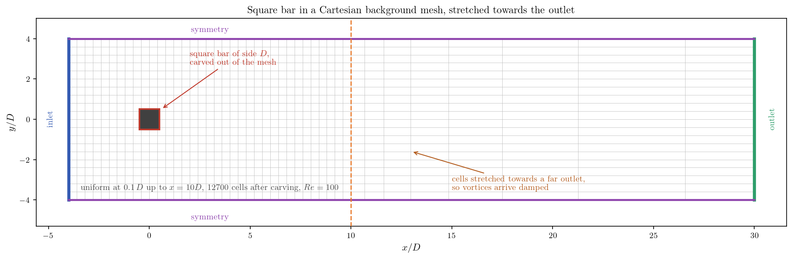
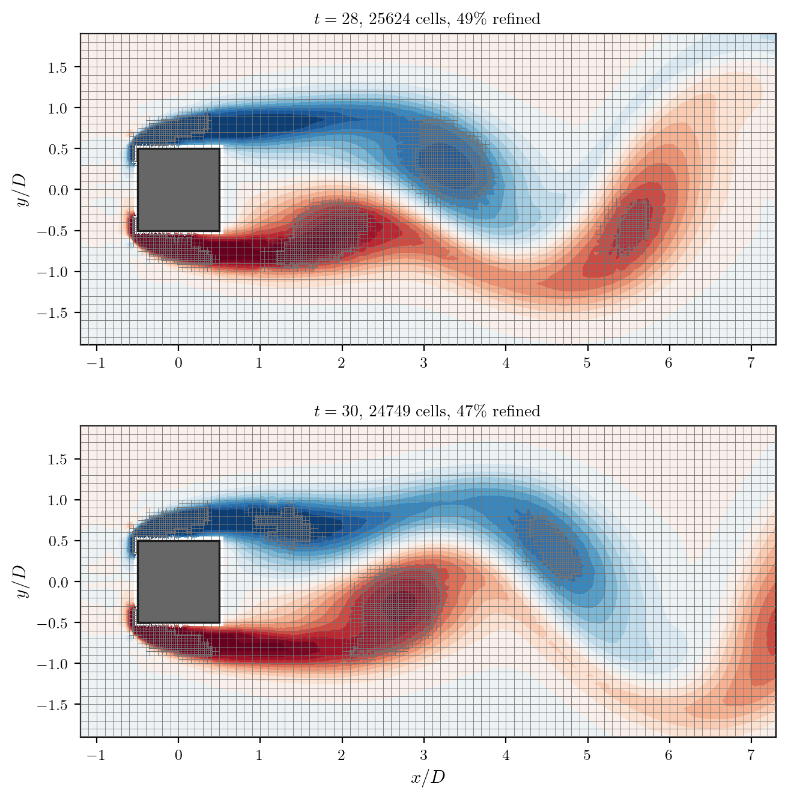

# Adaptive Mesh Refinement Following a Vortex Wake

A mesh is a bet on where the solution will need resolution, placed before the
solution is known. For a steady flow the bet is easy to win: refine near the
walls, in the shear layers, wherever experience says the gradients will be. For
a flow whose structures move, the bet cannot be won at all. A vortex street
sheds new eddies at one end and lets them decay at the other, and the region
that deserves a fine mesh travels with them. Refining the whole path is paying
for cells that are useful one instant in ten.

**Adaptive mesh refinement**, new in code_saturne 9.2, moves the bet inside the
run. The user supplies a function that answers one question for every cell,
"does this cell belong to the region worth resolving?", and the solver splits,
interpolates, and merges back as the answer changes. The mesh follows the flow.

This tutorial puts that machinery on a vortex street behind a square bar. It is
a **demonstration of how AMR is set up**, not a validation case: no quantity is
compared against reference data. What it does document, from the case itself, is
the handful of decisions that stand between a working setup and a mesh that
refines the wrong thing, which is where the real difficulty of the method lies.

Maintained by [Simvia](https://Simvia.tech/fr), part of the
[tutoriel-code_saturne](https://github.com/simvia-tech/tutorials-code_saturne) collection.

## Learning objectives

After completing this tutorial you will be able to:

1. Activate adaptive refinement with `cs_adaptive_refinement_define`, and know what each of its arguments controls, including the one that is not a refinement level.
2. Write a refinement indicator, here on the Q-criterion, and tune its threshold from the mesh size it produces.
3. Avoid the three setup mistakes that make an adapted mesh unusable, none of which is about refinement itself.

## Prerequisites

| Requirement | Detail |
|---|---|
| code_saturne | **v9.2** (the module does not exist in 9.1) |
| Tutorials | [Pre_Cell_Removal](../../05_preprocessing/Pre_Cell_Removal) (the obstacle is carved the same way), [Inc_Von_Karman](../../00_foundations/Inc_Von_Karman) (vortex shedding) |
| Background | Transient incompressible flow, vortex dynamics |

This is the only tutorial of the collection that requires 9.2 rather than 9.1.
The adaptive refinement module is a new addition and has no equivalent in the
earlier version.

If code_saturne is not yet installed, build it from the
[official homepage](https://code-saturne.org/), pull a
ready-to-use Singularity image from the
[Open Simulation Center](https://open-simulation-center.org/downloads/code_saturne/code_saturne),
or pull the
[Simvia Docker image](https://hub.docker.com/r/Simvia/code_saturne) before continuing.

## Case files

```text
Amr_Vortex_Wake/
├── CASE/
│   ├── DATA/
│   │   └── setup.xml               # pre-configured GUI case
│   └── SRC/
│       ├── cs_user_parameters.cpp  # the showcased feature: the indicator
│       └── cs_user_mesh.cpp        # background mesh and the carved bar
├── FIGURES/                        # figures used in this README
└── README.md
```

There is no mesh file: the background mesh is Cartesian, built in
`cs_user_mesh.cpp`, and the bar is obtained by removing the cells it occupies.

## Physical model

The flow is incompressible, laminar and isothermal, past a square bar of side
$D$ held across a free stream. At $Re=100$ the wake is unstable and sheds a
periodic street of counter-rotating vortices, which is the moving structure the
mesh has to follow. No turbulence model is used.

| Parameter | Value | Source |
|---|---:|---|
| Density $\rho$ | 1 | `setup.xml`: `density` |
| Dynamic viscosity $\mu$ | $10^{-2}$ | `setup.xml`: `molecular_viscosity` |
| Bar side $D$ | 1 | `cs_user_mesh.cpp` |
| Free-stream velocity $U_\infty$ | 1 | `setup.xml`: `inlet/velocity_pressure/norm` |
| Reynolds number | 100 | $\rho U_\infty D/\mu$ |

Vortex shedding grows from an asymmetry, and this case has none: a Cartesian
mesh and a square bar are symmetric to the last digit, far more so than a
body-fitted mesh around a cylinder, so the instability would take an extremely
long time to emerge from rounding alone. The initial field therefore carries a
localised transverse velocity behind the bar, which seeds it in a couple of
periods and then plays no further part.

## Geometry and boundary conditions

| Boundary | Type |
|---|---|
| inlet ($x=-4D$) | Inlet, uniform $U_\infty$ |
| outlet ($x=30D$) | Standard outlet |
| lateral ($y=\pm4D$) | Symmetry |
| `Obstacle` | Wall, created by the cell removal |
| $z$ planes | Symmetry (the case is plane) |

<p align="center">
  
  <br>
  <em>Figure 1: The domain and its uniform Cartesian background mesh. The bar is
  not meshed as a body: the cells it occupies are removed, and the faces this
  frees become the wall.</em>
</p>

The domain is meshed uniformly at $\Delta = 0.1\,D$ out to $x=10D$, then
stretched towards a distant outlet, for the reason given in the last section.

## Setting adaptive refinement up

Everything is in `CASE/SRC/cs_user_parameters.cpp`, and it is one call plus one
function. The call declares the module:

```c
cs_adaptive_refinement_define(2,        /* layers around the marked region */
                              20,       /* adapt every 20 time steps */
                              _wake_indicator,
                              nullptr,  /* no extra input for the indicator */
                              1,        /* gradient-based interpolation */
                              true);    /* rebalance the partitions */
```

The GUI has no page for this, so the call belongs in `cs_user_parameters`.

**The first argument is not a refinement level.** It is the number of cell layers
kept refined *around* the marked region, a spatial margin so that a structure
does not step outside the fine zone between two adaptations, twenty time steps
apart here.

The remaining arguments are the adaptation interval, the indicator and its
optional payload, the interpolation used when fields are carried onto the new
cells, and, in parallel, whether the partitions are rebalanced afterwards.
Rebalancing matters here because the refined region travels: without it the cell
count per rank drifts as the vortices move downstream.

### The indicator

The indicator writes 1 for the cells of the region to keep refined. It describes
a region, not an order to refine further: a cell that is marked and already
refined stays as it is, and a cell that stops being marked is coarsened back.
That is what lets the fine patch travel instead of accumulating.

The quantity tested here is the **Q-criterion**, the second invariant of the
velocity gradient, which is positive in a vortex core and small in pure shear.
It is built from the velocity gradient, so the same routine carries over
unchanged to a three-dimensional case:

```c
static void
_wake_indicator(const void *input, int *vals)
{
  cs_real_33_t *gradv;
  CS_MALLOC(gradv, n_cells_ext, cs_real_33_t);
  cs_field_gradient_vector(CS_F_(vel), false, 1, gradv);

  for (cs_lnum_t c_id = 0; c_id < n_cells; c_id++) {
    /* symmetric and antisymmetric parts of the gradient */
    cs_real_t s2 = 0., o2 = 0.;
    for (int i = 0; i < 3; i++) {
      for (int j = 0; j < 3; j++) {
        const cs_real_t sij = 0.5*(gradv[c_id][i][j] + gradv[c_id][j][i]);
        const cs_real_t oij = 0.5*(gradv[c_id][i][j] - gradv[c_id][j][i]);
        s2 += sij*sij;
        o2 += oij*oij;
      }
    }
    vals[c_id] = (0.5*(o2 - s2) > _q_threshold) ? 1 : 0;
  }

  CS_FREE(gradv);
}
```

The threshold is a fixed value in units of $(U_\infty/D)^2$, 0.5 here. It has no
universal value: it is tuned by running the case and reading the resulting mesh
size out of the log, which is how such criteria are set in practice.

## Numerical setup

| Setting | Value |
|---|---:|
| Background mesh | $\Delta=0.1D$ uniform to $x=10D$, then stretched |
| Cells after carving the bar | 12 700 |
| Time step | 0.01 (constant) |
| Iterations | 3000 (final time $30\,D/U_\infty$) |
| Adaptation interval | every 20 time steps |
| Q threshold | 0.5 |
| Layers around the marked region | 2 |

## Running the simulation

```bash
cd CASE
code_saturne run --n 4
```

The run takes about three minutes on four cores.

## Results

<p align="center">
  
  <br>
  <em>Figure 2: Vorticity and the mesh itself at two instants two convective
  times apart. The background mesh is visible everywhere; the denser grid
  marks the cells that have been split. Each patch has advanced with the vortex it
  covers.</em>
</p>

This is what the method is for. The refined patches sit on the vortex cores and
move with them: between the two instants each has advanced by two diameters, the
distance a structure travels at $U_\infty$ in two convective times. Behind them,
where the vortices have decayed below the threshold, the mesh has been coarsened
back to its original spacing.

| Quantity | Value |
|---|---:|
| Base mesh | 12 700 cells |
| Adapted mesh, established regime | about 25 000 cells |
| Cells refined | 47 to 49 percent |
| Uniform mesh at the fine spacing | 101 600 cells |
| Ratio | 4.0 |

The cell count settles rather than drifting, which is the sign that refinement
and coarsening are in balance. The factor of four is modest because the case is
two-dimensional and the wake occupies a large share of the domain; refinement
splits a cell into eight, so the arithmetic is unforgiving when half the domain
is marked. In three dimensions, where the region of interest is a small fraction
of a volume, the same criterion pays far better.

## Three things to get right

None of these is about refinement itself, and each of them was got wrong here
first.

| Setting | Why |
|---|---|
| Writer set to `transient_connectivity` | the default writes the initial connectivity, so the output shows a pristine uniform mesh however much the solver has adapted |
| Time step sized for the **refined** cells | refinement halves the cell size, so the Courant number doubles where the mesh adapts |
| Outlet far enough, with cells stretched towards it | vortices crossing a nearby outlet induce inflow through it, and the spurious vorticity this creates was at one point the most refined region of the domain |

## Summary

Adaptive refinement in code_saturne 9.2 is declared in one call and driven by one
user function. The call takes a margin in cell layers, not a refinement level,
which the module does not expose at all; the function marks the region to keep
refined, and the solver splits, interpolates and merges as that region moves.

The engineering is in the indicator. The criterion used here is the
Q-criterion, positive in a vortex core and small in pure shear, with a threshold
tuned from the mesh size it produces.

Set up this way the refined patches track the vortices and the mesh size settles,
for four times fewer cells than a uniform mesh at the same fine spacing.

This case is a demonstration of the setup, not a validation: no quantity here is
compared with reference data.

## References

1. code_saturne documentation: <https://code-saturne.org/doc/>.
2. J. C. R. Hunt, A. A. Wray, P. Moin, "Eddies, streams, and convergence zones in turbulent flows", *Center for Turbulence Research Report* CTR-S88, pp. 193-208, 1988.

## Authors

[Simvia](https://Simvia.tech/fr) - Questions, remarks and requests are welcome.
