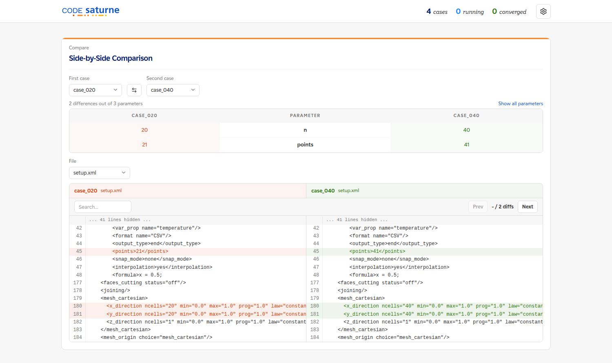
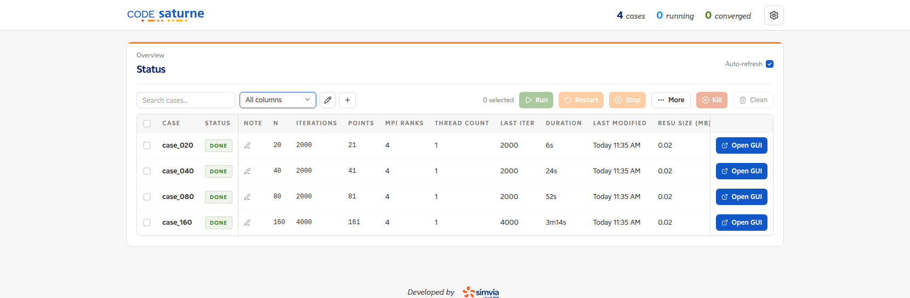
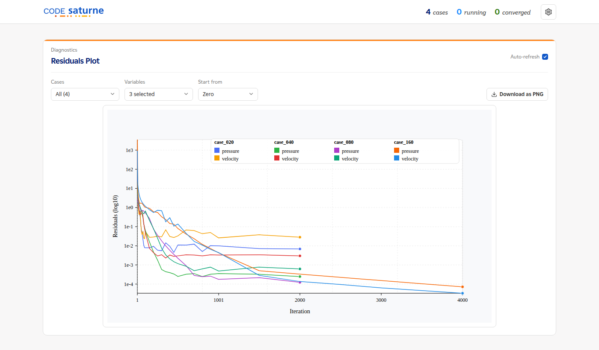
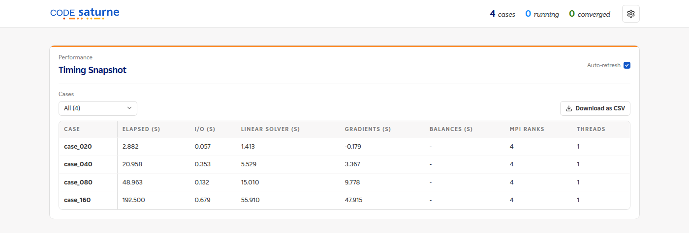
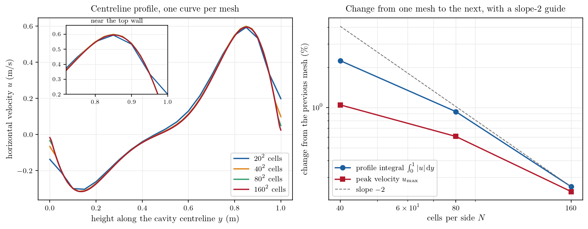

# Mesh Convergence with csauto: Four Meshes from One Template

A mesh convergence study is the same case run several times on finer and finer
meshes, until the answer stops moving. The work is not in the physics, it is in
the bookkeeping: four case directories to create, four runs to launch and follow,
four sets of results to line up, and the certainty that nothing else changed
along the way.

[csauto](https://github.com/simvia-tech/csauto) does that bookkeeping. You give it
one template case and one CSV with one row per case, it writes the case
directories, launches them, and shows the campaign in a web dashboard. This
tutorial runs the cavity of
[Th_Buoyant_Cavity](../../20_thermal/Th_Buoyant_Cavity) on $20^2$, $40^2$, $80^2$
and $160^2$ cells and reads the mesh convergence off the result.

csauto orchestrates the campaign and shows whether each run converged. The
physical comparison at the end is ordinary post-processing of the volume output,
done once the campaign is over.

Maintained by [Simvia](https://Simvia.tech/fr), part of the
[tutoriel-code_saturne](https://github.com/simvia-tech/tutorials-code_saturne) collection.

## Learning objectives

After completing this tutorial you will be able to:

1. Turn an existing case into a **csauto template** by replacing the values you want to vary with placeholders.
2. Write a **DOE table** where the parameters that must follow the mesh do follow it.
3. Launch a campaign with `csauto prepare` and `csauto run`, and read its state in the dashboard.
4. Check, before comparing anything, that every run in the campaign actually converged.
5. Extract a convergence order from the campaign, and tell a global measure from a local one.

## Prerequisites

| Requirement | Detail |
|---|---|
| code_saturne | **v9.1** |
| csauto | **v0.5.0**, installed as described in its [README](https://github.com/simvia-tech/csauto) |
| Docker | the runtime used here, so no local code_saturne build is needed |
| Tutorials | [Th_Buoyant_Cavity](../../20_thermal/Th_Buoyant_Cavity), the case this campaign varies |
| Background | Notions of grid convergence and of Richardson extrapolation |

csauto is before its 1.0 release and says so: expect its commands to move a
little. The version used throughout is **0.5.0**.

## Case files

```text
Csa_Mesh_Convergence/
├── TEMPLATE/
│   └── DATA/
│       └── setup.xml       # the cavity case, with placeholders
├── csauto.toml             # runtime and dashboard settings
├── doe.csv                 # one row per case
├── FIGURES/
└── README.md
```

`RUNS/`, the four case directories csauto generates, is not shipped: it is
rebuilt by `csauto prepare`.

## The template

The template is the `CASE` of `Th_Buoyant_Cavity`, at $Ra = 10^5$, with three
values replaced by `{placeholder}` names. csauto substitutes them line by line,
so a placeholder works anywhere in `setup.xml`, including inside an attribute:

```xml
<mesh_cartesian>
  <x_direction ncells="{n}" min="0.0" max="1.0" prog="1.0" law="constant"/>
  <y_direction ncells="{n}" min="0.0" max="1.0" prog="1.0" law="constant"/>
  <z_direction ncells="1" min="0.0" max="1.0" prog="1.0" law="constant"/>
</mesh_cartesian>
```

```xml
<iterations>{iterations}</iterations>
```

```xml
<profile label="centerline">
  <var_prop name="velocity" component="0"/>
  <var_prop name="temperature"/>
  <format name="CSV"/>
  <output_type>end</output_type>
  <points>{points}</points>
  <snap_mode>none</snap_mode>
  <interpolation>yes</interpolation>
  <formula>x = 0.5;
y = s;
z = 0.5;</formula>
</profile>
```

The mesh is built by code_saturne's own Cartesian mesher, so refining it is a
matter of one number and there is no mesh file to regenerate. The profile writes
the vertical centreline to `RESU/<run>/profiles/centerline.csv`, which the
dashboard can plot.

## The DOE table

```csv
case_id,n,iterations,points
case_020,20,2000,21
case_040,40,2000,41
case_080,80,2000,81
case_160,160,4000,161
```

Only one thing is being studied, the mesh, but two other columns have to follow
it.

**The iteration budget.** The case reaches its steady state with a local
(pseudo) time step capped by a Courant number of one, so the time step follows
the cell size: a finer mesh advances less per iteration and needs more of them.
Left at $2000$ iterations for every mesh, the $160^2$ run is still moving when it
stops, and the study then compares a converged coarse solution with an
unconverged fine one. Doubling the budget for the finest mesh settles it.

**The profile resolution.** The profile is sampled at fixed coordinates, so
asking for $200$ points on a $20$-cell mesh gives ten identical samples per cell
and a staircase. One point per cell face keeps every mesh sampled at its own
resolution.

`case_id` is free, with one catch: csauto's bulk commands look for directories
whose name starts with `case`, so `case_020` is seen by `csauto doctor` and
`csauto run` while `mesh_020` would not be.

## Step 1: tell csauto how to run

Everything below is run from the tutorial directory, because that is where
csauto looks for its configuration:

```bash
cd Csa_Mesh_Convergence
```

`csauto.toml` is picked up automatically from the current directory, so these
settings apply to every command that follows and none of them has to be repeated
on the command line:

```toml
runtime = "docker"
docker_image = "simvia/code_saturne:9.1.0"
use_slurm = false
max_parallel = 4
host = "127.0.0.1"
port = 8000
```

| Key | What it does |
|---|---|
| `runtime` | how to launch the solver: `docker`, `singularity`, `native` for a local build, or `auto` to let csauto pick |
| `docker_image` | the image used by the `docker` runtime, here the Simvia image for code_saturne 9.1 |
| `use_slurm` | `false` runs the cases as background processes on this machine; `true` submits one Slurm job per case |
| `max_parallel` | how many cases may run at the same time. Four is the size of this campaign, so all four start at once |
| `host`, `port` | where the dashboard listens. `127.0.0.1` keeps it on this machine |

Choosing `docker` is what makes the tutorial reproducible without a local build.
If you already have code_saturne installed, replace those two lines with
`runtime = "native"` and `saturne_bin = "/path/to/code_saturne"`.

## Step 2: generate the four cases

```bash
csauto prepare doe.csv TEMPLATE RUNS
csauto doctor RUNS
```

`prepare` writes `RUNS/case_020/` to `RUNS/case_160/`, each with its rendered
`setup.xml` and a `doe_row.csv` recording the values used. It warns that the
shared `MESH` and `POST` directories are missing, which is expected here: the
mesh is in `setup.xml`. `doctor` then checks the runtime and the cases before
anything is launched, and prints one `[OK]` per check:

```text
[OK] write OK: RUNS
[OK] 4 cases detected
[OK] setup.xml present in every case
[OK] docker available
```

## Step 3: open the dashboard

```bash
csauto serve RUNS
```

The host and port come from `csauto.toml`, so there is nothing to pass here. The
command stays in the foreground for the rest of the session: run it in its own
terminal, then open <http://127.0.0.1:8000>. On a remote machine, tunnel the port
first with `ssh -L 8000:127.0.0.1:8000 your-server`.

The dashboard is worth a look before committing four runs to the queue, because
it can show what `prepare` produced. Scroll to **Side-by-Side Comparison**, pick
two cases, and choose `setup.xml` as the file:

<p align="center">
  
  <br>
  <em>Figure 1: Two prepared cases compared. The parameter table names what
  differs, and the file diff shows where: the two <code>ncells</code> attributes
  and the profile resolution. Everything else in the 274 lines of
  <code>setup.xml</code> is identical.</em>
</p>

## Step 4: launch the campaign from the dashboard

This is the recommended way to launch: the **Status** panel does it, and you stay
in the interface you will be watching anyway.

1. Click the checkbox in the table header to select all four cases. The toolbar
   then reads `4 selected` and its buttons become active.
2. Click **Run**. A dialog asks for the three numbers csauto needs.
3. Set **MPI Ranks (n)** to `4` and leave **OMP Threads (nt)** at `1`, so each
   case gets four ranks with one thread each. **Max Parallel** comes pre-filled
   at `4`, which is what we want here: all four at once, for sixteen cores in
   total.
4. Click **Run**.

<p align="center">
  
  <br>
  <em>Figure 2: Launching the four cases from the Status panel.</em>
</p>

The rows go from `PREPARED` to `RUNNING`, the `LAST ITER` column climbs as each
solver advances, and each row turns `DONE` on its own.

<p align="center">
  
  <br>
  <em>Figure 3: The Status panel once the campaign is over. The DOE columns sit
  next to the case name, so the mesh, the iteration budget and the profile
  resolution are visible with the state of each run.</em>
</p>

The whole campaign is over in the time of its longest case: $6$ s, $24$ s, $52$ s
and $3$ min $14$ s of wall time, all four at once.

The same launch from a terminal, for a script or a machine with no browser, is:

```bash
csauto run "$PWD/RUNS" --n 4 --nt 1
```

Note the absolute path: the launcher needs one, which is what `"$PWD/RUNS"` is
for. The command returns as soon as the cases are launched, since they run in the
background either way.

## Step 5: check that every run converged

This is the step to do before looking at any physics. A mesh convergence study
compares four steady solutions, and a run that stopped short of steady state is
not one of them.

In the **Residuals Plot** panel, leave the case selector on `All (4)`: the four
runs are overlaid on one chart.

<p align="center">
  
  <br>
  <em>Figure 4: Residuals for the four runs on one chart. The two longest curves
  are the 160² case, which was given 4000 iterations.</em>
</p>

Each run falls by several orders of magnitude and flattens. The coarsest
mesh flattens highest, near $3\times10^{-2}$ on the velocity, and its near-wall
probe still wanders by $0.7\%$ over the last 200 iterations, which the **Probes**
panel shows and `RESU/<run>/monitoring/` records: on $20^2$ cells the flow does
not fully settle. The other three settle to better than $0.01\%$. That
is worth knowing before the coarse point is read as an error of discretisation
alone.

## Step 6: read what the campaign cost

The **Timing Snapshot** panel reads each run's `performance.log` and puts the
four side by side, with a **Download as CSV** button for the numbers.

<p align="center">
  
  <br>
  <em>Figure 5: Solver time per case, from each run's own performance log.</em>
</p>

| Mesh | Cells | Iterations | Elapsed |
|---|---:|---:|---:|
| $20^2$ | $400$ | $2000$ | $2.9$ s |
| $40^2$ | $1\,600$ | $2000$ | $21.0$ s |
| $80^2$ | $6\,400$ | $2000$ | $49.0$ s |
| $160^2$ | $25\,600$ | $4000$ | $192.5$ s |

Four times the cells and twice the iterations cost roughly four times the time
between the last two meshes. That ratio is the reason a convergence study stops
somewhere, and the reason it is worth knowing where.

## Step 7: compare the meshes

The comparison itself is ordinary post-processing, done after the campaign on the
volume output of each run: the horizontal velocity is sampled along the vertical
centreline of the cavity, at the same $400$ points for all four meshes.

<p align="center">
  
  <br>
  <em>Figure 6: Left, the centreline profile on each mesh, with the near-wall peak
  magnified. Right, how much each measure moves from one mesh to the next.</em>
</p>

| Mesh | $\int_0^1 \lvert u \rvert \, \mathrm{d}y$ | change | $u_{\max}$ | change |
|---|---:|---:|---:|---:|
| $20^2$ | $0.246926$ | | $0.593774$ | |
| $40^2$ | $0.241371$ | $2.25\%$ | $0.599993$ | $1.05\%$ |
| $80^2$ | $0.239118$ | $0.93\%$ | $0.596348$ | $0.61\%$ |
| $160^2$ | $0.238508$ | $0.25\%$ | $0.594952$ | $0.23\%$ |

The profiles are already close on $40^2$ cells and indistinguishable by eye from
$80^2$ on. What separates the meshes is the peak near the top wall, where the
boundary layer is thin, which is where the magnified inset looks.

The integral of the profile is a global measure and it converges cleanly: the
change shrinks by a factor of $2.4$ and then $3.7$ as the cell size is halved,
approaching the factor of four a second-order scheme gives, and the observed order
over the three finest meshes is $1.89$. The peak velocity is a local measure taken inside a boundary
layer, and it shrinks at about the same rate but not monotonically, overshooting
on $40^2$ before settling. Reading an order of convergence off a local extremum
is unreliable for that reason.

For engineering purposes the answer is that $80^2$ cells are enough: going to
$160^2$ moves both measures by a quarter of a percent. This is a self-convergence
study: it says when the mesh stops mattering, not whether the physics is right.
The comparison against the reference solution of Sockol lives in
[Th_Buoyant_Cavity](../../20_thermal/Th_Buoyant_Cavity).

## Summary

One template, one CSV of four rows, two commands. csauto wrote the four cases,
ran them side by side, and showed in one dashboard that each had converged, what
each had cost, and that nothing but the intended parameters differed between
them.

The two things worth carrying over to the next campaign are in the DOE table. A
parameter that must follow the mesh belongs in its own column, or the campaign
compares solutions that are not comparable: here the iteration budget, because
the local time step follows the cell size, and the profile resolution, because a
profile sampled far finer than the mesh only shows the mesh. And the convergence
of each run is worth checking before any of the results are compared.

## References

1. [csauto](https://github.com/simvia-tech/csauto), the campaign tool used here, and its [documentation](https://simvia-tech.github.io/csauto/)
2. P. J. Roache, *Verification and Validation in Computational Science and Engineering*, Hermosa, 1998, for grid convergence and Richardson extrapolation
3. [code_saturne documentation](https://code-saturne.org/doc/)

## Authors

[Simvia](https://Simvia.tech/fr) - Questions, remarks and requests are welcome.
